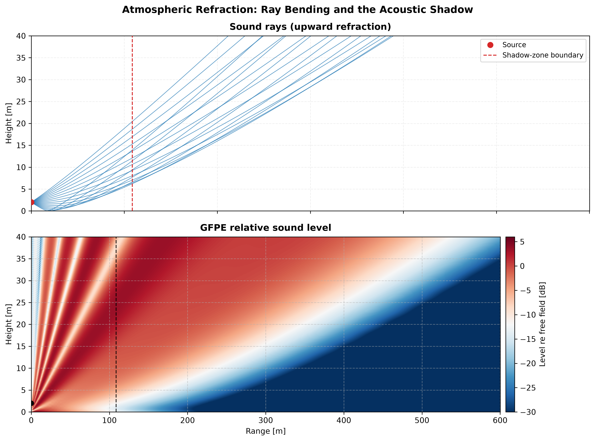

← [Documentation index](README.md)

# Atmospheric refraction: ray tracing and the parabolic equation (Salomons / Attenborough)

The [ISO 9613-2 method](outdoor-propagation.md) and the
[spherical-wave ground effect](ground-barriers.md) both assume a **homogeneous**
atmosphere. In reality the sound speed changes with height, because temperature
and wind change with height, and this **refracts** sound: rays curve, and over a
few hundred metres the received level can swing by tens of decibels. This page
covers `phonometry.environmental.atmospheric_refraction`, the
refracting-atmosphere counterpart of the ocean solvers in
[`phonometry.underwater.numerical_propagation`](underwater-propagation.md): a
**ray model** and a **parabolic-equation (PE)** solver, both clean-room from
Salomons, *Computational Atmospheric Acoustics* (2001) and Attenborough & Van
Renterghem, *Predicting Outdoor Sound* 2e (2021, Ch. 11).



## 1. Effective sound-speed profile

A moving (windy) atmosphere is well approximated by a non-moving one with the
**effective sound speed** `c_eff(z) = c(z) + u(z)`, the adiabatic sound speed
plus the component of the wind in the propagation direction (Salomons Eq. 4.4).
Two profile shapes cover most surface-layer cases:

- a **linear** profile `c_eff(z) = c0 + g·z` (`linear_sound_speed_profile`),
  the simplest refracting atmosphere and the one with exact ray geometry;
- the realistic **logarithmic** surface-layer profile
  `c_eff(z) = c0 + b·ln(1 + z/z0)` (`log_linear_sound_speed_profile`, Salomons
  Eq. 4.5), with `b ≈ +1 m/s` for a typical downward-refracting atmosphere,
  `b ≈ -1 m/s` for an upward-refracting one, and `z0` the roughness length
  (about 0.1 m for grassland).

A positive gradient (sound speed increasing upward) bends rays **down** toward
the receiver (favourable propagation); a negative gradient bends them **up** and
opens an acoustic **shadow** near the ground.

```python
from phonometry import log_linear_sound_speed_profile

profile = log_linear_sound_speed_profile(-1.0, ground_speed=340.0)  # upward
profile.speed_at(10.0)   # effective sound speed 10 m above the ground
profile.plot()           # c_eff(z) with height on the vertical axis
```

## 2. Ray model

In geometrical acoustics a sound ray obeys Snell's law
`cos(γ(z))/c(z) = const` (Salomons Eq. 4.3). `atmospheric_ray_paths` integrates
it with a fourth-order Runge-Kutta scheme, marching in range and reflecting
specularly at the ground, and returns the curved paths, the turning points, the
travel times and the number of ground reflections.

```python
import numpy as np
from phonometry import atmospheric_ray_paths, log_linear_sound_speed_profile

profile = log_linear_sound_speed_profile(-1.0, ground_speed=340.0)
rays = atmospheric_ray_paths(profile, source_height=2.0,
                             launch_angles_deg=np.linspace(-8.0, 8.0, 17),
                             max_range=600.0)
rays.plot()   # curved ray fan with the acoustic shadow near the ground
```

### Closed-form geometry (linear gradient)

For a **linear** profile every ray is an exact **circular arc**. Its radius of
curvature is (Salomons Sec. 4.4; Attenborough Ch. 11):

$$
R_c = \frac{1}{|g|\,\xi}, \qquad \xi = \frac{\cos\theta_0}{c(\text{launch})},
\qquad\Rightarrow\qquad
R_c = \frac{c_0}{|g|\cos\theta_0},
$$

exposed as `ray_curvature_radius`. A ray launched at angle `θ0` in downward
refraction turns at the height `Rc(1 - cos θ0)`. For an **upward-refracting**
linear profile the ground-grazing ray bounds a region beyond which no direct or
once-reflected ray arrives, at the closed-form **shadow-zone distance**
(`shadow_zone_distance`):

$$
x_\text{shadow} = \sqrt{2 R_c}\left(\sqrt{h_s} + \sqrt{h_r}\right),
\qquad R_c = \frac{c_0}{|g|}.
$$

These closed forms are the exact oracle for the ray tracer: a circle fit of a
traced ray recovers `Rc` to machine precision.

## 3. Parabolic equation (Green's Function PE)

The **parabolic equation** is the reference method for refraction and shadow
zones at long range. It replaces the wave equation with a one-way (outgoing)
equation valid within a limiting elevation angle, and marches it in range on a
range-height grid. `atmospheric_parabolic_equation` implements the **Green's
Function PE** (GFPE, Salomons Appendix H), the atmospheric member of the same
split-step Fourier family as the ocean
[`parabolic_equation`](underwater-propagation.md). Each range step:

1. transforms the field to the vertical-wavenumber domain (FFT);
2. applies the free-space propagator `exp(i Δr (√(ka² − kz²) − ka))` together
   with the finite-impedance ground reflection
   `R(kz) = (kz Z − k0)/(kz Z + k0)` (Salomons Eq. H.28);
3. transforms back and adds the surface-wave residue of the reflection pole
   at `kz = −k0/Z` (the third term of Eq. H.49, present for a passive ground,
   `Im(Z) > 0`);
4. applies the refraction phase screen `exp(i Δr (k(z) − ka))` (Eq. H.58).

The source is a **Gaussian starter** with its ground image (Eqs. G.64, G.76)
and an **absorbing layer** at the top of the grid (Sec. G.9) suppresses
top-boundary reflections. The result is the **relative sound level**
`ΔL(z, r) = 20 lg(|p| R1)` (dB re free field, Salomons Eq. 3.6) over the whole
range-height plane.

```python
from phonometry import atmospheric_parabolic_equation, log_linear_sound_speed_profile

profile = log_linear_sound_speed_profile(-1.0, ground_speed=340.0)  # upward
pe = atmospheric_parabolic_equation(400.0, profile, source_height=2.0,
                                    flow_resistivity=200e3,  # grassland
                                    max_range=600.0, max_height=40.0)
pe.level_at_height(2.0)   # relative level vs range at 2 m
pe.plot()                 # the range-height relative-level field
```

The ground impedance is supplied directly (`impedance=`, a normalized complex
value in the `e^{-iωt}` convention of Salomons, with `Im(Z) > 0` for a passive
ground), as a `PorousMediumResult`, or from an effective `flow_resistivity` via
the [porous models](porous-absorbers.md) of the materials domain; the porous
models work in the opposite `e^{+jωt}` convention, so their impedance is
conjugated internally.

## 4. Validation

The models are anchored by independent oracles:

- **Homogeneous limit → spherical ground effect.** With a zero gradient the
  GFPE field must reproduce the exact Weyl-Van der Pol
  [`ground_effect`](ground-barriers.md) at every range. It does so to a few
  tenths of a dB over grassland on the default grid (source and receiver near
  the ground, 50 m to 1 km), and to the coherent **+6 dB** two-ray enhancement
  over a rigid ground.
- **Exact ray geometry.** For a linear profile the traced ray is a circular arc
  whose fitted radius matches the closed-form `ray_curvature_radius` to machine
  precision, and the turning height matches `Rc(1 - cos θ0)`.
- **Reciprocity.** Swapping the source and receiver heights leaves the PE level.
- **Shadow zone.** Over an upward-refracting profile the PE level collapses far
  inside the closed-form shadow distance.

These checks are pinned numerically in the
[conformance report](CONFORMANCE.md) (section "Atmospheric refraction").

## References

- Salomons, E. M. (2001). *Computational Atmospheric Acoustics*. Kluwer /
  Springer. Chapter 4 (ray model, PE examples), Appendix G (CNPE), Appendix H
  (GFPE).
- Attenborough, K., & Van Renterghem, T. (2021). *Predicting Outdoor Sound*
  (2nd ed.). CRC Press. Chapter 11 (refraction and ray models).

---

← [Spherical ground and barriers](ground-barriers.md) ·
[Outdoor propagation (ISO 9613-2)](outdoor-propagation.md) ·
[Underwater numerical propagation](underwater-propagation.md) ·
[Documentation index](README.md)
