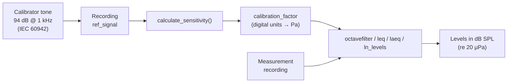

← [Documentation index](README.md)

# Calibration and dBFS

phonometry can return results in physical **Sound Pressure Level (dB SPL)** or
digital **decibels relative to Full Scale (dBFS)**.

## Why calibrate? The theory

A digital recording only knows *numbers*: a full-scale sine wave is ±1.0
regardless of whether it was a whisper or a jet engine. To report physical
sound pressure levels the chain microphone → preamplifier → ADC must be
characterized by a single number, the **sensitivity factor** S, that converts
digital units into pascals:

$$
p(t) = S \ x(t) \qquad
S = \frac{p_\text{ref} \cdot 10^{L_\text{cal}/20}}{\tilde{x}_\text{ref}}
$$

where $L_\text{cal}$ is the calibrator's level (typically 94 dB, i.e. 1 Pa),
$p_\text{ref} = 20\ \mu\text{Pa}$ and $\tilde{x}_\text{ref}$ is the RMS of
the recorded calibration tone in digital units. `calculate_sensitivity()` is
exactly that equation. The factor is valid as long as nothing in the chain
changes — touch the gain knob and you must recalibrate.

<picture><source media="(prefers-color-scheme: dark)" srcset="https://raw.githubusercontent.com/jmrplens/phonometry/main/.github/images/diagram_calibration_setup_dark.svg"></picture>

## Physical Calibration (Sound Level Meter)



To get accurate SPL measurements from a digital recording, you must first
calculate the sensitivity of your measurement chain using a reference tone
(e.g., 94 dB @ 1 kHz).

```python
from phonometry import octavefilter, calculate_sensitivity

# 1. Record your 94dB calibrator signal
# ref_signal = ... (your recording)

# 2. Calculate sensitivity factor
sensitivity = calculate_sensitivity(ref_signal, target_spl=94.0)

# 3. Apply calibration to your measurements
spl, freq = octavefilter(signal, fs, calibration_factor=sensitivity)
# Now 'spl' values are in real-world dB SPL!
```

The same `calibration_factor` works across the whole library: `octavefilter`,
`OctaveFilterBank`, `leq`, `laeq` and `ln_levels`.

## Calibrator assumptions (IEC 60942)

`calculate_sensitivity` assumes the reference recording comes from an acoustic
calibrator as specified by **IEC 60942** (classes LS, 1 and 2):

- The default `target_spl=94.0` matches the common 94 dB @ 1 kHz calibrator
  output (the standard requires the principal level to be at least 90 dB re
  20 µPa; 94 dB and 114 dB are the usual choices).
- The resulting sensitivity inherits the calibrator's class tolerance — e.g.
  ±0.4 dB for a class 1 calibrator between 160 Hz and 1.25 kHz (IEC 60942
  Table 1) — plus the RMS estimation error of your recording.
- IEC 60942 specifies the generated level as a 20 s average: record a few
  seconds of *stable* tone (excluding handling noise at the start/end) for the
  RMS estimate to converge.

### Automatic stability validation

When you pass the sample rate (and `validate=True`, the default),
`calculate_sensitivity(ref, fs=fs)` checks the recording the way
IEC 60942:2017 checks the calibrator itself (5.3.3): the *short-term level
fluctuation* — the absolute difference between each of the maximum and minimum
F-time-weighted levels and the mean level — must not exceed the Table 2 class 1
limit for the calibrator's nominal frequency (0.07 dB at and above 160 Hz, relaxed
to 0.10 dB below 160 Hz and 0.20 dB at or below 63 Hz, where the F
time-weighting itself ripples). Pass `frequency=` to select the right row for non-1 kHz
calibrators. A `CalibrationWarning` flags badly coupled microphones or handling
noise before they silently corrupt every calibrated level. The recording must
be at least 2 s long (1 s for the F-integrator to settle plus 1 s of settled
envelope); shorter recordings get a warning instead of an unreliable verdict.
Without `fs` the check is skipped. Override the limit with
`max_fluctuation_db` or disable with `validate=False`.

The check catches exactly what ruins field calibrations — a loose coupler,
wind, handling noise:

<picture><source media="(prefers-color-scheme: dark)" srcset="https://raw.githubusercontent.com/jmrplens/phonometry/main/.github/images/calibration_stability_dark.png"></picture>

### `calculate_sensitivity()` parameters

| Parameter | Type / shape | Units | Range / default | Notes |
| :--- | :--- | :--- | :--- | :--- |
| `ref_signal` | 1D/2D array | digital units | non-empty, non-silent | Recording of the calibration tone only (trim handling noise) |
| `target_spl` | float | dB re 20 µPa | default `94.0` | The calibrator's nominal level (114 dB calibrators: pass `114.0`) |
| `ref_pressure` | float | Pa | default `2e-5` | Reference pressure p₀; rarely changed |
| `fs` | int, optional | Hz | > 0; default `None` | Required for the stability validation; omit to skip it |
| `validate` | bool | — | default `True` | Emit `CalibrationWarning` on unstable/short recordings |
| `max_fluctuation_db` | float, optional | dB | default `None` → Table 2 class 1 | Explicit override of the stability limit |
| `frequency` | float | Hz | default `1000.0` | Calibrator's nominal frequency; selects the IEC 60942 Table 2 row |

Returns the sensitivity factor (float) to pass as `calibration_factor=` to
`octavefilter`, `leq`, `laeq`, `ln_levels`, `lc_peak`, `sel` and the dose
functions.

## Digital Analysis (dBFS)

If you are working with digital audio files (e.g., WAV, FLAC) and want to
analyze levels relative to Full Scale rather than physical pressure, you can use
the `dbfs=True` parameter.

In this mode:

* **0 dBFS** corresponds to a numeric signal level of 1.0 (RMS or Peak).
* `calibration_factor` does not apply (dBFS is relative to digital full scale).
* Useful for analyzing headroom, digital mastering, or normalized signals.

```python
# Assume 'signal' is normalized between -1.0 and 1.0
spl_dbfs, freq = octavefilter(signal, fs, dbfs=True)
# Results will be negative (e.g., -20 dBFS)
```

## RMS vs Peak Levels

phonometry supports two measurement modes to align with professional software
like BK:

- **RMS (`mode='rms'`)**: Energy-based level (standard).
- **Peak (`mode='peak'`)**: Absolute maximum value reached in the frame
  (Peak-holding).

```python
# Measure peak-holding levels for impact analysis
spl_peak, freq = octavefilter(signal, fs, mode='peak')
```

> [!NOTE]
> `mode='peak'` measures the absolute maximum of the **filtered** band signal,
> which includes the filter's onset transient (overshoot). Signals that start
> abruptly may read up to ~1 dB high. This is inherent to IIR band filters
> (an analog SLM behaves the same way), not a processing artifact.

## Integer audio input

Integer signals (e.g. int16 from `scipy.io.wavfile.read`) are converted to
float64 internally before any squaring, so calibration and level results are
identical whether you pass the raw integer array or a float conversion.
