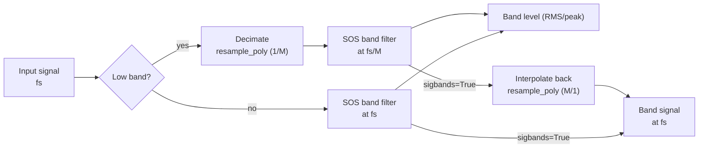

← [Documentation index](README.md)

# Theory: Signal Analysis

This page collects the theory behind the measurement chain itself: the standardized fractional-octave bands and the time-domain filter banks that implement them, the frequency weighting curves, time integration, level, event and exposure metrics, sound intensity, and the GUM uncertainty framework that underpins every measured quantity. It is part of the [theory reference](theory.md).

## Octave Band Frequencies (ANSI S1.11 / IEC 61260)

The mid-band frequencies (fm) and edges (f1, f2) use a base-10 ratio:

$$
G = 10^{0.3}
$$

**Mid-band:**

$$
f_m = 1000 \cdot G^{x/b}
$$

(for odd b)

**Band edges:**

$$
f_1 = f_m \cdot G^{-1/2b}, \quad f_2 = f_m \cdot G^{1/2b}
$$

## Frequency Resolution vs FFT Bin Spacing

`octave_filter` is a **time-domain fractional-octave filter bank**, not an FFT or
Welch spectrum estimator. Therefore, its result does not have a frequency
resolution in the `fs / nfft` sense.

For `fraction=3`, the output contains one scalar level per third-octave band.
The relevant frequency granularity is the standardized band definition: center
frequency, lower edge, and upper edge. Because fractional-octave bands are
logarithmically spaced, their absolute bandwidth in Hz grows with frequency
while their relative bandwidth remains approximately constant.

For example, with `fraction=3` and `limits=[12, 20000]`, the exact third-octave
band around 1 kHz is approximately:

| Nominal band | Lower edge | Center | Upper edge | Bandwidth |
| :--- | ---: | ---: | ---: | ---: |
| 1 kHz | 891.25 Hz | 1000.00 Hz | 1122.02 Hz | 230.77 Hz |

You can inspect the exact bands with:

```python
from phonometry import nominal_frequencies

fc, fl, fu, labels = nominal_frequencies(fraction=3, limits=[12, 20000])
for label, center, lower, upper in zip(labels, fc, fl, fu):
    print(label, center, lower, upper, upper - lower)
```

If you need narrowband FFT bins for tonal inspection, run Welch/FFT on the
original signal and use the phonometry band edges as masks:

```python
import numpy as np
from scipy import signal
from phonometry import octave_filter, nominal_frequencies

fs = 100_000
# any 1D pressure signal in Pa (synthesized here so the example runs)
pressure_signal_pa = 0.02 * np.random.default_rng(0).standard_normal(fs)
x = pressure_signal_pa

# Standardized third-octave levels from phonometry.
levels, centers = octave_filter(
    x,
    fs=fs,
    fraction=3,
    limits=[12, 20_000],
)

# Same standardized band definitions, including lower/upper edges.
fc, fl, fu, labels = nominal_frequencies(fraction=3, limits=[12, 20_000])

# Narrowband Welch estimate on the original signal.
nperseg = min(2**15, len(x))
freq_bins, psd = signal.welch(
    x,
    fs=fs,
    window="hann",
    nperseg=nperseg,
    noverlap=nperseg // 2,
    scaling="density",
)

# Example: list the Welch bins inside the third-octave band closest to 1 kHz.
band_index = int(np.argmin(np.abs(np.asarray(fc) - 1000.0)))
in_band = (freq_bins >= fl[band_index]) & (freq_bins <= fu[band_index])

print("Selected third-octave band:", labels[band_index])
print("Welch bin spacing:", freq_bins[1] - freq_bins[0], "Hz")
for f, pxx in zip(freq_bins[in_band], psd[in_band]):
    print(f, pxx)
```

This keeps the two concepts separate: phonometry gives standardized
fractional-octave levels, while Welch gives narrowband FFT bins. With
`fs=100000` and `nperseg=2**15`, the Welch bin spacing is about `3.05 Hz`.
Window choice and overlap affect leakage and averaging variance, but they do not
change the bin spacing of each FFT segment.

When `sigbands=True`, `octave_filter` can also return the time-domain waveform
filtered by each band. Applying Welch/FFT to one selected filtered waveform can
be useful as a diagnostic view of the content inside that filtered band, but it
does not recover FFT bins from the scalar band levels.

## Magnitude Responses |H(jw)|

The library implements standard classical filter prototypes:

**1. Butterworth:** Maximally flat passband.

$$
|H(j\omega)| = \frac{1}{\sqrt{1 + (\omega/\omega_c)^{2n}}}
$$

**2. Chebyshev I:** Equiripple in passband, steeper roll-off.

$$
|H(j\omega)| = \frac{1}{\sqrt{1 + \epsilon^2 T_n^2(\omega/\omega_c)}}
$$

**3. Chebyshev II:** Inverse Chebyshev, equiripple in stopband, flat passband.

$$
|H(j\omega)| = \frac{1}{\sqrt{1 + \frac{1}{\epsilon^2 T_n^2(\omega_{stop}/\omega)}}}
$$

**4. Elliptic:** Equiripple in both, maximum selectivity.

$$
|H(j\omega)| = \frac{1}{\sqrt{1 + \epsilon^2 R_n^2(\omega/\omega_c, L)}}
$$

**5. Bessel:** Maximally flat group delay (linear phase).

$$
H(s) = \frac{\theta_n(0)}{\theta_n(s/\omega_0)}
$$

(Where $\theta_n$ is the reverse Bessel polynomial)

### Band-edge placement

For every architecture the bank places the **−3 dB points on the band edges**.
Two cases need special handling:

- **Chebyshev II**: scipy's `Wn` is the *stopband* edge. phonometry maps the
  desired −3 dB edges to stopband edges analytically — the prototype transition
  ratio is $\cosh(\operatorname{acosh}(\sqrt{10^{A/10}-1})/N)$ — applying the
  lowpass→bandpass transform in the pre-warped bilinear domain so the mapping
  stays exact for decimated bands close to Nyquist.
- **Bessel**: designed with `norm="mag"`, which defines the −3 dB point exactly
  at `Wn` (the `phase` norm would shift the edges to roughly −10 dB).

## Filter Bank Design & Numerical Stability

To ensure **100% stability** across the entire audible spectrum (even at low
frequencies like 16 Hz with high sample rates), phonometry employs two
critical strategies:



1. **Second-Order Sections (SOS):** All filters are implemented as a series of
   cascaded biquads. This avoids the catastrophic numerical precision loss
   associated with high-order transfer functions (coefficients a, b).
2. **Multi-rate Decimation:** For low-frequency bands, the signal is
   automatically downsampled (decimated) before filtering and upsampled
   afterwards. This keeps the digital pole locations far from the unit circle
   boundary, preventing oscillation and noise. Chebyshev II banks reserve extra
   decimation headroom so their stopband edges stay below the decimated Nyquist.

## Weighting Curves (IEC 61672-1)

The A-weighting transfer function:

$$
R_A(f) = \frac{12194^2 \cdot f^4}{(f^2 + 20.6^2)\sqrt{(f^2 + 107.7^2)(f^2 + 737.9^2)}(f^2 + 12194^2)}
$$

$$
A(f) = 20 \log_{10}(R_A(f)) + 2.00
$$

The digital filter is obtained from the analog poles/zeros via the bilinear
transform. Because the bilinear transform compresses frequencies near Nyquist,
the default `high_accuracy` mode designs and runs the filter at an internally
oversampled rate (≥ 144 kHz) — see [Frequency Weighting](weighting.md).

## Time Integration

Implemented as a first-order IIR exponential integrator:

$$
y[n] = \alpha \cdot x^2[n] + (1 - \alpha) \cdot y[n-1]
$$

$$
\alpha = 1 - e^{-1 / (f_s \cdot \tau)}
$$

Where `tau` is the time constant (e.g., 125 ms for Fast).

The default initial condition is `y[-1] = 0`. Use `initial_state='first'` to
start from the first input energy, or pass a scalar/array with the previous
mean-square output state. See [Why phonometry](why-phonometry.md) for the
IEC 61672-1 tone-burst verification of this implementation.

## G-weighting (ISO 7196)

The G curve extends frequency weighting into the infrasound range. ISO 7196:1995 Table 1 (p. 2) defines it by four zeros at the origin and four complex-conjugate pole pairs, given as coordinates in Hz (multiplied by $2\pi$ to obtain rad/s):

$$
z_{1..4} = 0, \qquad
p = 2\pi \left\lbrace -0.707 \pm j0.707,\  -19.27 \pm j5.16,\  -14.11 \pm j14.11,\  -5.16 \pm j19.27 \right\rbrace \ \text{Hz}
$$

The gain $k$ is chosen so that the response is exactly **0 dB at 10 Hz** (clause 4):

$$
k = \left| \frac{\prod_i (j\omega_{10} - p_i)}{\prod_i (j\omega_{10} - z_i)} \right|, \qquad \omega_{10} = 2\pi \cdot 10 \ \text{rad/s}
$$

The four zeros against eight poles shape the characteristic response: a rise of approximately **+12 dB/octave between 1 Hz and 20 Hz**, with roll-offs of approximately **24 dB/octave** below 1 Hz and above 20 Hz. Infrasound needs its own curve because near the hearing threshold the perceived loudness of very-low-frequency tones grows much more steeply with sound pressure level than at mid frequencies — a small dB increase above threshold produces a large loudness jump — so the A curve (anchored at 1 kHz) grossly misrepresents infrasonic annoyance.

Since G acts on 0.25 Hz – 315 Hz, the plain bilinear transform is already exact there and the internal oversampling used for the A/C designs (whose action extends to 16 kHz) is not applied.

See the [Frequency Weighting guide](weighting.md) for usage.

## Event and dose metrics

**Sound exposure level** (SEL; LAE with A-weighting, IEC 61672-1:2013) normalizes the energy of a discrete event (aircraft flyover, train pass) to a 1 s reference duration:

$$
\mathrm{SEL} = L_{eq,T} + 10 \log_{10}\left(\frac{T}{T_0}\right), \qquad T_0 = 1\ \text{s}
$$

**Sound exposure** $E$ (IEC 61252, 3.1) is the time integral of the squared A-weighted sound pressure, expressed in pascal-squared hours:

$$
E = \int_0^T p_A^2(t)\ dt = \overline{p_A^2} \cdot T \quad [\text{Pa}^2\text{h}]
$$

When the recording is a representative sample of a longer shift, $E$ scales the measured mean square by the actual exposure duration. The **normalized 8 h level** (IEC 61252, 3.3) converts exposure to the steady level that carries the same energy over a nominal working day:

$$
L_{EX,8h} = 10 \log_{10}\left(\frac{E}{8\ \text{h} \cdot p_0^2}\right), \qquad p_0 = 20\ \mu\text{Pa}
$$

It is identical to $L_{EP,d}$ of Directive 86/188/EEC and $L_{EX,8h}$ of ISO 1999 (IEC 61252, 3.3 NOTES 5–6). The anchor of IEC 61252 (3.3 NOTE 4): an exposure of **3.2 Pa²h corresponds to $L_{EX,8h}$ of exactly 90 dB**.

**LCpeak** (IEC 61672-1:2013, subclause 5.13) is the absolute maximum of the C-weighted sound pressure expressed in dB, $L_{Cpeak} = 20\log_{10}(\max|p_C(t)|/p_0)$ — the quantity behind the 135/137/140 dB(C) occupational action limits. The implementation is verified against the one-cycle and half-cycle reference responses of Table 5.

See the [Levels guide](levels.md) for usage and the [Calibration guide](calibration.md) for absolute-scale setup.

## Sound intensity (IEC 61043)

Sound intensity is the time-averaged acoustic power flux $I = \overline{p u}$. The particle velocity follows from **Euler's equation** (linearized conservation of momentum):

$$
\rho_0 \frac{\partial u}{\partial t} = -\frac{\partial p}{\partial r}
$$

A p-p probe approximates the pressure gradient by the **finite difference** of two microphones a spacer distance $\Delta r$ apart (IEC 61043:1994, definition 3.2):

$$
p = \frac{p_1 + p_2}{2}, \qquad u = -\frac{1}{\rho_0 \Delta r} \int (p_2 - p_1)\ dt, \qquad I = \overline{p\ u}
$$

For stationary signals the same estimator has an exact frequency-domain form through the imaginary part of the one-sided **cross spectrum** $G_{12}$ of the two pressures — the implementation estimates it with Welch-averaged, Hann-windowed segments:

$$
I(f) = -\ \frac{\mathrm{Im}\lbrace G_{12}(f)\rbrace}{2 \pi f\ \rho_0\ \Delta r}
$$

The finite difference underestimates the true plane-wave intensity by the factor

$$
\frac{\sin(k \Delta r)}{k \Delta r}, \qquad k = \frac{2 \pi f}{c}
$$

— IEC 61043 clause 7.3 specifies the probe intensity response with exactly this argument and Table 3 tabulates it (e.g. −10.5 dB at 6.3 kHz for a 25 mm spacer). Below $f = 0.1 c / \Delta r$ (i.e. $k \Delta r$ under 0.63) the bias stays within about 0.3 dB; `bias_correction` provides the reciprocal factor per band and `max_valid_frequency` the bound.

The **pressure-intensity index** $\delta_{pI} = L_p - L_I$ measures how reactive the field is: in a free plane progressive wave it equals $10 \log_{10}(\rho_0 c / 400) = 0.14$ dB, while large values flag reactive or noisy fields in which the inter-channel phase error dominates. ISO 9614-1:1993 Annex A generalizes it over a measurement surface as the indicator F2 (with F3 for negative partial power and F4 for field non-uniformity), and the instrument's **dynamic capability** $L_d = \delta_{pI0} - K$ (pressure-residual intensity index minus the bias error factor: 10 dB for grades 1/2, 7 dB for grade 3) must exceed F2 for the measurement to be valid (criterion 1).

See the [Sound Intensity guide](intensity.md) for usage.

## Measurement uncertainty (ISO/IEC Guide 98-3 — GUM and Supplement 1)

Domain budgets like ISO 12999-1 and ISO 9612 Annex C are instances of the
general framework of the GUM (ISO/IEC Guide 98-3:2008). Given a measurement
model $y = f(x_1, \ldots, x_N)$, the law of propagation of uncertainty
(clause 5) combines the input standard uncertainties through sensitivity
coefficients:

$$
u_c^2(y) = \sum_{i=1}^{N} \left( \frac{\partial f}{\partial x_i} \right)^2 u^2(x_i),
$$

generalized to $(c \odot u)^{\top} r\ (c \odot u)$ for correlated inputs. The
sensitivities are obtained by central differences on the user's model callable
(step scaled to $10^{-3}$ of each input uncertainty), so no hand-derived
partials are needed. Type B inputs enter through the clause 4.3 half-width
rules: rectangular $a/\sqrt{3}$ (4.3.7), triangular $a/\sqrt{6}$ (4.3.9),
U-shaped $a/\sqrt{2}$. The expanded uncertainty $U = k\,u_c$ takes $k$ from
the t-distribution at the Welch–Satterthwaite effective degrees of freedom
(Annex G.4):

$$
\nu_{\mathrm{eff}} = \frac{u_c^4}{\sum_i u_i^4 / \nu_i}.
$$

**Supplement 1** (ISO/IEC Guide 98-3-1:2008) propagates the full distributions
instead: $10^6$ Monte Carlo draws (clause 6.4) through the same model give
$u(y)$ and the probabilistically symmetric coverage interval from the
$\frac{1}{2}(1 \mp p)$ fractiles (clause 7.7) — the route when the model is
non-linear or the output visibly non-Gaussian. The Guides' own examples are
reproduced: the four-term additive model gives $u_c = 2.0$ and the Monte Carlo
95 % interval $\pm 3.88$ of Supplement 1 clause 9.2/Table 3 (four rectangular
inputs — the output is nearly trapezoidal, not Gaussian, so the interval is
narrower than $\pm 1.96\,u$), and the GUM Annex H.1 end-gauge example gives
$k = t_{0.99}(\nu_{\mathrm{eff}} = 16) = 2.92$ and $U_{99} = 93$ nm.

See the [GUM Uncertainty guide](gum-uncertainty.md) for usage.
