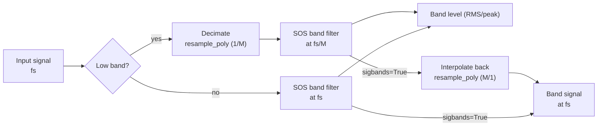

← [Documentation index](README.md)

# Theoretical Background

## Octave Band Frequencies (ANSI S1.11 / IEC 61260)

The mid-band frequencies (fm) and edges (f1, f2) use a base-10 ratio:

$$
G = 10^{0.3}
$$

**Mid-band:**

$$
f_m = 1000 \cdot G^{x/b}
$$

(for odd b)

**Band edges:**

$$
f_1 = f_m \cdot G^{-1/2b}, \quad f_2 = f_m \cdot G^{1/2b}
$$

## Frequency Resolution vs FFT Bin Spacing

`octavefilter` is a **time-domain fractional-octave filter bank**, not an FFT or
Welch spectrum estimator. Therefore, its result does not have a frequency
resolution in the `fs / nfft` sense.

For `fraction=3`, the output contains one scalar level per third-octave band.
The relevant frequency granularity is the standardized band definition: center
frequency, lower edge, and upper edge. Because fractional-octave bands are
logarithmically spaced, their absolute bandwidth in Hz grows with frequency
while their relative bandwidth remains approximately constant.

For example, with `fraction=3` and `limits=[12, 20000]`, the exact third-octave
band around 1 kHz is approximately:

| Nominal band | Lower edge | Center | Upper edge | Bandwidth |
| :--- | ---: | ---: | ---: | ---: |
| 1 kHz | 891.25 Hz | 1000.00 Hz | 1122.02 Hz | 230.77 Hz |

You can inspect the exact bands with:

```python
from phonometry import getansifrequencies

fc, fl, fu, labels = getansifrequencies(fraction=3, limits=[12, 20000])
for label, center, lower, upper in zip(labels, fc, fl, fu):
    print(label, center, lower, upper, upper - lower)
```

If you need narrowband FFT bins for tonal inspection, run Welch/FFT on the
original signal and use the phonometry band edges as masks:

```python
import numpy as np
from scipy import signal
from phonometry import octavefilter, getansifrequencies

fs = 100_000
x = pressure_signal_pa  # 1D pressure signal in Pa

# Standardized third-octave levels from phonometry.
levels, centers = octavefilter(
    x,
    fs=fs,
    fraction=3,
    limits=[12, 20_000],
)

# Same standardized band definitions, including lower/upper edges.
fc, fl, fu, labels = getansifrequencies(fraction=3, limits=[12, 20_000])

# Narrowband Welch estimate on the original signal.
nperseg = min(2**15, len(x))
freq_bins, psd = signal.welch(
    x,
    fs=fs,
    window="hann",
    nperseg=nperseg,
    noverlap=nperseg // 2,
    scaling="density",
)

# Example: list the Welch bins inside the third-octave band closest to 1 kHz.
band_index = int(np.argmin(np.abs(np.asarray(fc) - 1000.0)))
in_band = (freq_bins >= fl[band_index]) & (freq_bins <= fu[band_index])

print("Selected third-octave band:", labels[band_index])
print("Welch bin spacing:", freq_bins[1] - freq_bins[0], "Hz")
for f, pxx in zip(freq_bins[in_band], psd[in_band]):
    print(f, pxx)
```

This keeps the two concepts separate: phonometry gives standardized
fractional-octave levels, while Welch gives narrowband FFT bins. With
`fs=100000` and `nperseg=2**15`, the Welch bin spacing is about `3.05 Hz`.
Window choice and overlap affect leakage and averaging variance, but they do not
change the bin spacing of each FFT segment.

When `sigbands=True`, `octavefilter` can also return the time-domain waveform
filtered by each band. Applying Welch/FFT to one selected filtered waveform can
be useful as a diagnostic view of the content inside that filtered band, but it
does not recover FFT bins from the scalar band levels.

## Magnitude Responses |H(jw)|

The library implements standard classical filter prototypes:

**1. Butterworth:** Maximally flat passband.

$$
|H(j\omega)| = \frac{1}{\sqrt{1 + (\omega/\omega_c)^{2n}}}
$$

**2. Chebyshev I:** Equiripple in passband, steeper roll-off.

$$
|H(j\omega)| = \frac{1}{\sqrt{1 + \epsilon^2 T_n^2(\omega/\omega_c)}}
$$

**3. Chebyshev II:** Inverse Chebyshev, equiripple in stopband, flat passband.

$$
|H(j\omega)| = \frac{1}{\sqrt{1 + \frac{1}{\epsilon^2 T_n^2(\omega_{stop}/\omega)}}}
$$

**4. Elliptic:** Equiripple in both, maximum selectivity.

$$
|H(j\omega)| = \frac{1}{\sqrt{1 + \epsilon^2 R_n^2(\omega/\omega_c, L)}}
$$

**5. Bessel:** Maximally flat group delay (linear phase).

$$
H(s) = \frac{\theta_n(0)}{\theta_n(s/\omega_0)}
$$

(Where $\theta_n$ is the reverse Bessel polynomial)

### Band-edge placement

For every architecture the bank places the **−3 dB points on the band edges**.
Two cases need special handling:

- **Chebyshev II**: scipy's `Wn` is the *stopband* edge. phonometry maps the
  desired −3 dB edges to stopband edges analytically — the prototype transition
  ratio is $\cosh(\operatorname{acosh}(\sqrt{10^{A/10}-1})/N)$ — applying the
  lowpass→bandpass transform in the pre-warped bilinear domain so the mapping
  stays exact for decimated bands close to Nyquist.
- **Bessel**: designed with `norm="mag"`, which defines the −3 dB point exactly
  at `Wn` (the `phase` norm would shift the edges to roughly −10 dB).

## Filter Bank Design & Numerical Stability

To ensure **100% stability** across the entire audible spectrum (even at low
frequencies like 16 Hz with high sample rates), phonometry employs two
critical strategies:



1. **Second-Order Sections (SOS):** All filters are implemented as a series of
   cascaded biquads. This avoids the catastrophic numerical precision loss
   associated with high-order transfer functions (coefficients a, b).
2. **Multi-rate Decimation:** For low-frequency bands, the signal is
   automatically downsampled (decimated) before filtering and upsampled
   afterwards. This keeps the digital pole locations far from the unit circle
   boundary, preventing oscillation and noise. Chebyshev II banks reserve extra
   decimation headroom so their stopband edges stay below the decimated Nyquist.

## Weighting Curves (IEC 61672-1)

The A-weighting transfer function:

$$
R_A(f) = \frac{12194^2 \cdot f^4}{(f^2 + 20.6^2)\sqrt{(f^2 + 107.7^2)(f^2 + 737.9^2)}(f^2 + 12194^2)}
$$

$$
A(f) = 20 \log_{10}(R_A(f)) + 2.00
$$

The digital filter is obtained from the analog poles/zeros via the bilinear
transform. Because the bilinear transform compresses frequencies near Nyquist,
the default `high_accuracy` mode designs and runs the filter at an internally
oversampled rate (≥ 96 kHz) — see [Frequency Weighting](weighting.md).

## Time Integration

Implemented as a first-order IIR exponential integrator:

$$
y[n] = \alpha \cdot x^2[n] + (1 - \alpha) \cdot y[n-1]
$$

$$
\alpha = 1 - e^{-1 / (f_s \cdot \tau)}
$$

Where `tau` is the time constant (e.g., 125 ms for Fast).

The default initial condition is `y[-1] = 0`. Use `initial_state='first'` to
start from the first input energy, or pass a scalar/array with the previous
mean-square output state. See [Why phonometry](why-phonometry.md) for the
IEC 61672-1 tone-burst verification of this implementation.

## G-weighting (ISO 7196)

The G curve extends frequency weighting into the infrasound range. ISO 7196:1995 Table 1 (p. 2) defines it by four zeros at the origin and four complex-conjugate pole pairs, given as coordinates in Hz (multiplied by $2\pi$ to obtain rad/s):

$$
z_{1..4} = 0, \qquad
p = 2\pi \left\{ -0.707 \pm j0.707,\; -19.27 \pm j5.16,\; -14.11 \pm j14.11,\; -5.16 \pm j19.27 \right\} \ \text{Hz}
$$

The gain $k$ is chosen so that the response is exactly **0 dB at 10 Hz** (clause 4):

$$
k = \left| \frac{\prod_i (j\omega_{10} - p_i)}{\prod_i (j\omega_{10} - z_i)} \right|, \qquad \omega_{10} = 2\pi \cdot 10 \ \text{rad/s}
$$

The four zeros against eight poles shape the characteristic response: a rise of approximately **+12 dB/octave between 1 Hz and 20 Hz**, with roll-offs of approximately **24 dB/octave** below 1 Hz and above 20 Hz. Infrasound needs its own curve because near the hearing threshold the perceived loudness of very-low-frequency tones grows much more steeply with sound pressure level than at mid frequencies — a small dB increase above threshold produces a large loudness jump — so the A curve (anchored at 1 kHz) grossly misrepresents infrasonic annoyance.

Since G acts on 0.25 Hz – 315 Hz, the plain bilinear transform is already exact there and the internal oversampling used for the A/C designs (whose action extends to 16 kHz) is not applied.

See the [Frequency Weighting guide](weighting.md) for usage.

## Equal-loudness contours (ISO 226:2023)

A tone has a *loudness level* of $L_N$ phon when it is judged equally loud as a 1 kHz pure tone at $L_N$ dB SPL. ISO 226:2023 Formula (1) (clause 4.1, p. 2) gives the SPL of a pure tone at frequency $f$ that reaches loudness level $L_N$:

$$
L_f = \frac{10}{\alpha_f} \log_{10}\!\left[ \left(4 \cdot 10^{-10}\right)^{0.3 - \alpha_f} \left( 10^{\,0.03 L_N} - 10^{\,0.072} \right) + 10^{\,\alpha_f (T_f + L_U)/10} \right] - L_U
$$

Formula (2) (clause 4.2) inverts it, returning the loudness level of a tone at SPL $L_f$:

$$
L_N = \frac{100}{3} \log_{10}\!\left[ \frac{10^{\,\alpha_f (L_f + L_U)/10} - 10^{\,\alpha_f (T_f + L_U)/10}}{\left(4 \cdot 10^{-10}\right)^{0.3 - \alpha_f}} + 10^{\,0.072} \right]
$$

The three parameters come from Table 1 (p. 4), tabulated at the 29 preferred third-octave frequencies of ISO 266 from 20 Hz to 12.5 kHz:

- $\alpha_f$ — exponent for loudness perception at frequency $f$,
- $L_U$ — magnitude of the linear transfer function, normalized at 1 kHz ($L_U = 0$ at 1 kHz),
- $T_f$ — threshold of hearing at $f$, in dB.

The standard specifies **no interpolation** between the tabulated frequencies. Formula (1) is specified for **20 phon to 90 phon** between 20 Hz and 4 kHz, and only up to **80 phon between 5 kHz and 12.5 kHz** — above 80 phon the contour therefore stops at 4 kHz. Values outside these limits from Formula (2) are extrapolations the standard labels as informative only.

See the [Levels guide](levels.md) for usage.

## Tone prominence: TNR and PR (ECMA-418-1)

Both methods operate on a Hann-windowed, RMS-averaged power spectrum (clauses 11.1 / 12.1) and use the clause 10 critical-band model. The critical bandwidth centred on a tone at $f$ is (Formula 2):

$$
\Delta f_c = 25.0 + 75.0 \left(1.0 + 1.4 \left(\tfrac{f}{1000}\right)^2\right)^{0.69} \ \text{Hz}
$$

Band edges are placed **arithmetically** for $f \le 500$ Hz (Formulae 4–5): $f_{1,2} = f \mp \Delta f_c / 2$, and **geometrically** above (Formulae 7–8): $f_1 = -\Delta f_c/2 + \sqrt{\Delta f_c^2 + 4 f^2}/2$, $f_2 = f_1 + \Delta f_c$.

**TNR** (clause 11). The tone band spans the spectral minima on both sides of the peak within 15 % of $\Delta f_c$ (clause 11.2). The tone power subtracts the straight line connecting the band-edge bins (Formula 9): over $N$ tone-band bins, $P_t = \sum_k P_k - (P_{\text{lo}} + P_{\text{hi}})\,N/2$. The masking-noise power is the remaining critical-band power rescaled to the full critical bandwidth (Formula 10): $P_n = (P_{\text{band}} - P_t) \cdot \Delta f_c / \Delta f_{\text{band}}$, and $\mathrm{TNR} = 10\log_{10}(P_t/P_n)$ (Formula 11). The prominence criterion (Formulae 12–13) is

$$
\mathrm{TNR}_{\text{crit}} = \begin{cases} 8.0 + 8.33 \log_{10}(1000/f_t) \ \text{dB} & f_t < 1\,\text{kHz} \\ 8.0 \ \text{dB} & f_t \ge 1\,\text{kHz} \end{cases}
$$

**PR** (clause 12) compares the level of the critical band centred on the tone, $L_M$, with the mean power of the two **contiguous** critical bands $L_L$, $L_U$ (edges from the fitted Formulae 21–22 with Tables 2–3): $\mathrm{PR} = 10\log_{10} P_M - 10\log_{10}\left[(P_L + P_U)/2\right]$ (Formula 23). For $f_t \le 171.4$ Hz the lower band is truncated at 20 Hz and its power rescaled to a **100 Hz bandwidth** (Formula 24). The criterion (Formulae 25–26) is 9.0 dB at $f_t \ge 1$ kHz, rising as $9.0 + 10.0\log_{10}(1000/f_t)$ below. Tones are assessed within the 89.1 Hz – 11.2 kHz range of interest (clauses 11.5 / 12.6).

See the [Levels guide](levels.md) for usage.

## Event and dose metrics

**Sound exposure level** (SEL; LAE with A-weighting, IEC 61672-1:2013) normalizes the energy of a discrete event (aircraft flyover, train pass) to a 1 s reference duration:

$$
\mathrm{SEL} = L_{eq,T} + 10 \log_{10}\!\left(\frac{T}{T_0}\right), \qquad T_0 = 1\ \text{s}
$$

**Sound exposure** $E$ (IEC 61252, 3.1) is the time integral of the squared A-weighted sound pressure, expressed in pascal-squared hours:

$$
E = \int_0^T p_A^2(t)\, dt = \overline{p_A^2} \cdot T \quad [\text{Pa}^2\text{h}]
$$

When the recording is a representative sample of a longer shift, $E$ scales the measured mean square by the actual exposure duration. The **normalized 8 h level** (IEC 61252, 3.3) converts exposure to the steady level that carries the same energy over a nominal working day:

$$
L_{EX,8h} = 10 \log_{10}\!\left(\frac{E}{8\ \text{h} \cdot p_0^2}\right), \qquad p_0 = 20\ \mu\text{Pa}
$$

It is identical to $L_{EP,d}$ of Directive 86/188/EEC and $L_{EX,8h}$ of ISO 1999 (BS EN 61252:1995, 3.3 NOTES 5–6). The anchor of BS EN 61252:1995 (3.3 NOTE 4): an exposure of **3.2 Pa²h corresponds to $L_{EX,8h}$ of exactly 90 dB**.

**LCpeak** (IEC 61672-1:2013, subclause 5.13) is the absolute maximum of the C-weighted sound pressure expressed in dB, $L_{Cpeak} = 20\log_{10}(\max|p_C(t)|/p_0)$ — the quantity behind the 135/137/140 dB(C) occupational action limits. The implementation is verified against the one-cycle and half-cycle reference responses of Table 5.

See the [Levels guide](levels.md) for usage and the [Calibration guide](calibration.md) for absolute-scale setup.

## Environmental descriptors (ISO 1996-1)

The **day-evening-night level** $L_{den}$ (ISO 1996-1:2016, 3.6.4) is an energy average over the 24 h day with penalty weightings of **+5 dB for the evening** and **+10 dB for the night**:

$$
L_{den} = 10 \log_{10}\!\left\{\frac{1}{24}\left[ t_d\, 10^{0.1 L_{day}} + t_e\, 10^{0.1 (L_{evening} + 5)} + t_n\, 10^{0.1 (L_{night} + 10)} \right]\right\}
$$

with default period durations $(t_d, t_e, t_n) = (12, 4, 8)$ h — countries may define the periods differently (3.6.4 Note 1). The **day-night level** $L_{dn}$ (3.6.5) drops the evening period:

$$
L_{dn} = 10 \log_{10}\!\left\{\frac{1}{24}\left[ t_d\, 10^{0.1 L_{day}} + t_n\, 10^{0.1 (L_{night} + 10)} \right]\right\}, \qquad (t_d, t_n) = (15, 9)\ \text{h}
$$

Both are special cases of the **composite whole-day rating level** (6.5, generalizing Formulae 5–6), where each period $i$ contributes its rating level $L_i$ plus an adjustment $K_i$, weighted by its share of the day:

$$
L_R = 10 \log_{10}\!\left[ \sum_i \frac{h_i}{24}\, 10^{0.1 (L_i + K_i)} \right], \qquad \sum_i h_i = 24\ \text{h}
$$

The adjustments $K_i$ cover time-of-day penalties (ISO 1996-1 Table A.1: evening 5 dB, night 10 dB) as well as source-character adjustments — e.g. tonal penalties, which the ECMA-418-1 TNR/PR assessments can justify objectively.

See the [Levels guide](levels.md) for usage.
