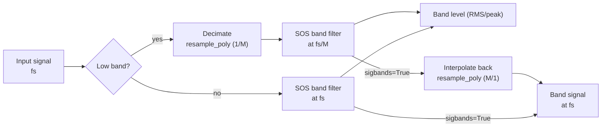

← [Documentation index](README.md)

# Theoretical Background

## Octave Band Frequencies (ANSI S1.11 / IEC 61260)

The mid-band frequencies (fm) and edges (f1, f2) use a base-10 ratio:

$$
G = 10^{0.3}
$$

**Mid-band:**

$$
f_m = 1000 \cdot G^{x/b}
$$

(for odd b)

**Band edges:**

$$
f_1 = f_m \cdot G^{-1/2b}, \quad f_2 = f_m \cdot G^{1/2b}
$$

## Frequency Resolution vs FFT Bin Spacing

`octavefilter` is a **time-domain fractional-octave filter bank**, not an FFT or
Welch spectrum estimator. Therefore, its result does not have a frequency
resolution in the `fs / nfft` sense.

For `fraction=3`, the output contains one scalar level per third-octave band.
The relevant frequency granularity is the standardized band definition: center
frequency, lower edge, and upper edge. Because fractional-octave bands are
logarithmically spaced, their absolute bandwidth in Hz grows with frequency
while their relative bandwidth remains approximately constant.

For example, with `fraction=3` and `limits=[12, 20000]`, the exact third-octave
band around 1 kHz is approximately:

| Nominal band | Lower edge | Center | Upper edge | Bandwidth |
| :--- | ---: | ---: | ---: | ---: |
| 1 kHz | 891.25 Hz | 1000.00 Hz | 1122.02 Hz | 230.77 Hz |

You can inspect the exact bands with:

```python
from phonometry import getansifrequencies

fc, fl, fu, labels = getansifrequencies(fraction=3, limits=[12, 20000])
for label, center, lower, upper in zip(labels, fc, fl, fu):
    print(label, center, lower, upper, upper - lower)
```

If you need narrowband FFT bins for tonal inspection, run Welch/FFT on the
original signal and use the phonometry band edges as masks:

```python
import numpy as np
from scipy import signal
from phonometry import octavefilter, getansifrequencies

fs = 100_000
x = pressure_signal_pa  # 1D pressure signal in Pa

# Standardized third-octave levels from phonometry.
levels, centers = octavefilter(
    x,
    fs=fs,
    fraction=3,
    limits=[12, 20_000],
)

# Same standardized band definitions, including lower/upper edges.
fc, fl, fu, labels = getansifrequencies(fraction=3, limits=[12, 20_000])

# Narrowband Welch estimate on the original signal.
nperseg = min(2**15, len(x))
freq_bins, psd = signal.welch(
    x,
    fs=fs,
    window="hann",
    nperseg=nperseg,
    noverlap=nperseg // 2,
    scaling="density",
)

# Example: list the Welch bins inside the third-octave band closest to 1 kHz.
band_index = int(np.argmin(np.abs(np.asarray(fc) - 1000.0)))
in_band = (freq_bins >= fl[band_index]) & (freq_bins <= fu[band_index])

print("Selected third-octave band:", labels[band_index])
print("Welch bin spacing:", freq_bins[1] - freq_bins[0], "Hz")
for f, pxx in zip(freq_bins[in_band], psd[in_band]):
    print(f, pxx)
```

This keeps the two concepts separate: phonometry gives standardized
fractional-octave levels, while Welch gives narrowband FFT bins. With
`fs=100000` and `nperseg=2**15`, the Welch bin spacing is about `3.05 Hz`.
Window choice and overlap affect leakage and averaging variance, but they do not
change the bin spacing of each FFT segment.

When `sigbands=True`, `octavefilter` can also return the time-domain waveform
filtered by each band. Applying Welch/FFT to one selected filtered waveform can
be useful as a diagnostic view of the content inside that filtered band, but it
does not recover FFT bins from the scalar band levels.

## Magnitude Responses |H(jw)|

The library implements standard classical filter prototypes:

**1. Butterworth:** Maximally flat passband.

$$
|H(j\omega)| = \frac{1}{\sqrt{1 + (\omega/\omega_c)^{2n}}}
$$

**2. Chebyshev I:** Equiripple in passband, steeper roll-off.

$$
|H(j\omega)| = \frac{1}{\sqrt{1 + \epsilon^2 T_n^2(\omega/\omega_c)}}
$$

**3. Chebyshev II:** Inverse Chebyshev, equiripple in stopband, flat passband.

$$
|H(j\omega)| = \frac{1}{\sqrt{1 + \frac{1}{\epsilon^2 T_n^2(\omega_{stop}/\omega)}}}
$$

**4. Elliptic:** Equiripple in both, maximum selectivity.

$$
|H(j\omega)| = \frac{1}{\sqrt{1 + \epsilon^2 R_n^2(\omega/\omega_c, L)}}
$$

**5. Bessel:** Maximally flat group delay (linear phase).

$$
H(s) = \frac{\theta_n(0)}{\theta_n(s/\omega_0)}
$$

(Where $\theta_n$ is the reverse Bessel polynomial)

### Band-edge placement

For every architecture the bank places the **−3 dB points on the band edges**.
Two cases need special handling:

- **Chebyshev II**: scipy's `Wn` is the *stopband* edge. phonometry maps the
  desired −3 dB edges to stopband edges analytically — the prototype transition
  ratio is $\cosh(\operatorname{acosh}(\sqrt{10^{A/10}-1})/N)$ — applying the
  lowpass→bandpass transform in the pre-warped bilinear domain so the mapping
  stays exact for decimated bands close to Nyquist.
- **Bessel**: designed with `norm="mag"`, which defines the −3 dB point exactly
  at `Wn` (the `phase` norm would shift the edges to roughly −10 dB).

## Filter Bank Design & Numerical Stability

To ensure **100% stability** across the entire audible spectrum (even at low
frequencies like 16 Hz with high sample rates), phonometry employs two
critical strategies:



1. **Second-Order Sections (SOS):** All filters are implemented as a series of
   cascaded biquads. This avoids the catastrophic numerical precision loss
   associated with high-order transfer functions (coefficients a, b).
2. **Multi-rate Decimation:** For low-frequency bands, the signal is
   automatically downsampled (decimated) before filtering and upsampled
   afterwards. This keeps the digital pole locations far from the unit circle
   boundary, preventing oscillation and noise. Chebyshev II banks reserve extra
   decimation headroom so their stopband edges stay below the decimated Nyquist.

## Weighting Curves (IEC 61672-1)

The A-weighting transfer function:

$$
R_A(f) = \frac{12194^2 \cdot f^4}{(f^2 + 20.6^2)\sqrt{(f^2 + 107.7^2)(f^2 + 737.9^2)}(f^2 + 12194^2)}
$$

$$
A(f) = 20 \log_{10}(R_A(f)) + 2.00
$$

The digital filter is obtained from the analog poles/zeros via the bilinear
transform. Because the bilinear transform compresses frequencies near Nyquist,
the default `high_accuracy` mode designs and runs the filter at an internally
oversampled rate (≥ 96 kHz) — see [Frequency Weighting](weighting.md).

## Time Integration

Implemented as a first-order IIR exponential integrator:

$$
y[n] = \alpha \cdot x^2[n] + (1 - \alpha) \cdot y[n-1]
$$

$$
\alpha = 1 - e^{-1 / (f_s \cdot \tau)}
$$

Where `tau` is the time constant (e.g., 125 ms for Fast).

The default initial condition is `y[-1] = 0`. Use `initial_state='first'` to
start from the first input energy, or pass a scalar/array with the previous
mean-square output state. See [Why phonometry](why-phonometry.md) for the
IEC 61672-1 tone-burst verification of this implementation.
