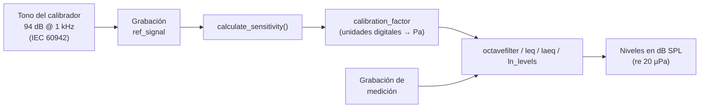

phonometry puede devolver resultados en **nivel de presión sonora físico
(dB SPL)** o en **decibelios relativos a fondo de escala digital (dBFS)**.

## Calibración física (sonómetro)



Para obtener mediciones SPL precisas a partir de una grabación digital, primero
debes calcular la sensibilidad de tu cadena de medición usando un tono de
referencia (p. ej. 94 dB @ 1 kHz).

```python
from phonometry import octavefilter, calculate_sensitivity

# 1. Graba la señal de tu calibrador de 94 dB
# ref_signal = ... (tu grabación)

# 2. Calcula el factor de sensibilidad
sensitivity = calculate_sensitivity(ref_signal, target_spl=94.0)

# 3. Aplica la calibración a tus mediciones
spl, freq = octavefilter(signal, fs, calibration_factor=sensitivity)
# ¡Ahora los valores de 'spl' son dB SPL reales!
```

El mismo `calibration_factor` funciona en toda la librería: `octavefilter`,
`OctaveFilterBank`, `leq`, `laeq` y `ln_levels`.

## Supuestos del calibrador (IEC 60942)

`calculate_sensitivity` asume que la grabación de referencia procede de un
calibrador acústico según **IEC 60942** (clases LS, 1 y 2):

- El `target_spl=94.0` por defecto corresponde a la salida habitual de 94 dB
  @ 1 kHz (la norma exige que el nivel principal sea al menos 90 dB re 20 µPa;
  94 dB y 114 dB son los valores usuales).
- La sensibilidad resultante hereda la tolerancia de clase del calibrador —
  p. ej. ±0,4 dB para clase 1 entre 160 Hz y 1,25 kHz (IEC 60942, Tabla 1) —
  más el error de estimación RMS de tu grabación.
- IEC 60942 especifica el nivel generado como promedio de 20 s: graba unos
  segundos de tono *estable* (excluyendo el ruido de manipulación del
  principio y el final) para que la estimación RMS converja.

### Validación automática de estabilidad

Si pasas la frecuencia de muestreo (y `validate=True`, el valor por defecto),
`calculate_sensitivity(ref, fs=fs)` comprueba la grabación igual que la
IEC 60942 comprueba el calibrador: la *fluctuación de nivel a corto plazo* —
la mitad de la diferencia entre los niveles máximo y mínimo con ponderación
temporal F — no debe superar 0,10 dB (límite de clase 1 de la Tabla 1). Un
`CalibrationWarning` delata micrófonos mal acoplados o ruido de manipulación
antes de que corrompan silenciosamente todos los niveles calibrados. La
grabación debe durar al menos 2 s (1 s para que el integrador F se asiente más
1 s de envolvente estable); con grabaciones más cortas se avisa en lugar de dar
un veredicto poco fiable. Sin `fs` la comprobación se omite. Ajusta con
`max_fluctuation_db` o desactiva con `validate=False`.

## Análisis digital (dBFS)

Si trabajas con archivos de audio digital (WAV, FLAC…) y quieres analizar
niveles relativos al fondo de escala en lugar de presión física, usa el
parámetro `dbfs=True`.

En este modo:

* **0 dBFS** corresponde a un nivel numérico de señal de 1.0 (RMS o pico).
* `calibration_factor` no aplica (dBFS es relativo al fondo de escala digital).
* Útil para analizar headroom, mastering digital o señales normalizadas.

```python
# Suponiendo que 'signal' está normalizada entre -1.0 y 1.0
spl_dbfs, freq = octavefilter(signal, fs, dbfs=True)
# Los resultados serán negativos (p. ej. -20 dBFS)
```

## RMS vs niveles de pico

phonometry admite dos modos de medición, alineados con software profesional
como BK:

- **RMS (`mode='rms'`)**: nivel energético (estándar).
- **Pico (`mode='peak'`)**: máximo absoluto alcanzado en el frame (peak-holding).

```python
# Medir niveles de pico para análisis de impactos
spl_peak, freq = octavefilter(signal, fs, mode='peak')
```

:::note
`mode='peak'` mide el máximo absoluto de la señal de banda **filtrada**, que
incluye el transitorio de arranque del filtro (sobreimpulso). Las señales que
empiezan de forma abrupta pueden leer hasta ~1 dB de más. Es inherente a los
filtros de banda IIR (un sonómetro analógico se comporta igual), no un artefacto
del procesado.
:::

## Entrada de audio entero

Las señales enteras (p. ej. int16 de `scipy.io.wavfile.read`) se convierten
internamente a float64 antes de cualquier elevación al cuadrado, así que la
calibración y los niveles son idénticos tanto si pasas el array entero crudo
como una conversión a float.
