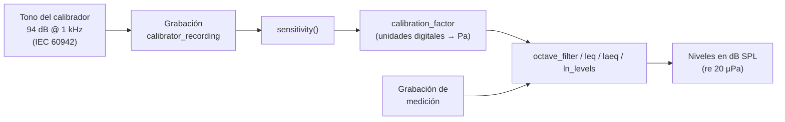

phonometry puede devolver resultados en **nivel de presión sonora físico
(dB SPL)** o en **decibelios relativos a fondo de escala digital (dBFS)**.


## ¿Por qué calibrar? La teoría

Una grabación digital solo conoce *números*: una senoide a fondo de escala es
±1,0 tanto si era un susurro como un motor a reacción. Para expresar niveles
de presión sonora físicos, la cadena micrófono → preamplificador → ADC debe
caracterizarse con un único número, el **factor de sensibilidad** $S$, que
convierte unidades digitales en pascales:

$$
p(t) = S\ x(t) \qquad S = \frac{p_\text{ref}\cdot 10^{L_\text{cal}/20}}{\tilde{x}_\text{ref}}
$$

donde $L_\text{cal}$ es el nivel del calibrador (típicamente 94 dB, es decir,
1 Pa), $p_\text{ref} = 20\ \mu\text{Pa}$ y $\tilde{x}_\text{ref}$ es el RMS
del tono de calibración grabado, en unidades digitales.
`sensitivity()` es exactamente esa ecuación. El factor vale mientras
nada cambie en la cadena — si tocas la ganancia, recalibra.


## Calibración física (sonómetro)



Para obtener mediciones SPL precisas a partir de una grabación digital, primero
debes calcular la sensibilidad de tu cadena de medición usando un tono de
referencia (p. ej. 94 dB @ 1 kHz).

```python
import numpy as np
from phonometry import octave_filter, sensitivity

# 1. Graba la señal de tu calibrador de 94 dB (1 kHz, 1 Pa RMS = 94 dB SPL)
fs = 48000
# calibrator_recording: tu tono de calibrador de 1 kHz grabado (1 Pa RMS = 94 dB SPL).
#   Sintetizado aquí para que la guía funcione; en una medición real graba tu calibrador.
calibrator_recording = np.sqrt(2) * np.sin(2 * np.pi * 1000 * np.arange(fs) / fs)
# recording: la captura de micrófono que quieres calibrar, misma cadena de entrada (Pa tras calibrar).
#   Sintetizada aquí; en una medición real es tu señal grabada.
recording = 0.2 * np.sin(2 * np.pi * 1000 * np.arange(fs) / fs)

# 2. Calcula el factor de sensibilidad
calibration_factor = sensitivity(calibrator_recording, target_spl=94.0, fs=fs)

# 3. Aplica la calibración a tus mediciones
spl, freq = octave_filter(recording, fs, calibration_factor=calibration_factor)
# ¡Ahora los valores de 'spl' son dB SPL reales!
```

El mismo `calibration_factor` funciona en toda la librería: `octave_filter`,
`OctaveFilterBank`, `leq`, `laeq` y `ln_levels`.

## Supuestos del calibrador (IEC 60942)

`sensitivity` asume que la grabación de referencia procede de un
calibrador acústico según **IEC 60942** (clases LS, 1 y 2):

- El `target_spl=94.0` por defecto corresponde a la salida habitual de 94 dB
  @ 1 kHz (la norma exige que el nivel principal sea al menos 90 dB re 20 µPa;
  94 dB y 114 dB son los valores usuales).
- La sensibilidad resultante hereda la tolerancia de clase del calibrador —
  p. ej. ±0,4 dB para clase 1 entre 160 Hz y 1,25 kHz (IEC 60942, Tabla 1) —
  más el error de estimación RMS de tu grabación.
- IEC 60942 especifica el nivel generado como promedio de 20 s: graba unos
  segundos de tono *estable* (excluyendo el ruido de manipulación del
  principio y el final) para que la estimación RMS converja.

### Validación automática de estabilidad

Si pasas la frecuencia de muestreo (y `validate=True`, el valor por defecto),
`sensitivity(ref, fs=fs)` comprueba la grabación igual que la
IEC 60942:2017 comprueba el calibrador (5.3.3): la *fluctuación de nivel a
corto plazo* — el valor absoluto de la diferencia entre cada uno de los niveles
máximo y mínimo con ponderación temporal F y el nivel medio — no debe superar
el límite de clase 1 de la Tabla 2 para la frecuencia nominal del calibrador
(0,07 dB desde 160 Hz, relajado a 0,10 dB por debajo de 160 Hz y a 0,20 dB por
debajo de 63 Hz, donde la propia ponderación F ondula). Pasa `frequency=` para
seleccionar la fila correcta en calibradores que no sean de 1 kHz. Un
`CalibrationWarning` delata micrófonos mal acoplados o ruido de manipulación
antes de que corrompan silenciosamente todos los niveles calibrados. La
grabación debe durar al menos 2 s (1 s para que el integrador F se asiente más
1 s de envolvente estable); con grabaciones más cortas se avisa en lugar de dar
un veredicto poco fiable. Sin `fs` la comprobación se omite. Sobrescribe el
límite con `max_fluctuation_db` o desactiva con `validate=False`.

La comprobación caza justo lo que arruina las calibraciones de campo — un acoplador flojo,
viento, ruido de manipulación:


<details>
<summary>Mostrar el código de esta figura</summary>

```python
import matplotlib.pyplot as plt
import numpy as np
from phonometry import time_weighting

fs = 48000
t = np.arange(int(fs * 6.0)) / fs
stable = 0.5 * np.sin(2 * np.pi * 1000 * t)
# Modulación de amplitud del 3 % a 2 Hz: ~0,14 dB de oscilación, fuera de límite
unstable = stable * (1 + 0.03 * np.sin(2 * np.pi * 2.0 * t))

plt.figure(figsize=(9, 5))
skip = fs                # descartamos el ataque del integrador F (~8 tau)
for x, label in ((stable, "Tono estable (buen acoplamiento)"),
                 (unstable, "Tono con AM del 3% (acoplamiento flojo)")):
    env = time_weighting(x, fs, mode="fast")[skip:]
    level = 10 * np.log10(np.maximum(env, np.finfo(float).eps))
    plt.plot(t[skip:], level - level.mean(), label=label)
for lim in (0.07, -0.07):
    plt.axhline(lim, linestyle="--", color="gray")
plt.xlabel("Tiempo [s]")
plt.ylabel("Nivel F respecto a la media [dB]")
plt.legend()
plt.show()
```

</details>

### Parámetros de `sensitivity()`

| Parámetro | Tipo / forma | Unidades | Rango / defecto | Notas |
| :--- | :--- | :--- | :--- | :--- |
| `ref_signal` | array 1D/2D | unidades digitales | no vacío, no silencio | Grabación solo del tono de calibración (recorta el ruido de manipulación) |
| `target_spl` | float | dB re 20 µPa | defecto `94.0` | Nivel nominal del calibrador (calibradores de 114 dB: pasa `114.0`) |
| `ref_pressure` | float | Pa | defecto `2e-5` | Presión de referencia p₀; rara vez se cambia |
| `fs` | int, opcional | Hz | > 0; defecto `None` | Necesario para la validación de estabilidad; omítelo para saltarla |
| `validate` | bool | — | defecto `True` | Emite `CalibrationWarning` con grabaciones inestables/cortas |
| `max_fluctuation_db` | float, opcional | dB | defecto `None` → Tabla 2 clase 1 | Sobrescritura explícita del límite de estabilidad |
| `frequency` | float | Hz | defecto `1000.0` | Frecuencia nominal del calibrador; elige la fila de la Tabla 2 de IEC 60942 |
| `narrowband` | bool | — | defecto `False` | Estima el tono con un detector coherente (Goertzel) cerca de `frequency` (requiere `fs`) en lugar del RMS de banda completa; rechaza el zumbido/ruido de banda ancha que si no infla el RMS y reduce todos los niveles posteriores (~−0,44 dB a 20 dB de SNR). Actívalo para grabaciones de acoplador ruidosas |

Devuelve el factor de sensibilidad (float) para pasarlo como
`calibration_factor=` a `octave_filter`, `leq`, `laeq`, `ln_levels`, `lc_peak`,
`sel` y las funciones de dosis.

## Comprobaciones de campo, verificación de laboratorio y deriva

La calibración vive en tres escalas de tiempo:

- **En cada sesión: la comprobación de campo.** Acopla el calibrador y deriva
  la sensibilidad antes de cada serie de mediciones, y compruébala de nuevo
  al terminar. Los métodos normativos hacen obligatoria la segunda
  comprobación y usan la diferencia antes/después como criterio de validez
  (uno habitual invalida la serie cuando ambas difieren en más de 0,5 dB).
  Sea cual sea el umbral, esa diferencia es tu cota de deriva para todo lo
  capturado entre medias; llévala al presupuesto de incertidumbre en lugar
  de suponerla cero.
- **Periódicamente: verificación de laboratorio.** Una comprobación de campo
  solo compara la cadena con el calibrador; no puede ver un error que
  calibrador y medidor compartan, y no dice nada de la respuesta lejos de
  1 kHz. IEC 61672-3 define los ensayos periódicos del sonómetro
  (ponderaciones, linealidad de nivel y balística contrastadas con los
  límites de clase) e IEC 60942 los ensayos correspondientes del propio
  calibrador; los intervalos de laboratorio típicos son de uno a dos años.
- **Entre comprobaciones: la deriva.** La sensibilidad del micrófono se
  mueve con la temperatura, la humedad y el envejecimiento de la cápsula; la
  electrónica, con la tensión de la batería. Una cadena de clase 1 sana
  deriva unas centésimas de dB en una sesión, y por eso una diferencia
  antes/después de medio decibelio señala un daño y no el clima. La mayor
  "deriva" de todas es un mando de ganancia tocado: el factor S solo vale
  mientras la cadena permanece exactamente como se calibró.

Una sutileza más sobre clases: las tolerancias se encadenan. Una medición de
clase 1 exige un calibrador de clase 1 (o LS) *y* un sonómetro de clase 1;
calibrar una cadena de clase 1 con un calibrador de clase 2 degrada en
silencio todos los niveles derivados a exactitud de clase 2, porque la
tolerancia de nivel más ancha del calibrador entra directamente en S.

## Análisis digital (dBFS)

Si trabajas con archivos de audio digital (WAV, FLAC…) y quieres analizar
niveles relativos al fondo de escala en lugar de presión física, usa el
parámetro `dbfs=True`.

En este modo:

* **0 dBFS** corresponde a un nivel numérico de señal de 1,0 (RMS o pico).
* `calibration_factor` no aplica (dBFS es relativo al fondo de escala digital).
* Útil para analizar headroom, mastering digital o señales normalizadas.

```python
# Suponiendo que 'recording' está normalizada entre -1.0 y 1.0
spl_dbfs, freq = octave_filter(recording, fs, dbfs=True)
# Los resultados serán negativos (p. ej. -20 dBFS)
```

## RMS vs niveles de pico

phonometry admite dos modos de medición, alineados con software profesional
como BK:

- **RMS (`mode='rms'`)**: nivel energético (estándar).
- **Pico (`mode='peak'`)**: máximo absoluto alcanzado en el frame (peak-holding).

```python
# Medir niveles de pico para análisis de impactos
spl_peak, freq = octave_filter(recording, fs, mode='peak')
```

:::note
`mode='peak'` mide el máximo absoluto de la señal de banda **filtrada**, que
incluye el transitorio de arranque del filtro (sobreimpulso). Las señales que
empiezan de forma abrupta pueden leer hasta ~1 dB de más. Es inherente a los
filtros de banda IIR (un sonómetro analógico se comporta igual), no un artefacto
del procesado.
:::

## Entrada de audio entero

Las señales enteras (p. ej. int16 de `scipy.io.wavfile.read`) se convierten
internamente a float64 antes de cualquier elevación al cuadrado, así que la
calibración y los niveles son idénticos tanto si pasas el array entero crudo
como una conversión a float.

## Referencias

- International Electrotechnical Commission. (2017). *Electroacoustics —
  Sound calibrators* (IEC 60942:2017).
  [Catálogo IEC](https://webstore.iec.ch/en/publication/30045).
  Las clases de calibrador, las tolerancias de nivel y el criterio de
  estabilidad a corto plazo que `sensitivity()` aplica a la grabación de
  referencia.
- International Electrotechnical Commission. (2013). *Electroacoustics —
  Sound level meters — Part 3: Periodic tests* (IEC 61672-3:2013).
  [Catálogo IEC](https://webstore.iec.ch/en/publication/5710).
  El procedimiento de verificación de laboratorio tras las comprobaciones
  periódicas recomendadas arriba.

---

**Normas.** IEC 60942:2017, *Electroacoustics — Sound calibrators* — los
supuestos de nivel y clase del calibrador en `sensitivity()` (el nivel
principal de 94 dB y las tolerancias de clase de la Tabla 1) y la comprobación
de estabilidad por fluctuación de nivel a corto plazo de la grabación de
referencia (5.3.3, límites de clase 1 de la Tabla 2 según la frecuencia
nominal).

## Véase también

- Referencia de la API: [`metrology.calibration`](/phonometry/es/reference/api/levels/calibration/) y [`phonometry`](/phonometry/es/reference/api/filters/phonometry/).
