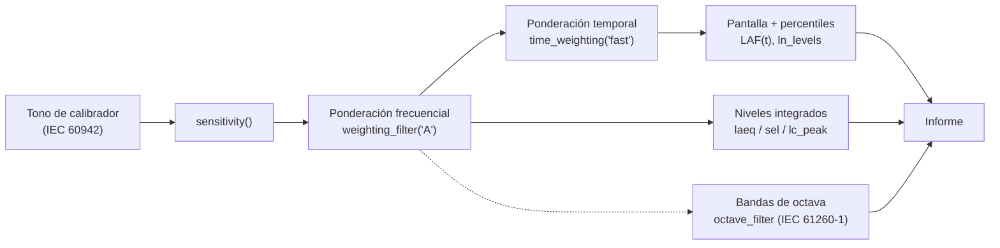

Un sonómetro no es un algoritmo, sino una breve cadena de ellos, e
IEC 61672-1 especifica cada etapa. phonometry implementa cada etapa como una
función independiente y componible; esta página las ensambla, en orden, en un
sonómetro funcional. Todos los fragmentos se ejecutan tal cual (las señales
se sintetizan para que la página sea autocontenida), y cada etapa enlaza con
la guía de fondo que la explica por completo.



Los fragmentos de esta página se apoyan unos en otros: ejecútalos de arriba
abajo en una misma sesión (o pega la página entera en un script).

## 1. El escenario

Un sonómetro necesita dos grabaciones de la *misma* cadena de entrada: el
tono de calibrador que ancla los números digitales a pascales, y la propia
medición. Aquí ambas se sintetizan para que puedas ejecutar la página en
cualquier parte; en una medición real proceden de tu micrófono.

```python
import numpy as np
from phonometry import metrology

fs = 48000

# Tono de calibrador: 94 dB SPL = 1 Pa RMS a 1 kHz (IEC 60942).
#   Sintetizado aquí; en campo, graba unos segundos de tu calibrador.
calibrator = np.sqrt(2) * np.sin(2 * np.pi * 1000 * np.arange(3 * fs) / fs)

# Medición "de calle": 10 s de ruido rosa de fondo más un evento de 1 s a
#   1 kHz, tipo bocina, para que los niveles estadísticos tengan algo que separar.
recording = metrology.noise_signal(fs, 10.0, color="pink", rms=0.02, seed=7)
recording[4 * fs : 5 * fs] += 0.2 * np.sqrt(2) * np.sin(
    2 * np.pi * 1000 * np.arange(fs) / fs
)
```

## 2. Calibra: da significado físico a las muestras

Las muestras digitales son adimensionales; el **factor de sensibilidad** las
convierte a pascales. `sensitivity()` lo calcula a partir de la grabación del
calibrador y, de paso, valida la estabilidad a corto plazo de la grabación
igual que IEC 60942 cualifica el propio calibrador, de modo que un micrófono
mal acoplado se detecta aquí en lugar de corromper todos los niveles
posteriores.

```python
cal = metrology.sensitivity(calibrator, target_spl=94.0, fs=fs)
# cal está en Pa por unidad digital; todas las funciones de nivel lo aceptan
# como calibration_factor. Para este tono sintético vale ≈1,0.
```

Guía de fondo: [Calibración y dBFS](/phonometry/es/guides/calibration/), que
cubre también la calibración desde una sensibilidad de micrófono conocida y
el modo digital dBFS que se usa cuando no existe referencia física.

## 3. Pondera: frecuencia y tiempo (IEC 61672-1)

El sonómetro nunca muestra la presión en bruto. La señal pasa primero por la
**ponderación frecuencial A** (la curva de respuesta del oído de
IEC 61672-1), se eleva al cuadrado y se suaviza con el **detector
exponencial Fast** (constante de tiempo de 125 ms). El resultado es el nivel
móvil que sigue la pantalla de un sonómetro, LAF(t):

```python
pressure = cal * recording                          # unidades digitales -> Pa
weighted = metrology.weighting_filter(pressure, fs, curve="A")
envelope = metrology.time_weighting(weighted, fs, mode="fast")  # media cuadrática en Pa^2
laf_t = 10 * np.log10(np.maximum(envelope, 1e-12) / (2e-5) ** 2)
# laf_t alcanza unos 80 dB durante el evento y se asienta cerca de 55 dB entre medias.
```

Rara vez escribirás esta cadena a mano: todas las funciones de nivel del paso
siguiente aplican la ponderación frecuencial internamente, y los niveles
percentiles reconstruyen por ti esta envolvente Fast. Las métricas de energía
(Leq, SEL) integran directamente la señal ponderada al cuadrado, sin
balística, exactamente como hace un sonómetro. La cadena se muestra aquí
porque *es* la pantalla del sonómetro.

Guías de fondo:
[Ponderación frecuencial (A, C, G, Z)](/phonometry/es/guides/weighting/) y
[Ponderación temporal](/phonometry/es/guides/time-weighting/).

## 4. Integra: los números que reporta un sonómetro

Una sola pasada sobre la grabación calibrada produce las lecturas estándar:
el **LAeq** equivalente en energía, los **niveles percentiles** que describen
cómo fluctuó el nivel (L90 es el fondo, L10 los eventos), el **nivel de
exposición sonora** que normaliza el evento a un segundo, y el **pico** con
ponderación C para contenido impulsivo.

```python
la_eq = metrology.laeq(recording, fs, calibration_factor=cal)     # ≈70,2 dB
ln = metrology.ln_levels(
    recording, fs, n=(10, 50, 90), weighting="A", calibration_factor=cal
)                                          # L10 ≈78,0, L50 ≈55,1, L90 ≈54,9
lae = metrology.sel(recording, fs, weighting="A", calibration_factor=cal)  # ≈80,2
lc_pk = metrology.lc_peak(recording, fs, calibration_factor=cal)           # ≈84,4

print(f"LAeq {la_eq:.1f} dB | L10 {ln[10]:.1f} | L90 {ln[90]:.1f} "
      f"| LAE {lae:.1f} | LCpeak {lc_pk:.1f}")
```

Fíjate en la aritmética que codifican los números: el evento de 1 s domina
el LAeq (está 25 dB por encima del fondo, mucho más de los 10 dB que el
fondo, nueve veces más largo, recupera por duración), el LAE es el LAeq más
10 log10 de los 10 s de duración, y el L90 apenas nota el evento.

Guía de fondo:
[Niveles integrados y estadísticos](/phonometry/es/guides/levels/), que añade
dosis de ruido, Lden y niveles de valoración, y espectrogramas de octava.

## 5. Filtra en bandas: la vista de espectro (IEC 61260-1)

Un sonómetro de clase 1 con juego de filtros reporta niveles por banda.
`octave_filter` descompone la señal calibrada en bandas de octava fraccional
cuyo diseño está anclado a los bordes de banda de IEC 61260-1;
`nominal=True` las etiqueta con las frecuencias preferentes que leerías en un
instrumento.

```python
spl, bands = metrology.octave_filter(
    recording, fs, fraction=3, calibration_factor=cal, nominal=True
)
# 33 niveles de banda de tercio de octava en dB SPL, etiquetados '12.5' ... '20k'.
# La banda '1k' contiene el evento: ≈70 dB, con sus vecinas ≈25 dB por debajo.
print(dict(zip(bands, np.round(spl, 1))))
```

Guías de fondo: [Bancos de filtros](/phonometry/es/guides/filter-banks/) para
las arquitecturas de filtro y el modo de fase cero,
[Procesado por bloques](/phonometry/es/guides/block-processing/) para
streaming, y [Multicanal y rendimiento](/phonometry/es/guides/multichannel/)
para arrays.

## 6. Verifica: ¿es este sonómetro de clase 1?

Un instrumento real solo es un "sonómetro de clase 1" cuando sus
ponderaciones y filtros superan los límites de aceptación de las normas. La
biblioteca incluye los mismos verificadores que se aplica a sí misma en CI:
`verify_weighting_class` barre un `WeightingFilter` contra los límites de la
Tabla 3 de IEC 61672-1, y `verify_filter_class` barre un `OctaveFilterBank`
contra los límites de la Tabla 1 de IEC 61260-1.

```python
wf = metrology.WeightingFilter(fs, curve="A")
print(metrology.verify_weighting_class(wf)["overall_class"])   # 1

bank = metrology.OctaveFilterBank(fs, fraction=3)
print(metrology.verify_filter_class(bank)["overall_class"])    # 1
```

Los veredictos también llegan por banda, de modo que puedes ver exactamente
dónde un diseño se saldría de su pasillo de clase. Guías de fondo:
[Ponderación frecuencial](/phonometry/es/guides/weighting/) (sección de
verificación de clase) y [Bancos de filtros](/phonometry/es/guides/filter-banks/)
(conformidad de clase).

## Adónde ir después

El sonómetro construido aquí es el tronco; el resto del núcleo crece de él.

- [Incertidumbre de medida (GUM y Monte Carlo)](/phonometry/es/guides/gum-uncertainty/):
  acompaña de una incertidumbre el LAeq que acabas de calcular, término de
  calibración incluido.
- [Análisis espectral calibrado](/phonometry/es/guides/spectral-analysis/):
  cuando las bandas se quedan cortas, la PSD de Welch con intervalos de
  confianza.
- [Correlación, retardo y envolvente](/phonometry/es/guides/correlation-delay/):
  dos micrófonos en lugar de uno, y el retardo entre ellos.
- [Procesado por bloques](/phonometry/es/guides/block-processing/): convierte
  el sonómetro fuera de línea de esta página en uno en streaming con estado
  de filtro arrastrado.

## Véase también

- Referencia de la API: [`metrology.calibration`](/phonometry/es/reference/api/levels/calibration/),
  [`metrology.parametric_filters`](/phonometry/es/reference/api/filters/parametric-filters/),
  [`metrology.levels`](/phonometry/es/reference/api/levels/levels/),
  [`phonometry`](/phonometry/es/reference/api/filters/phonometry/) y
  [`metrology.compliance`](/phonometry/es/reference/api/filters/compliance/).
