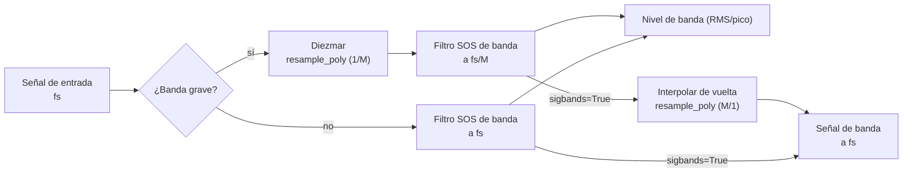

## Frecuencias de banda de octava (ANSI S1.11 / IEC 61260)

Las frecuencias centrales (fm) y los bordes (f1, f2) usan una razón en base 10:

$$
G = 10^{0.3}
$$

**Frecuencia central:**

$$
f_m = 1000 \cdot G^{x/b}
$$

(para b impar)

**Bordes de banda:**

$$
f_1 = f_m \cdot G^{-1/2b}, \quad f_2 = f_m \cdot G^{1/2b}
$$

## Resolución frecuencial vs separación de bins FFT

`octavefilter` es un **banco de filtros de octava fraccional en el dominio del
tiempo**, no un estimador espectral FFT/Welch. Por tanto, su resultado no tiene
una resolución frecuencial en el sentido `fs / nfft`.

Para `fraction=3`, la salida contiene un nivel escalar por banda de tercio de
octava. La granularidad relevante es la definición normalizada de la banda:
frecuencia central, borde inferior y borde superior. Como las bandas de octava
fraccional están espaciadas logarítmicamente, su ancho absoluto en Hz crece con
la frecuencia mientras su ancho relativo se mantiene aproximadamente constante.

Por ejemplo, con `fraction=3` y `limits=[12, 20000]`, la banda de tercio de
octava en torno a 1 kHz es aproximadamente:

| Banda nominal | Borde inferior | Centro | Borde superior | Ancho |
| :--- | ---: | ---: | ---: | ---: |
| 1 kHz | 891.25 Hz | 1000.00 Hz | 1122.02 Hz | 230.77 Hz |

Puedes inspeccionar las bandas exactas con:

```python
from phonometry import getansifrequencies

fc, fl, fu, labels = getansifrequencies(fraction=3, limits=[12, 20000])
for label, center, lower, upper in zip(labels, fc, fl, fu):
    print(label, center, lower, upper, upper - lower)
```

Si necesitas bins FFT de banda estrecha para inspección tonal, ejecuta
Welch/FFT sobre la señal original y usa los bordes de banda de phonometry como
máscaras:

```python
import numpy as np
from scipy import signal
from phonometry import octavefilter, getansifrequencies

fs = 100_000
# cualquier señal de presión 1D en Pa (se sintetiza para que el ejemplo funcione)
pressure_signal_pa = 0.02 * np.random.default_rng(0).standard_normal(fs)
x = pressure_signal_pa

# Niveles de tercio de octava normalizados de phonometry.
levels, centers = octavefilter(
    x,
    fs=fs,
    fraction=3,
    limits=[12, 20_000],
)

# Las mismas definiciones de banda, incluidos los bordes.
fc, fl, fu, labels = getansifrequencies(fraction=3, limits=[12, 20_000])

# Estimación Welch de banda estrecha sobre la señal original.
nperseg = min(2**15, len(x))
freq_bins, psd = signal.welch(
    x,
    fs=fs,
    window="hann",
    nperseg=nperseg,
    noverlap=nperseg // 2,
    scaling="density",
)

# Ejemplo: listar los bins Welch dentro de la banda más cercana a 1 kHz.
band_index = int(np.argmin(np.abs(np.asarray(fc) - 1000.0)))
in_band = (freq_bins >= fl[band_index]) & (freq_bins <= fu[band_index])

print("Banda de tercio de octava seleccionada:", labels[band_index])
print("Separación de bins Welch:", freq_bins[1] - freq_bins[0], "Hz")
for f, pxx in zip(freq_bins[in_band], psd[in_band]):
    print(f, pxx)
```

Esto mantiene separados los dos conceptos: phonometry da niveles de octava
fraccional normalizados, mientras Welch da bins FFT de banda estrecha. Con
`fs=100000` y `nperseg=2**15`, la separación de bins Welch es de unos `3.05 Hz`.
La ventana y el solape afectan al leakage y a la varianza del promediado, pero
no cambian la separación de bins de cada segmento FFT.

Con `sigbands=True`, `octavefilter` también puede devolver la forma de onda
filtrada por cada banda. Aplicar Welch/FFT a una de esas señales puede servir
como vista diagnóstica del contenido dentro de esa banda, pero no recupera bins
FFT a partir de los niveles escalares por banda.

## Respuestas en magnitud |H(jw)|

La librería implementa los prototipos clásicos estándar:

**1. Butterworth:** banda de paso máximamente plana.

$$
|H(j\omega)| = \frac{1}{\sqrt{1 + (\omega/\omega_c)^{2n}}}
$$

**2. Chebyshev I:** rizado uniforme en la banda de paso, caída más abrupta.

$$
|H(j\omega)| = \frac{1}{\sqrt{1 + \epsilon^2 T_n^2(\omega/\omega_c)}}
$$

**3. Chebyshev II:** Chebyshev inverso, rizado uniforme en la banda atenuada,
banda de paso plana.

$$
|H(j\omega)| = \frac{1}{\sqrt{1 + \frac{1}{\epsilon^2 T_n^2(\omega_{stop}/\omega)}}}
$$

**4. Elíptico:** rizado en ambas bandas, máxima selectividad.

$$
|H(j\omega)| = \frac{1}{\sqrt{1 + \epsilon^2 R_n^2(\omega/\omega_c, L)}}
$$

**5. Bessel:** retardo de grupo máximamente plano (fase lineal).

$$
H(s) = \frac{\theta_n(0)}{\theta_n(s/\omega_0)}
$$

(donde $\theta_n$ es el polinomio de Bessel inverso)

### Colocación de los bordes de banda

Para todas las arquitecturas, el banco sitúa los **puntos de −3 dB en los bordes
de banda**. Dos casos requieren tratamiento especial:

- **Chebyshev II**: en scipy, `Wn` es el borde de la banda *atenuada*.
  phonometry mapea analíticamente los bordes de −3 dB deseados a bordes de
  banda atenuada — la razón de transición del prototipo es
  $\cosh(\operatorname{acosh}(\sqrt{10^{A/10}-1})/N)$ — aplicando la
  transformación paso-bajo→paso-banda en el dominio bilineal pre-warpeado, de
  modo que el mapeo es exacto incluso para bandas diezmadas cercanas a Nyquist.
- **Bessel**: se diseña con `norm="mag"`, que define el punto de −3 dB
  exactamente en `Wn` (la norma `phase` desplazaría los bordes a unos −10 dB).

## Diseño del banco y estabilidad numérica

Para garantizar **estabilidad total** en todo el espectro audible (incluso a
frecuencias bajas como 16 Hz con frecuencias de muestreo altas), phonometry
emplea dos estrategias fundamentales:



1. **Secciones de segundo orden (SOS):** todos los filtros se implementan como
   biquads en cascada, evitando la pérdida catastrófica de precisión de las
   funciones de transferencia de orden alto.
2. **Diezmado multitasa:** para las bandas graves, la señal se diezma antes de
   filtrar y se interpola después. Esto mantiene los polos digitales lejos del
   borde del círculo unidad, evitando oscilaciones y ruido. Los bancos
   Chebyshev II reservan margen de diezmado adicional para que sus bordes de
   banda atenuada queden por debajo del Nyquist diezmado.

## Curvas de ponderación (IEC 61672-1)

La función de transferencia de la ponderación A:

$$
R_A(f) = \frac{12194^2 \cdot f^4}{(f^2 + 20.6^2)\sqrt{(f^2 + 107.7^2)(f^2 + 737.9^2)}(f^2 + 12194^2)}
$$

$$
A(f) = 20 \log_{10}(R_A(f)) + 2.00
$$

El filtro digital se obtiene de los polos/ceros analógicos mediante la
transformación bilineal. Como esta comprime las frecuencias cerca de Nyquist, el
modo `high_accuracy` por defecto diseña y ejecuta el filtro a una frecuencia
interna sobremuestreada (≥ 96 kHz) — consulta
[Ponderación frecuencial](/phonometry/es/guides/weighting/).

## Integración temporal

Implementada como un integrador exponencial IIR de primer orden:

$$
y[n] = \alpha \cdot x^2[n] + (1 - \alpha) \cdot y[n-1]
$$

$$
\alpha = 1 - e^{-1 / (f_s \cdot \tau)}
$$

donde `tau` es la constante de tiempo (p. ej. 125 ms para Fast).

La condición inicial por defecto es `y[-1] = 0`. Usa `initial_state='first'`
para partir de la energía de la primera muestra, o pasa un escalar/array con el
estado cuadrático medio anterior. Consulta
[Por qué phonometry](/phonometry/es/reference/why-phonometry/) para la
verificación de esta implementación con ráfagas de tono de IEC 61672-1.

## Ponderación G (ISO 7196)

La curva G extiende la ponderación frecuencial al rango de los infrasonidos. La Tabla 1 de ISO 7196:1995 (p. 2) la define mediante cuatro ceros en el origen y cuatro pares de polos complejos conjugados, dados como coordenadas en Hz (multiplicadas por $2\pi$ para obtener rad/s):

$$
z_{1..4} = 0, \qquad
p = 2\pi \left\lbrace -0.707 \pm j0.707,\  -19.27 \pm j5.16,\  -14.11 \pm j14.11,\  -5.16 \pm j19.27 \right\rbrace \ \text{Hz}
$$

La ganancia $k$ se elige para que la respuesta sea exactamente **0 dB a 10 Hz** (apartado 4):

$$
k = \left| \frac{\prod_i (j\omega_{10} - p_i)}{\prod_i (j\omega_{10} - z_i)} \right|, \qquad \omega_{10} = 2\pi \cdot 10 \ \text{rad/s}
$$

Los cuatro ceros frente a ocho polos dan forma a la respuesta característica: una subida de aproximadamente **+12 dB/octava entre 1 Hz y 20 Hz**, con caídas de aproximadamente **24 dB/octava** por debajo de 1 Hz y por encima de 20 Hz. Los infrasonidos necesitan su propia curva porque, cerca del umbral de audición, la sonoridad percibida de los tonos de muy baja frecuencia crece con el nivel de presión sonora mucho más abruptamente que a frecuencias medias — un pequeño incremento en dB sobre el umbral produce un gran salto de sonoridad —, de modo que la curva A (anclada en 1 kHz) distorsiona por completo la molestia infrasónica.

Como G actúa sobre 0,25 Hz – 315 Hz, la transformación bilineal simple ya es exacta en ese rango, y no se aplica el sobremuestreo interno usado en los diseños A/C (cuya acción se extiende hasta 16 kHz).

Consulta la [guía de ponderación frecuencial](/phonometry/es/guides/weighting/) para su uso.

## Líneas isofónicas (ISO 226:2023)

Un tono tiene un *nivel de sonoridad* de $L_N$ fonios cuando se juzga igual de sonoro que un tono puro de 1 kHz a $L_N$ dB SPL. La Fórmula (1) de ISO 226:2023 (apartado 4.1, p. 2) da el SPL de un tono puro a la frecuencia $f$ que alcanza el nivel de sonoridad $L_N$:

$$
L_f = \frac{10}{\alpha_f} \log_{10}\left[ \left(4 \cdot 10^{-10}\right)^{0.3 - \alpha_f} \left( 10^{\ 0.03 L_N} - 10^{\ 0.072} \right) + 10^{\ \alpha_f (T_f + L_U)/10} \right] - L_U
$$

La Fórmula (2) (apartado 4.2) la invierte, devolviendo el nivel de sonoridad de un tono a SPL $L_f$:

$$
L_N = \frac{100}{3} \log_{10}\left[ \frac{10^{\ \alpha_f (L_f + L_U)/10} - 10^{\ \alpha_f (T_f + L_U)/10}}{\left(4 \cdot 10^{-10}\right)^{0.3 - \alpha_f}} + 10^{\ 0.072} \right]
$$

Los tres parámetros provienen de la Tabla 1 (p. 4), tabulados en las 29 frecuencias preferentes de tercio de octava de ISO 266 desde 20 Hz hasta 12,5 kHz:

- $\alpha_f$ — exponente de la percepción de sonoridad a la frecuencia $f$,
- $L_U$ — magnitud de la función de transferencia lineal, normalizada en 1 kHz ($L_U = 0$ en 1 kHz),
- $T_f$ — umbral de audición en $f$, en dB.

La norma **no especifica interpolación** entre las frecuencias tabuladas. La Fórmula (1) está especificada para **20 fonios a 90 fonios** entre 20 Hz y 4 kHz, y solo hasta **80 fonios entre 5 kHz y 12,5 kHz** — por encima de 80 fonios la línea isofónica se detiene, por tanto, en 4 kHz. Los valores fuera de estos límites obtenidos con la Fórmula (2) son extrapolaciones que la norma califica de meramente informativas.

Consulta la [guía de niveles](/phonometry/es/guides/levels/) para su uso.

## Prominencia tonal: TNR y PR (ECMA-418-1)

Ambos métodos operan sobre un espectro de potencia con ventana de Hann promediado en RMS (apartados 11.1 / 12.1) y usan el modelo de bandas críticas del apartado 10. El ancho de banda crítico centrado en un tono a $f$ es (Fórmula 2):

$$
\Delta f_c = 25.0 + 75.0 \left(1.0 + 1.4 \left(\tfrac{f}{1000}\right)^2\right)^{0.69} \ \text{Hz}
$$

Los bordes de banda se colocan **aritméticamente** para $f \le 500$ Hz (Fórmulas 4–5): $f_{1,2} = f \mp \Delta f_c / 2$, y **geométricamente** por encima (Fórmulas 7–8): $f_1 = -\Delta f_c/2 + \sqrt{\Delta f_c^2 + 4 f^2}/2$, $f_2 = f_1 + \Delta f_c$.

**TNR** (apartado 11). La banda del tono abarca los mínimos espectrales a ambos lados del pico dentro del 15 % de $\Delta f_c$ (apartado 11.2). A la potencia del tono se le resta la recta que conecta los bins de los bordes de banda (Fórmula 9): sobre los $N$ bins de la banda del tono, $P_t = \sum_k P_k - (P_{\text{lo}} + P_{\text{hi}})\ N/2$. La potencia del ruido enmascarante es la potencia restante de la banda crítica reescalada al ancho de banda crítico completo (Fórmula 10): $P_n = (P_{\text{band}} - P_t) \cdot \Delta f_c / \Delta f_{\text{band}}$, y $\mathrm{TNR} = 10\log_{10}(P_t/P_n)$ (Fórmula 11). El criterio de prominencia (Fórmulas 12–13) es

$$
\mathrm{TNR}_{\text{crit}} = \begin{cases} 8.0 + 8.33 \log_{10}(1000/f_t) \ \text{dB} & f_t < 1\ \text{kHz} \\ 8.0 \ \text{dB} & f_t \ge 1\ \text{kHz} \end{cases}
$$

**PR** (apartado 12) compara el nivel de la banda crítica centrada en el tono, $L_M$, con la potencia media de las dos bandas críticas **contiguas** $L_L$, $L_U$ (bordes según las Fórmulas ajustadas 21–22 con las Tablas 2–3): $\mathrm{PR} = 10\log_{10} P_M - 10\log_{10}\left[(P_L + P_U)/2\right]$ (Fórmula 23). Para $f_t \le 171.4$ Hz la banda inferior se trunca en 20 Hz y su potencia se reescala a un **ancho de banda de 100 Hz** (Fórmula 24). El criterio (Fórmulas 25–26) es 9,0 dB para $f_t \ge 1$ kHz, y crece como $9.0 + 10.0\log_{10}(1000/f_t)$ por debajo. Los tonos se evalúan dentro del rango de interés de 89,1 Hz – 11,2 kHz (apartados 11.5 / 12.6).

Consulta la [guía de niveles](/phonometry/es/guides/levels/) para su uso.

## Métricas de evento y de dosis

El **nivel de exposición sonora** (SEL; LAE con ponderación A, IEC 61672-1:2013) normaliza la energía de un evento discreto (sobrevuelo de un avión, paso de un tren) a una duración de referencia de 1 s:

$$
\mathrm{SEL} = L_{eq,T} + 10 \log_{10}\left(\frac{T}{T_0}\right), \qquad T_0 = 1\ \text{s}
$$

La **exposición sonora** $E$ (IEC 61252, 3.1) es la integral temporal del cuadrado de la presión sonora ponderada A, expresada en pascales al cuadrado por hora:

$$
E = \int_0^T p_A^2(t)\ dt = \overline{p_A^2} \cdot T \quad [\text{Pa}^2\text{h}]
$$

Cuando la grabación es una muestra representativa de una jornada más larga, $E$ escala el cuadrático medio medido por la duración real de la exposición. El **nivel normalizado a 8 h** (IEC 61252, 3.3) convierte la exposición en el nivel estacionario que transporta la misma energía a lo largo de una jornada laboral nominal:

$$
L_{EX,8h} = 10 \log_{10}\left(\frac{E}{8\ \text{h} \cdot p_0^2}\right), \qquad p_0 = 20\ \mu\text{Pa}
$$

Es idéntico al $L_{EP,d}$ de la Directiva 86/188/CEE y al $L_{EX,8h}$ de ISO 1999 (BS EN 61252:1995, 3.3 NOTAS 5–6). El ancla de BS EN 61252:1995 (3.3 NOTA 4): una exposición de **3,2 Pa²h corresponde a un $L_{EX,8h}$ de exactamente 90 dB**.

**LCpeak** (IEC 61672-1:2013, subapartado 5.13) es el máximo absoluto de la presión sonora ponderada C expresado en dB, $L_{Cpeak} = 20\log_{10}(\max|p_C(t)|/p_0)$ — la magnitud detrás de los límites de acción laborales de 135/137/140 dB(C). La implementación se verifica contra las respuestas de referencia de un ciclo y de medio ciclo de la Tabla 5.

Consulta la [guía de niveles](/phonometry/es/guides/levels/) para su uso y la [guía de calibración](/phonometry/es/guides/calibration/) para configurar la escala absoluta.

## Descriptores ambientales (ISO 1996-1)

El **nivel día-tarde-noche** $L_{den}$ (ISO 1996-1:2016, 3.6.4) es un promedio energético sobre las 24 h del día con penalizaciones de **+5 dB para la tarde** y **+10 dB para la noche**:

$$
L_{den} = 10 \log_{10}\left\lbrace\frac{1}{24}\left[ t_d\ 10^{0.1 L_{day}} + t_e\ 10^{0.1 (L_{evening} + 5)} + t_n\ 10^{0.1 (L_{night} + 10)} \right]\right\rbrace
$$

con duraciones de periodo por defecto $(t_d, t_e, t_n) = (12, 4, 8)$ h — cada país puede definir los periodos de forma distinta (3.6.4 Nota 1). El **nivel día-noche** $L_{dn}$ (3.6.5) prescinde del periodo de tarde:

$$
L_{dn} = 10 \log_{10}\left\lbrace\frac{1}{24}\left[ t_d\ 10^{0.1 L_{day}} + t_n\ 10^{0.1 (L_{night} + 10)} \right]\right\rbrace, \qquad (t_d, t_n) = (15, 9)\ \text{h}
$$

Ambos son casos particulares del **nivel de evaluación compuesto de día completo** (6.5, que generaliza las Fórmulas 5–6), donde cada periodo $i$ aporta su nivel de evaluación $L_i$ más un ajuste $K_i$, ponderado por su fracción del día:

$$
L_R = 10 \log_{10}\left[ \sum_i \frac{h_i}{24}\ 10^{0.1 (L_i + K_i)} \right], \qquad \sum_i h_i = 24\ \text{h}
$$

Los ajustes $K_i$ cubren las penalizaciones horarias (ISO 1996-1 Tabla A.1: tarde 5 dB, noche 10 dB) así como los ajustes por carácter de la fuente — p. ej. penalizaciones tonales, que las evaluaciones TNR/PR de ECMA-418-1 permiten justificar objetivamente.

Consulta la [guía de niveles](/phonometry/es/guides/levels/) para su uso.

## Sonoridad de Zwicker (ISO 532-1)

El oído analiza el sonido en **bandas críticas**: regiones de frecuencia dentro de las cuales la energía se suma antes de formarse la sonoridad. La **escala Bark** transforma la frecuencia en razón de banda crítica $z$, de 0 a 24 Bark, e ISO 532-1:2017 muestrea la sonoridad específica $N'(z)$ en pasos de 0,1 Bark (240 valores). La implementación es un port de sala limpia del programa de referencia normativo de la norma (Anexo A.4) y procede por etapas:

1. **Niveles de tercio de octava** — 28 bandas, de 25 Hz a 12,5 kHz (el banco de filtros del Anexo A a 48 kHz, Tablas A.1/A.2). Para sonidos variables en el tiempo, las salidas de banda al cuadrado se suavizan con tres paso-bajos en cascada con $\tau = 2/(3 f_c)$ ($f_c$ limitada a 1 kHz) y se muestrean cada 2 ms.
2. **Agrupación en baja frecuencia** — las 11 bandas hasta 250 Hz reciben las correcciones isofónicas de la Tabla A.3 y se suman en las tres primeras bandas críticas (25–80, 100–160, 200–250 Hz).
3. **Transmisión a0** — la corrección de transferencia del oído externo/medio de la Tabla A.4 (más la diferencia de campo difuso de la Tabla A.5 con `field='diffuse'`) produce los niveles de banda crítica $L_E$.
4. **Sonoridad núcleo** — cada una de las 20 bandas críticas se transforma con los niveles de umbral en silencio $L_{TQ}$ de la Tabla A.6 (tras la adaptación de ancho de banda DCB de la Tabla A.7):

$$
N_c = 0.0635 \cdot 10^{0.025 L_{TQ}} \left[ \left( 1 - s + s \cdot 10^{(L_E - L_{TQ})/10} \right)^{0.25} - 1 \right] \ \text{sonos/Bark}, \qquad s = 0.25
$$

(la forma que da el programa de referencia a la transformación de sonoridad de Zwicker; las bandas por debajo del umbral aportan cero).

5. **Pendientes** — las pendientes superiores de enmascaramiento dependientes del nivel (inclinación por rango de sonoridad específica y banda crítica, Tablas A.8/A.9) añaden flancos decrecientes hacia $z$ mayores; la sonoridad total es el área bajo el patrón:

$$
N = \int_0^{24} N'(z)\ dz \ \ \text{sonos}
$$

Para sonidos variables en el tiempo, un decaimiento temporal no lineal (constantes de tiempo 5/15/75 ms, apartado 6.3) y la ponderación dependiente de la duración de la sonoridad total (paso-bajos de 3,5 ms y 70 ms ponderados 0,47/0,53, apartado 6.4) preceden a la salida de sonoridad frente al tiempo a 500 Hz y a los percentiles N5/N10 (apartado 6.5).

**Sonos y fonios** quedan ligados por el ancla de 1 kHz (1 sono = 40 fonios; apartado 5.6):

$$
N = 2^{(L_N - 40)/10} \ \text{sonos} \qquad \Longleftrightarrow \qquad L_N = 40 + 10 \log_2 N \ \text{fonios} \qquad (N \ge 1)
$$

por debajo de 1 sono el programa de referencia usa $L_N = 40 (N + 0.0005)^{0.35}$, con suelo en 3 fonios.

Consulta la [guía de psicoacústica](/phonometry/es/guides/psychoacoustics/) para su uso.

## Transferencia de modulación y STI (IEC 60268-16)

La inteligibilidad del habla viaja en las modulaciones lentas de intensidad de la envolvente del habla. La **función de transferencia de modulación (MTF)** $m(F)$ de un canal de transmisión es la razón entre la profundidad de modulación recibida y la emitida de la envolvente de intensidad por banda de octava a la frecuencia de modulación $F$; el STI completo la evalúa en las 14 frecuencias de modulación en tercios de octava de 0,63 a 12,5 Hz en las siete bandas de octava de 125 Hz a 8 kHz (A.2.2). Desde una respuesta al impulso medida, la **forma cerrada de Schroeder** la da directamente (método indirecto):

$$
m_k(f_m) = \frac{\left| \int_0^{\infty} h_k^2(t)\ e^{-j 2 \pi f_m t}\ dt \right|}{\int_0^{\infty} h_k^2(t)\ dt}
$$

El ruido de fondo estacionario multiplica el $m$ de cada banda por la razón de intensidades (el término de ruido):

$$
m'_k = m_k \cdot \frac{I_k}{I_k + I_{n,k}} = \frac{m_k}{1 + 10^{-\mathrm{SNR}_k/10}}
$$

y cuando se conocen los niveles absolutos por banda, la corrección completa $m'_k = m_k I_k / (I_k + I_{am,k} + I_{rt,k} + I_{n,k})$ añade la intensidad de enmascaramiento auditivo $I_{am,k}$ (desde la banda de octava inmediatamente inferior, Tabla A.2) y el umbral absoluto de recepción $I_{rt,k}$ (Tabla A.3). Cada $m$ corregido se transforma en una **SNR efectiva**, recortada al rango de ±15 dB donde la inteligibilidad varía realmente, y después en un índice de transmisión (A.5.4/A.5.5):

$$
\mathrm{SNR}_{\mathrm{eff}} = 10 \log_{10} \frac{m}{1 - m}\ \text{dB}, \qquad \mathrm{TI} = \frac{\mathrm{SNR}_{\mathrm{eff}} + 15}{30}
$$

El MTI de banda es la media de los TI sobre las frecuencias de modulación, y el STI pondera las bandas con los factores masculinos $\alpha_k$, $\beta_k$ de la Tabla A.1 de la Ed. 5 (A.5.6):

$$
\mathrm{STI} = \sum_{k=1}^{7} \alpha_k\ \mathrm{MTI}_k - \sum_{k=1}^{6} \beta_k \sqrt{\mathrm{MTI}_k\ \mathrm{MTI}_{k+1}}
$$

truncado a 1,0. STIPA (Anexo B) muestrea la misma física con solo dos frecuencias de modulación por banda (Tabla B.1) sobre una señal de prueba con índice de modulación de fuente 0,55; las profundidades recibidas se miden por correlación seno/coseno de las envolventes de intensidad $I_k(t)$ filtradas paso-bajo a ~100 Hz sobre un número entero de periodos de modulación:

$$
m_{dr} = \frac{2 \sqrt{\left( \sum_t I_k(t) \sin 2 \pi f_m t \right)^2 + \left( \sum_t I_k(t) \cos 2 \pi f_m t \right)^2}}{\sum_t I_k(t)}, \qquad m = \frac{m_{dr}}{0.55}
$$

Consulta la [guía de psicoacústica](/phonometry/es/guides/psychoacoustics/) para su uso.

## Intensidad sonora (IEC 61043)

La intensidad sonora es el flujo de potencia acústica promediado en el tiempo $I = \overline{p u}$. La velocidad de partícula se obtiene de la **ecuación de Euler** (conservación del momento linealizada):

$$
\rho_0 \frac{\partial u}{\partial t} = -\frac{\partial p}{\partial r}
$$

Una sonda p-p aproxima el gradiente de presión por la **diferencia finita** de dos micrófonos separados una distancia de separador $\Delta r$ (IEC 61043:1994, definición 3.2):

$$
p = \frac{p_1 + p_2}{2}, \qquad u = -\frac{1}{\rho_0 \Delta r} \int (p_2 - p_1)\ dt, \qquad I = \overline{p\ u}
$$

Para señales estacionarias el mismo estimador tiene una forma exacta en el dominio de la frecuencia a través de la parte imaginaria del **espectro cruzado** unilateral $G_{12}$ de las dos presiones — la implementación lo estima con segmentos promediados tipo Welch con ventana de Hann:

$$
I(f) = -\ \frac{\mathrm{Im}\lbrace G_{12}(f)\rbrace}{2 \pi f\ \rho_0\ \Delta r}
$$

La diferencia finita subestima la intensidad real de onda plana en el factor

$$
\frac{\sin(k \Delta r)}{k \Delta r}, \qquad k = \frac{2 \pi f}{c}
$$

— el apartado 7.3 de IEC 61043 especifica la respuesta en intensidad de la sonda con exactamente este argumento y la Tabla 3 la tabula (p. ej. −10,5 dB a 6,3 kHz para un separador de 25 mm). Por debajo de $f = 0.1 c / \Delta r$ (es decir, $k \Delta r$ por debajo de 0,63) el sesgo se mantiene dentro de unos 0,3 dB; `bias_correction` proporciona el factor recíproco por banda y `max_valid_frequency` la cota.

El **índice presión-intensidad** $\delta_{pI} = L_p - L_I$ mide cuán reactivo es el campo: en una onda plana progresiva libre vale $10 \log_{10}(\rho_0 c / 400) = 0.14$ dB, mientras que valores grandes delatan campos reactivos o ruidosos en los que domina el error de fase entre canales. El Anexo A de ISO 9614-1:1993 lo generaliza sobre una superficie de medición como el indicador F2 (con F3 para la potencia parcial negativa y F4 para la no uniformidad del campo), y la **capacidad dinámica** del instrumento $L_d = \delta_{pI0} - K$ (índice presión-intensidad residual menos el factor de error de sesgo: 10 dB para los grados 1/2, 7 dB para el grado 3) debe superar F2 para que la medición sea válida (criterio 1).

Consulta la [guía de intensidad sonora](/phonometry/es/guides/intensity/) para su uso.


## Acústica de salas y edificación (ISO 18233, ISO 3382, ISO 16283-1, ISO 717-1)

### Respuesta al impulso por excitación determinista (ISO 18233)

Una sala o un camino de transmisión se modela como **lineal e invariante en el tiempo**, de modo que su respuesta al impulso $h(t)$ lo contiene todo. ISO 18233 sustituye el decaimiento clásico por ráfaga de ruido por una excitación determinista que se **deconvoluciona** para obtener $h(t)$, ganando 20–30 dB de relación señal-ruido efectiva. El barrido sinusoidal exponencial (ESS, Anexo B) tiene una frecuencia instantánea $f(t) = f_1 (f_2/f_1)^{t/T}$, de modo que su fase es la integral en forma cerrada de $2 \pi f(t)$:

$$
\varphi(t) = \frac{2 \pi f_1 T}{\ln(f_2/f_1)} \left[ \left( \frac{f_2}{f_1} \right)^{t/T} - 1 \right] .
$$

Un tiempo por octava constante hace que el espectro del ESS sea rosa (−3 dB/octava). La deconvolución se realiza mediante división espectral **lineal** (no circular, con relleno de ceros) $H = Y\ \overline{X} / (|X|^2 + \varepsilon)$, donde el término de Tikhonov $\varepsilon$ (una fracción de $\max |X|^2$) evita la amplificación del ruido en los extremos de banda. Como un barrido de grave a agudo sitúa los productos de distorsión armónica en tiempos de llegada negativos, caen en la cola envuelta y se eliminan conservando la parte causal (Farina). El método MLS (Anexo A) explota en cambio que la autocorrelación circular de una secuencia de longitud máxima de longitud $2^N-1$ es una delta periódica, de modo que $h = \operatorname{xcorr}_{\text{circ}}(\text{recorded}, \text{mls}) / 2^N$; el promediado síncrono de $n$ periodos añade $10 \log_{10} n$ dB.

### Integración inversa de Schroeder (ISO 3382-1, 5.3.3)

La curva de decaimiento por banda es la respuesta al impulso al cuadrado **integrada hacia atrás** (Schroeder):

$$
E(t) = \int_t^{\infty} p^2(\tau)\ d\tau = \int_0^{\infty} p^2\ d\tau - \int_0^t p^2\ d\tau , \qquad L(t) = 10 \log_{10} \frac{E(t)}{E(0)}\ \text{dB},
$$

es decir, una suma acumulada invertida en tiempo discreto. La integración hacia atrás cancela la fluctuación aleatoria de una única respuesta al impulso al cuadrado: para un decaimiento de energía puramente exponencial $p^2(t) = e^{-a t}$ da $E(t) = e^{-a t}/a$, una recta exactamente $L(t) = -(10 a / \ln 10)\ t$. El ruido de fondo aplana $E(t)$, así que la integración se trunca en el cruce $t_1$ de la recta de decaimiento ajustada con el nivel de ruido y la cola que falta se compensa con una exponencial de la pendiente ajustada; sin ese término la integral finita **subestima** sistemáticamente $T$.

### Ventanas de regresión y validez (ISO 3382-2, Cláusula 6, Anexo B/C)

El tiempo de reverberación es un ajuste por mínimos cuadrados $L = a + b t$ sobre una ventana, extrapolado a 60 dB mediante $T = -60/b$ (Anexo C): **EDT** de 0 a −10 dB, **T20** de −5 a −25 dB, **T30** de −5 a −35 dB. Un decaimiento de una sola pendiente da EDT = T20 = T30; una doble pendiente rápida al principio y lenta al final da EDT < T30. La validez se basa en la regla de rango dinámico de 5.3.3 — el ruido debe situarse al menos (rango de evaluación + 15) dB por debajo del pico de la respuesta al impulso, es decir 25/35/45 dB para EDT/T20/T30 — y la **curvatura** $C = 100\ (T_{30}/T_{20} - 1)$ % (Anexo B) señala un decaimiento no recto por encima del 10 %.

### Claridad, definición y tiempo central (ISO 3382-1, Anexo A)

Repartir la energía en una frontera temprano/tardío $t_e$ da el índice temprano-tardío y el cociente de definición:

$$
C_{te} = 10 \log_{10} \frac{\int_0^{t_e} p^2\ dt}{\int_{t_e}^{\infty} p^2\ dt}\ \text{dB}, \qquad D_{50} = \frac{\int_0^{0.05} p^2\ dt}{\int_0^{\infty} p^2\ dt}, \qquad C_{50} = 10 \log_{10} \frac{D_{50}}{1 - D_{50}},
$$

con $t_e = 50$ ms (C50, habla) o 80 ms (C80, música), y el **tiempo central** $T_s = \int_0^{\infty} t\ p^2\ dt / \int_0^{\infty} p^2\ dt$. Para un decaimiento puramente exponencial tienen formas cerradas $C_{te} = 10 \log_{10}(e^{a t_e} - 1)$ y $T_s = 1/a$; a $T = 1$ s ($a = 13.8155$) evalúan a C80 = 3,05 dB, C50 = −0,02 dB, D50 = 0,499 y Ts = 72,4 ms — los valores que reproduce la implementación. Las JND de la Tabla A.1 (EDT 5 %, C80 1 dB, D50 0,05, Ts 10 ms) acotan con qué finura merece la pena informar cada una.

### Decaimiento espacial en oficinas diáfanas (ISO 3382-3, Cláusula 6)

La tasa de decaimiento espacial del habla ponderada A es la pendiente por mínimos cuadrados ordinarios de $L_{p,A,S}$ frente a $\lg(r/r_0)$ ($r_0 = 1$ m) sobre las posiciones de 2–16 m, reescalada a una cifra por duplicación, y el nivel nominal se lee en la misma recta a 4 m:

$$
L = a + b\ \lg(r/r_0), \qquad D_{2,S} = -\lg(2)\ b, \qquad L_{p,A,S,4\text{m}} = a + b\ \lg(4/r_0).
$$

La distancia de distracción rD y la distancia de privacidad rP son las distancias donde una regresión **lineal** (no logarítmica) del STI frente a la distancia cruza 0,50 y 0,20; una pendiente ajustada no negativa (el STI no decrece con la distancia) las deja indefinidas, materializando la nota de la norma de que "puede resultar imposible de determinar".

### Aislamiento en campo e índice ponderado (ISO 16283-1, ISO 717-1)

Por banda de tercio de octava, la diferencia de niveles $D = L_1 - L_2$ (promediada en energía sobre las posiciones de micrófono, $L = 10 \log_{10}[(1/n) \sum_i 10^{L_i/10}]$) se normaliza de dos formas: la diferencia de niveles estandarizada $D_{nT} = D + 10 \log_{10}(T/T_0)$ con $T_0 = 0.5$ s (de modo que $D_{nT} = D$ cuando $T = T_0$), y el índice de reducción sonora aparente $R' = D + 10 \log_{10}(S/A)$ con el área de absorción de Sabine $A = 0.16\ V / T$, por tanto $R' = D + 10 \log_{10}[S T / (0.16\ V)]$.

El índice de un solo número (ISO 717-1, Cláusula 4.4) desplaza la **curva de referencia** de la Tabla 3 en pasos de 1 dB hacia la curva medida hasta que la suma de desviaciones *desfavorables* $\sum_i \max(0, \text{ref}_i + k - \text{meas}_i)$ es máxima pero $\le$ 32,0 dB (16 tercios) o 10,0 dB (5 octavas); el índice $R_w$ es la referencia desplazada a 500 Hz. Los **términos de adaptación espectral** son $C = X_{A1} - X_w$ y $C_{tr} = X_{A2} - X_w$ con $X_{Aj} = -10 \log_{10} \sum_i 10^{(L_{ij} - X_i)/10}$ (espectros de la Tabla 4: n.º 1 ruido rosa, n.º 2 tráfico urbano), cada uno redondeado a un entero. El ejemplo resuelto del Anexo C de ISO 717-1 ($R_w = 30$, $C = -2$, $C_{tr} = -3$, suma desfavorable 31,8 dB) se reproduce exactamente.

Consulta la [guía de acústica de salas y edificación](/phonometry/es/guides/room-acoustics/) para su uso.
