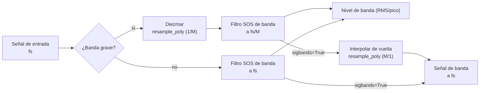

## Frecuencias de banda de octava (ANSI S1.11 / IEC 61260)

Las frecuencias centrales (fm) y los bordes (f1, f2) usan una razón en base 10:

$$
G = 10^{0.3}
$$

**Frecuencia central:**

$$
f_m = 1000 \cdot G^{x/b}
$$

(para b impar)

**Bordes de banda:**

$$
f_1 = f_m \cdot G^{-1/2b}, \quad f_2 = f_m \cdot G^{1/2b}
$$

## Resolución frecuencial vs separación de bins FFT

`octave_filter` es un **banco de filtros de octava fraccional en el dominio del
tiempo**, no un estimador espectral FFT/Welch. Por tanto, su resultado no tiene
una resolución frecuencial en el sentido `fs / nfft`.

Para `fraction=3`, la salida contiene un nivel escalar por banda de tercio de
octava. La granularidad relevante es la definición normalizada de la banda:
frecuencia central, borde inferior y borde superior. Como las bandas de octava
fraccional están espaciadas logarítmicamente, su ancho absoluto en Hz crece con
la frecuencia mientras su ancho relativo se mantiene aproximadamente constante.

Por ejemplo, con `fraction=3` y `limits=[12, 20000]`, la banda de tercio de
octava en torno a 1 kHz es aproximadamente:

| Banda nominal | Borde inferior | Centro | Borde superior | Ancho |
| :--- | ---: | ---: | ---: | ---: |
| 1 kHz | 891.25 Hz | 1000.00 Hz | 1122.02 Hz | 230.77 Hz |

Puedes inspeccionar las bandas exactas con:

```python
from phonometry import nominal_frequencies

fc, fl, fu, labels = nominal_frequencies(fraction=3, limits=[12, 20000])
for label, center, lower, upper in zip(labels, fc, fl, fu):
    print(label, center, lower, upper, upper - lower)
```

Si necesitas bins FFT de banda estrecha para inspección tonal, ejecuta
Welch/FFT sobre la señal original y usa los bordes de banda de phonometry como
máscaras:

```python
import numpy as np
from scipy import signal
from phonometry import octave_filter, nominal_frequencies

fs = 100_000
# cualquier señal de presión 1D en Pa (se sintetiza para que el ejemplo funcione)
pressure_signal_pa = 0.02 * np.random.default_rng(0).standard_normal(fs)
x = pressure_signal_pa

# Niveles de tercio de octava normalizados de phonometry.
levels, centers = octave_filter(
    x,
    fs=fs,
    fraction=3,
    limits=[12, 20_000],
)

# Las mismas definiciones de banda, incluidos los bordes.
fc, fl, fu, labels = nominal_frequencies(fraction=3, limits=[12, 20_000])

# Estimación Welch de banda estrecha sobre la señal original.
nperseg = min(2**15, len(x))
freq_bins, psd = signal.welch(
    x,
    fs=fs,
    window="hann",
    nperseg=nperseg,
    noverlap=nperseg // 2,
    scaling="density",
)

# Ejemplo: listar los bins Welch dentro de la banda más cercana a 1 kHz.
band_index = int(np.argmin(np.abs(np.asarray(fc) - 1000.0)))
in_band = (freq_bins >= fl[band_index]) & (freq_bins <= fu[band_index])

print("Banda de tercio de octava seleccionada:", labels[band_index])
print("Separación de bins Welch:", freq_bins[1] - freq_bins[0], "Hz")
for f, pxx in zip(freq_bins[in_band], psd[in_band]):
    print(f, pxx)
```

Esto mantiene separados los dos conceptos: phonometry da niveles de octava
fraccional normalizados, mientras Welch da bins FFT de banda estrecha. Con
`fs=100000` y `nperseg=2**15`, la separación de bins Welch es de unos `3.05 Hz`.
La ventana y el solape afectan al leakage y a la varianza del promediado, pero
no cambian la separación de bins de cada segmento FFT.

Con `sigbands=True`, `octave_filter` también puede devolver la forma de onda
filtrada por cada banda. Aplicar Welch/FFT a una de esas señales puede servir
como vista diagnóstica del contenido dentro de esa banda, pero no recupera bins
FFT a partir de los niveles escalares por banda.

## Respuestas en magnitud |H(jw)|

La librería implementa los prototipos clásicos estándar:

**1. Butterworth:** banda de paso máximamente plana.

$$
|H(j\omega)| = \frac{1}{\sqrt{1 + (\omega/\omega_c)^{2n}}}
$$

**2. Chebyshev I:** rizado uniforme en la banda de paso, caída más abrupta.

$$
|H(j\omega)| = \frac{1}{\sqrt{1 + \epsilon^2 T_n^2(\omega/\omega_c)}}
$$

**3. Chebyshev II:** Chebyshev inverso, rizado uniforme en la banda atenuada,
banda de paso plana.

$$
|H(j\omega)| = \frac{1}{\sqrt{1 + \frac{1}{\epsilon^2 T_n^2(\omega_{stop}/\omega)}}}
$$

**4. Elíptico:** rizado en ambas bandas, máxima selectividad.

$$
|H(j\omega)| = \frac{1}{\sqrt{1 + \epsilon^2 R_n^2(\omega/\omega_c, L)}}
$$

**5. Bessel:** retardo de grupo máximamente plano (fase lineal).

$$
H(s) = \frac{\theta_n(0)}{\theta_n(s/\omega_0)}
$$

(donde $\theta_n$ es el polinomio de Bessel inverso)

### Colocación de los bordes de banda

Para todas las arquitecturas, el banco sitúa los **puntos de −3 dB en los bordes
de banda**. Dos casos requieren tratamiento especial:

- **Chebyshev II**: en scipy, `Wn` es el borde de la banda *atenuada*.
  phonometry mapea analíticamente los bordes de −3 dB deseados a bordes de
  banda atenuada — la razón de transición del prototipo es
  $\cosh(\operatorname{acosh}(\sqrt{10^{A/10}-1})/N)$ — aplicando la
  transformación paso-bajo→paso-banda en el dominio bilineal pre-warpeado, de
  modo que el mapeo es exacto incluso para bandas diezmadas cercanas a Nyquist.
- **Bessel**: se diseña con `norm="mag"`, que define el punto de −3 dB
  exactamente en `Wn` (la norma `phase` desplazaría los bordes a unos −10 dB).

## Diseño del banco y estabilidad numérica

Para garantizar **estabilidad total** en todo el espectro audible (incluso a
frecuencias bajas como 16 Hz con frecuencias de muestreo altas), phonometry
emplea dos estrategias fundamentales:



1. **Secciones de segundo orden (SOS):** todos los filtros se implementan como
   biquads en cascada, evitando la pérdida catastrófica de precisión de las
   funciones de transferencia de orden alto.
2. **Diezmado multitasa:** para las bandas graves, la señal se diezma antes de
   filtrar y se interpola después. Esto mantiene los polos digitales lejos del
   borde del círculo unidad, evitando oscilaciones y ruido. Los bancos
   Chebyshev II reservan margen de diezmado adicional para que sus bordes de
   banda atenuada queden por debajo del Nyquist diezmado.

## Curvas de ponderación (IEC 61672-1)

La función de transferencia de la ponderación A:

$$
R_A(f) = \frac{12194^2 \cdot f^4}{(f^2 + 20.6^2)\sqrt{(f^2 + 107.7^2)(f^2 + 737.9^2)}(f^2 + 12194^2)}
$$

$$
A(f) = 20 \log_{10}(R_A(f)) + 2.00
$$

El filtro digital se obtiene de los polos/ceros analógicos mediante la
transformación bilineal. Como esta comprime las frecuencias cerca de Nyquist, el
modo `high_accuracy` por defecto diseña y ejecuta el filtro a una frecuencia
interna sobremuestreada (≥ 144 kHz) — consulta
[Ponderación frecuencial](/phonometry/es/guides/weighting/).

## Integración temporal

Implementada como un integrador exponencial IIR de primer orden:

$$
y[n] = \alpha \cdot x^2[n] + (1 - \alpha) \cdot y[n-1]
$$

$$
\alpha = 1 - e^{-1 / (f_s \cdot \tau)}
$$

donde `tau` es la constante de tiempo (p. ej. 125 ms para Fast).

La condición inicial por defecto es `y[-1] = 0`. Usa `initial_state='first'`
para partir de la energía de la primera muestra, o pasa un escalar/array con el
estado cuadrático medio anterior. Consulta
[Por qué phonometry](/phonometry/es/reference/why-phonometry/) para la
verificación de esta implementación con ráfagas de tono de IEC 61672-1.

## Ponderación G (ISO 7196)

La curva G extiende la ponderación frecuencial al rango de los infrasonidos. La Tabla 1 de ISO 7196:1995 (p. 2) la define mediante cuatro ceros en el origen y cuatro pares de polos complejos conjugados, dados como coordenadas en Hz (multiplicadas por $2\pi$ para obtener rad/s):

$$
z_{1..4} = 0, \qquad
p = 2\pi \left\lbrace -0.707 \pm j0.707,\  -19.27 \pm j5.16,\  -14.11 \pm j14.11,\  -5.16 \pm j19.27 \right\rbrace \ \text{Hz}
$$

La ganancia $k$ se elige para que la respuesta sea exactamente **0 dB a 10 Hz** (apartado 4):

$$
k = \left| \frac{\prod_i (j\omega_{10} - p_i)}{\prod_i (j\omega_{10} - z_i)} \right|, \qquad \omega_{10} = 2\pi \cdot 10 \ \text{rad/s}
$$

Los cuatro ceros frente a ocho polos dan forma a la respuesta característica: una subida de aproximadamente **+12 dB/octava entre 1 Hz y 20 Hz**, con caídas de aproximadamente **24 dB/octava** por debajo de 1 Hz y por encima de 20 Hz. Los infrasonidos necesitan su propia curva porque, cerca del umbral de audición, la sonoridad percibida de los tonos de muy baja frecuencia crece con el nivel de presión sonora mucho más abruptamente que a frecuencias medias — un pequeño incremento en dB sobre el umbral produce un gran salto de sonoridad —, de modo que la curva A (anclada en 1 kHz) distorsiona por completo la molestia infrasónica.

Como G actúa sobre 0,25 Hz – 315 Hz, la transformación bilineal simple ya es exacta en ese rango, y no se aplica el sobremuestreo interno usado en los diseños A/C (cuya acción se extiende hasta 16 kHz).

Consulta la [guía de ponderación frecuencial](/phonometry/es/guides/weighting/) para su uso.

## Líneas isofónicas (ISO 226:2023)

Un tono tiene un *nivel de sonoridad* de $L_N$ fonios cuando se juzga igual de sonoro que un tono puro de 1 kHz a $L_N$ dB SPL. La Fórmula (1) de ISO 226:2023 (apartado 4.1, p. 2) da el SPL de un tono puro a la frecuencia $f$ que alcanza el nivel de sonoridad $L_N$:

$$
L_f = \frac{10}{\alpha_f} \log_{10}\left[ \left(4 \cdot 10^{-10}\right)^{0.3 - \alpha_f} \left( 10^{\ 0.03 L_N} - 10^{\ 0.072} \right) + 10^{\ \alpha_f (T_f + L_U)/10} \right] - L_U
$$

La Fórmula (2) (apartado 4.2) la invierte, devolviendo el nivel de sonoridad de un tono a SPL $L_f$:

$$
L_N = \frac{100}{3} \log_{10}\left[ \frac{10^{\ \alpha_f (L_f + L_U)/10} - 10^{\ \alpha_f (T_f + L_U)/10}}{\left(4 \cdot 10^{-10}\right)^{0.3 - \alpha_f}} + 10^{\ 0.072} \right]
$$

Los tres parámetros provienen de la Tabla 1 (p. 4), tabulados en las 29 frecuencias preferentes de tercio de octava de ISO 266 desde 20 Hz hasta 12,5 kHz:

- $\alpha_f$ — exponente de la percepción de sonoridad a la frecuencia $f$,
- $L_U$ — magnitud de la función de transferencia lineal, normalizada en 1 kHz ($L_U = 0$ en 1 kHz),
- $T_f$ — umbral de audición en $f$, en dB.

La norma **no especifica interpolación** entre las frecuencias tabuladas. La Fórmula (1) está especificada para **20 fonios a 90 fonios** entre 20 Hz y 4 kHz, y solo hasta **80 fonios entre 5 kHz y 12,5 kHz** — por encima de 80 fonios la línea isofónica se detiene, por tanto, en 4 kHz. Los valores fuera de estos límites obtenidos con la Fórmula (2) son extrapolaciones que la norma califica de meramente informativas.

Consulta la [guía de niveles](/phonometry/es/guides/levels/) para su uso.

## Prominencia tonal: TNR y PR (ECMA-418-1)

Ambos métodos operan sobre un espectro de potencia con ventana de Hann promediado en RMS (apartados 11.1 / 12.1) y usan el modelo de bandas críticas del apartado 10. El ancho de banda crítico centrado en un tono a $f$ es (Fórmula 2):

$$
\Delta f_c = 25.0 + 75.0 \left(1.0 + 1.4 \left(\tfrac{f}{1000}\right)^2\right)^{0.69} \ \text{Hz}
$$

Los bordes de banda se colocan **aritméticamente** para $f \le 500$ Hz (Fórmulas 4–5): $f_{1,2} = f \mp \Delta f_c / 2$, y **geométricamente** por encima (Fórmulas 7–8): $f_1 = -\Delta f_c/2 + \sqrt{\Delta f_c^2 + 4 f^2}/2$, $f_2 = f_1 + \Delta f_c$.

**TNR** (apartado 11). La banda del tono abarca los mínimos espectrales a ambos lados del pico dentro del 15 % de $\Delta f_c$ (apartado 11.2). A la potencia del tono se le resta la recta que conecta los bins de los bordes de banda (Fórmula 9): sobre los $N$ bins de la banda del tono, $P_t = \sum_k P_k - (P_{\text{lo}} + P_{\text{hi}})\ N/2$. La potencia del ruido enmascarante es la potencia restante de la banda crítica reescalada al ancho de banda crítico completo (Fórmula 10): $P_n = (P_{\text{band}} - P_t) \cdot \Delta f_c / \Delta f_{\text{band}}$, y $\mathrm{TNR} = 10\log_{10}(P_t/P_n)$ (Fórmula 11). El criterio de prominencia (Fórmulas 12–13) es

$$
\mathrm{TNR}_{\text{crit}} = \begin{cases} 8.0 + 8.33 \log_{10}(1000/f_t) \ \text{dB} & f_t < 1\ \text{kHz} \\ 8.0 \ \text{dB} & f_t \ge 1\ \text{kHz} \end{cases}
$$

**PR** (apartado 12) compara el nivel de la banda crítica centrada en el tono, $L_M$, con la potencia media de las dos bandas críticas **contiguas** $L_L$, $L_U$ (bordes según las Fórmulas ajustadas 21–22 con las Tablas 2–3): $\mathrm{PR} = 10\log_{10} P_M - 10\log_{10}\left[(P_L + P_U)/2\right]$ (Fórmula 23). Para $f_t \le 171.4$ Hz la banda inferior se trunca en 20 Hz y su potencia se reescala a un **ancho de banda de 100 Hz** (Fórmula 24). El criterio (Fórmulas 25–26) es 9,0 dB para $f_t \ge 1$ kHz, y crece como $9.0 + 10.0\log_{10}(1000/f_t)$ por debajo. Los tonos se evalúan dentro del rango de interés de 89,1 Hz – 11,2 kHz (apartados 11.5 / 12.6).

Consulta la [guía de niveles](/phonometry/es/guides/levels/) para su uso.

## Métricas de evento y de dosis

El **nivel de exposición sonora** (SEL; LAE con ponderación A, IEC 61672-1:2013) normaliza la energía de un evento discreto (sobrevuelo de un avión, paso de un tren) a una duración de referencia de 1 s:

$$
\mathrm{SEL} = L_{eq,T} + 10 \log_{10}\left(\frac{T}{T_0}\right), \qquad T_0 = 1\ \text{s}
$$

La **exposición sonora** $E$ (IEC 61252, 3.1) es la integral temporal del cuadrado de la presión sonora ponderada A, expresada en pascales al cuadrado por hora:

$$
E = \int_0^T p_A^2(t)\ dt = \overline{p_A^2} \cdot T \quad [\text{Pa}^2\text{h}]
$$

Cuando la grabación es una muestra representativa de una jornada más larga, $E$ escala el cuadrático medio medido por la duración real de la exposición. El **nivel normalizado a 8 h** (IEC 61252, 3.3) convierte la exposición en el nivel estacionario que transporta la misma energía a lo largo de una jornada laboral nominal:

$$
L_{EX,8h} = 10 \log_{10}\left(\frac{E}{8\ \text{h} \cdot p_0^2}\right), \qquad p_0 = 20\ \mu\text{Pa}
$$

Es idéntico al $L_{EP,d}$ de la Directiva 86/188/CEE y al $L_{EX,8h}$ de ISO 1999 (BS EN 61252:1995, 3.3 NOTAS 5–6). El ancla de BS EN 61252:1995 (3.3 NOTA 4): una exposición de **3,2 Pa²h corresponde a un $L_{EX,8h}$ de exactamente 90 dB**.

**LCpeak** (IEC 61672-1:2013, subapartado 5.13) es el máximo absoluto de la presión sonora ponderada C expresado en dB, $L_{Cpeak} = 20\log_{10}(\max|p_C(t)|/p_0)$ — la magnitud detrás de los límites de acción laborales de 135/137/140 dB(C). La implementación se verifica contra las respuestas de referencia de un ciclo y de medio ciclo de la Tabla 5.

Consulta la [guía de niveles](/phonometry/es/guides/levels/) para su uso y la [guía de calibración](/phonometry/es/guides/calibration/) para configurar la escala absoluta.

## Descriptores ambientales (ISO 1996-1)

El **nivel día-tarde-noche** $L_{den}$ (ISO 1996-1:2016, 3.6.4) es un promedio energético sobre las 24 h del día con penalizaciones de **+5 dB para la tarde** y **+10 dB para la noche**:

$$
L_{den} = 10 \log_{10}\left\lbrace\frac{1}{24}\left[ t_d\ 10^{0.1 L_{day}} + t_e\ 10^{0.1 (L_{evening} + 5)} + t_n\ 10^{0.1 (L_{night} + 10)} \right]\right\rbrace
$$

con duraciones de periodo por defecto $(t_d, t_e, t_n) = (12, 4, 8)$ h — cada país puede definir los periodos de forma distinta (3.6.4 Nota 1). El **nivel día-noche** $L_{dn}$ (3.6.5) prescinde del periodo de tarde:

$$
L_{dn} = 10 \log_{10}\left\lbrace\frac{1}{24}\left[ t_d\ 10^{0.1 L_{day}} + t_n\ 10^{0.1 (L_{night} + 10)} \right]\right\rbrace, \qquad (t_d, t_n) = (15, 9)\ \text{h}
$$

Ambos son casos particulares del **nivel de evaluación compuesto de día completo** (6.5, que generaliza las Fórmulas 5–6), donde cada periodo $i$ aporta su nivel de evaluación $L_i$ más un ajuste $K_i$, ponderado por su fracción del día:

$$
L_R = 10 \log_{10}\left[ \sum_i \frac{h_i}{24}\ 10^{0.1 (L_i + K_i)} \right], \qquad \sum_i h_i = 24\ \text{h}
$$

Los ajustes $K_i$ cubren las penalizaciones horarias (ISO 1996-1 Tabla A.1: tarde 5 dB, noche 10 dB) así como los ajustes por carácter de la fuente — p. ej. penalizaciones tonales, que las evaluaciones TNR/PR de ECMA-418-1 permiten justificar objetivamente.

Consulta la [guía de niveles](/phonometry/es/guides/levels/) para su uso.

## Prominencia de sonidos impulsivos (NT ACOU 112)

Un impulso molesta más allá de su energía, por lo que las evaluaciones ambientales según ISO 1996-2 penalizan los periodos con sonidos impulsivos prominentes; NT ACOU 112:2002 hace objetiva esa penalización. A partir del historial de nivel ponderado A con ponderación temporal F de un único evento, la tasa de crecimiento (dB/s) y la diferencia de nivel (dB) del arranque — que cualifica cuando supera los 10 dB/s (cláusulas 4.5–4.7) — predicen la prominencia percibida (cláusula 7, Fórmula 1):

$$
P = 3 \lg(\text{tasa de crecimiento}) + 2 \lg(\text{diferencia de nivel}),
$$

diseñada para alcanzar en torno a 15 en impulsos muy súbitos e intensos. El ajuste al nivel del periodo de medición toma el impulso determinante (el de mayor $P$) (cláusula 8, Fórmula 2):

$$
K_I = 1{,}8\ (P - 5)\ \text{dB} \quad (P > 5;\ \text{si no, } K_I = 0),
$$

y el nivel de valoración de la jornada completa combina energéticamente los periodos ajustados (cláusula 8, Nota 1):

$$
L_{Ar,T} = 10 \lg\Big[ \frac{1}{T} \sum_N \Delta t_N\ 10^{(L_{Aeq,N} + K_{I,N})/10} \Big].
$$

$K_I$ es exactamente el tipo de ajuste por carácter de la fuente que entra en el nivel de evaluación compuesto de ISO 1996-1 anterior. Los anclajes $P(1000\ \text{dB/s}, 30\ \text{dB}) = 9 + 2\lg 30 = 11{,}95$ y $K_I(P{=}10) = 9{,}0$ dB se reproducen exactamente.

Consulta la [guía de prominencia de sonidos impulsivos](/phonometry/es/guides/impulse-prominence/) para su uso.

## Sonoridad de Zwicker (ISO 532-1)

El oído analiza el sonido en **bandas críticas**: regiones de frecuencia dentro de las cuales la energía se suma antes de formarse la sonoridad. La **escala Bark** transforma la frecuencia en razón de banda crítica $z$, de 0 a 24 Bark, e ISO 532-1:2017 muestrea la sonoridad específica $N'(z)$ en pasos de 0,1 Bark (240 valores). La implementación es un port de sala limpia del programa de referencia normativo de la norma (Anexo A.4) y procede por etapas:

1. **Niveles de tercio de octava** — 28 bandas, de 25 Hz a 12,5 kHz (el banco de filtros del Anexo A a 48 kHz, Tablas A.1/A.2). Para sonidos variables en el tiempo, las salidas de banda al cuadrado se suavizan con tres paso-bajos en cascada con $\tau = 2/(3 f_c)$ ($f_c$ limitada a 1 kHz) y se muestrean cada 2 ms.
2. **Agrupación en baja frecuencia** — las 11 bandas hasta 250 Hz reciben las correcciones isofónicas de la Tabla A.3 y se suman en las tres primeras bandas críticas (25–80, 100–160, 200–250 Hz).
3. **Transmisión a0** — la corrección de transferencia del oído externo/medio de la Tabla A.4 (más la diferencia de campo difuso de la Tabla A.5 con `field='diffuse'`) produce los niveles de banda crítica $L_E$.
4. **Sonoridad núcleo** — cada una de las 20 bandas críticas se transforma con los niveles de umbral en silencio $L_{TQ}$ de la Tabla A.6 (tras la adaptación de ancho de banda DCB de la Tabla A.7):

$$
N_c = 0.0635 \cdot 10^{0.025 L_{TQ}} \left[ \left( 1 - s + s \cdot 10^{(L_E - L_{TQ})/10} \right)^{0.25} - 1 \right] \ \text{sonos/Bark}, \qquad s = 0.25
$$

(la forma que da el programa de referencia a la transformación de sonoridad de Zwicker; las bandas por debajo del umbral aportan cero).

5. **Pendientes** — las pendientes superiores de enmascaramiento dependientes del nivel (inclinación por rango de sonoridad específica y banda crítica, Tablas A.8/A.9) añaden flancos decrecientes hacia $z$ mayores; la sonoridad total es el área bajo el patrón:

$$
N = \int_0^{24} N'(z)\ dz \ \ \text{sonos}
$$

Para sonidos variables en el tiempo, un decaimiento temporal no lineal (constantes de tiempo 5/15/75 ms, apartado 6.3) y la ponderación dependiente de la duración de la sonoridad total (paso-bajos de 3,5 ms y 70 ms ponderados 0,47/0,53, apartado 6.4) preceden a la salida de sonoridad frente al tiempo a 500 Hz y a los percentiles N5/N10 (apartado 6.5).

**Sonos y fonios** quedan ligados por el ancla de 1 kHz (1 sono = 40 fonios; apartado 5.6):

$$
N = 2^{(L_N - 40)/10} \ \text{sonos} \qquad \Longleftrightarrow \qquad L_N = 40 + 10 \log_2 N \ \text{fonios} \qquad (N \ge 1)
$$

por debajo de 1 sono el programa de referencia usa $L_N = 40 (N + 0.0005)^{0.35}$, con suelo en 3 fonios.

Consulta la [guía de psicoacústica](/phonometry/es/guides/psychoacoustics/) para su uso.

## Modelos avanzados de sonoridad y calidad sonora

ISO 532-1 es uno de tres modelos de sonoridad; dos familias más recientes refinan el front-end auditivo y añaden las métricas de calidad sonora tonalidad y aspereza.

### Sonoridad de Moore-Glasberg (ISO 532-2:2017, ISO 532-3:2023)

En lugar de las bandas críticas fijas de Zwicker, el modelo de Moore-Glasberg forma un **patrón de excitación** continuo sobre la escala del número ERB ("Cam") usando filtros auditivos **exponenciales redondeados (roex)** dependientes del nivel. En función de la desviación de frecuencia normalizada $g = |f - f_c| / f_c$ respecto a un filtro centrado en $f_c$, la ponderación del filtro es

$$
W(g) = (1 + p\ g)\ e^{-p\ g}
$$

donde la pendiente $p$ crece con el nivel de la fuente, ensanchando el flanco inferior a medida que sube el nivel (ISO 532-2, Fórmulas 2–5); esto reproduce la propagación ascendente del enmascaramiento. Al pasar la intensidad del estímulo por cada filtro se obtiene la excitación $E(i)$, y una ley compresiva la transforma en la **sonoridad específica** $N'(i)$ en sonos/Cam (Fórmulas 7–9), de la forma de nivel medio

$$
N'(i) = C \left[ \left( G\ \frac{E(i)}{E_0} + A \right)^{\alpha} - A^{\alpha} \right]
$$

con la constante de calibración $C = 0.0617$ sonos/Cam (ISO 532-2; $0.063$ en ISO 532-3). La sonoridad total es el área bajo el patrón,

$$
N = \int N'(i)\ di \ \ \text{sonos}
$$

y una etapa de inhibición binaural (Fórmulas 10–13) combina los oídos de modo que un sonido diótico es más sonoro que el mismo sonido en un solo oído. El ancla de 1 kHz / 40 dB SPL da exactamente 1 sono.

**ISO 532-3** lo hace variable en el tiempo. Un espectro deslizante de seis FFT paralelas con ventana de Hann (longitudes de segmento de 2 a 64 ms, cada una aportando su propio rango de frecuencias, actualizado cada $T_0 = 1$ ms) alimenta la misma cadena de excitación y sonoridad específica, integrada por dos suavizadores de primer orden en cascada con $\alpha = 1 - e^{-T_0 / \tau}$,

$$
S(t) = \alpha\ x(t) + (1 - \alpha)\ S(t - 1)
$$

usando una constante de tiempo rápida en el ataque y una más lenta en la relajación. Esto produce la **sonoridad de corto plazo** $S'(t)$ (ataque/relajación en torno a 20–30 ms) y la **sonoridad de largo plazo** $S''(t)$ (en torno a 0,1–0,75 s); la sonoridad de largo plazo de pico $N_{\max} = \max_t S''(t)$ predice la sonoridad de sonidos de hasta unos 5 s.

### Modelo de Sottek (ECMA-418-2:2025)

ECMA-418-2 construye sus tres métricas sobre un único front-end auditivo (Cláusula 5): un filtro de oído externo/medio, un banco de 53 filtros paso-banda solapados de tipo gammatone espaciados en la escala Bark_HMS ($z = 0.5$ a $26.5$), rectificación de media onda y un RMS de bloque corto $\tilde{p}(l, z)$ por banda $z$ y bloque temporal $l$. Una no linealidad compresiva (Fórmula 23) convierte el RMS de banda en la **sonoridad de base específica** $N'_{\mathrm{basis}}(l, z)$, cuya constante de calibración $c_N$ fija un tono de 1 kHz / 40 dB SPL en 1 sone_HMS. La sonoridad ensambla las sonoridades tonal y de ruido (abajo) sobre bandas y tiempo (Fórmulas 113–117); crece unas $1.65\times$ por cada 10 dB, más lentamente que el factor de 2 de Zwicker — una propiedad intrínseca de la suma de Sottek.

### Tonalidad — autocorrelación de la señal de banda (ECMA-418-2)

Una componente tonal es periódica, así que sobrevive en la **función de autocorrelación** (ACF) de la señal rectificada de una banda mientras que el ruido de banda ancha se descorrelaciona. Para cada banda, la ACF no sesgada del bloque es

$$
\phi_z(m) = \frac{1}{M - m} \sum_{n=0}^{M - 1 - m} p_z(n)\ p_z(n + m)
$$

Una estimación espectral con ventana de $\phi_z$ separa una **sonoridad tonal** $N'_{\mathrm{tonal}}(l, z)$ de la **sonoridad de ruido** $N'_{\mathrm{noise}}(l, z)$ (Fórmulas 36–48). La tonalidad específica es la sonoridad tonal escalada por una compuerta suave de relación señal-ruido $q(l)$ (Fórmulas 49–51),

$$
T'(l, z) = c_T\ q(l)\ N'_{\mathrm{tonal}}(l, z)
$$

y el valor único $T$ (tu_HMS) es el promedio temporal con compuerta del máximo por bloque sobre las bandas (Fórmulas 61–64). La constante $c_T$ fija el tono de 1 kHz / 40 dB en 1 tu_HMS, y la banda del pico de la ACF da la frecuencia tonal $f_{\mathrm{ton}}$.

### Aspereza — modulación de la envolvente (ECMA-418-2)

La aspereza es la sensación de modulación de amplitud rápida (aproximadamente 20–300 Hz), máxima cerca de 70 Hz. A partir de la envolvente de cada banda $p_E(n)$ (magnitud de Hilbert) se forma un espectro de modulación ponderado por una función de tasa de modulación con pico cerca de 70 Hz y por la profundidad de modulación; correlacionando la modulación entre bandas vecinas y aplicando el filtrado temporal especificado se obtiene la **aspereza específica** $R'(l_{50}, z)$ y la aspereza dependiente del tiempo

$$
R(l_{50}) = \sum_z R'(l_{50}, z) \ \ \text{asper}
$$

(Fórmulas 65–111). El valor único $R$ es el percentil 90 de $R(l_{50})$ en el tiempo (Cláusula 7.1.10); la constante $c_R$ (Fórmula 104) calibra el sonido de referencia — un portador de 1 kHz modulado en amplitud al 100 % a 70 Hz y 60 dB SPL — a 1 asper.

### Sharpness (DIN 45692)

El sharpness condensa en un solo número el énfasis en alta frecuencia de un sonido: el primer momento ponderado por $g(z)$ del patrón de sonoridad específica estacionaria de ISO 532-1 (DIN 45692:2009, Ecuación 1):

$$
S = k\ \frac{\int_0^{24} N'(z)\ g(z)\ z\ dz}{\int_0^{24} N'(z)\ dz} \ \text{acum}, \qquad
g(z) = \begin{cases} 1 & z \le 15{,}8\ \text{Bark} \\ 0{,}15\ e^{0{,}42 (z - 15{,}8)} + 0{,}85 & z > 15{,}8\ \text{Bark} \end{cases}
$$

evaluado sobre la misma malla de 240 puntos a 0,1 Bark. La constante $k$ no está codificada a mano, sino que se deriva del requisito de calibración (cláusula 6): un ruido de banda estrecha de una banda crítica de ancho, 920–1080 Hz a 60 dB SPL, puntúa exactamente 1 acum — la $k = 0{,}108$ derivada cae dentro de la ventana normativa $0{,}105 \le k < 0{,}115$ (cláusula 5.2). Las ponderaciones informativas del Anexo B se ofrecen bajo el mismo anclaje de 1 acum: von Bismarck (codo en 15 Bark, $0{,}2\ e^{0{,}308(z-15)} + 0{,}8$) y Aures (dependiente de la sonoridad, $g(z) = 0{,}078\ (e^{0{,}171 z}/z)\ N/\ln(0{,}05 N + 1)$). Los objetivos de banda estrecha de la Tabla A.2 se reproducen dentro de la tolerancia de la cláusula 6 (5 % o 0,05 acum): 0,38 acum a 250 Hz, 1,00 a 1 kHz, 1,78 a 2,5 kHz, 2,82 a 4 kHz.

Consulta la [guía de psicoacústica](/phonometry/es/guides/psychoacoustics/) para su uso.

## Transferencia de modulación y STI (IEC 60268-16)

La inteligibilidad del habla viaja en las modulaciones lentas de intensidad de la envolvente del habla. La **función de transferencia de modulación (MTF)** $m(F)$ de un canal de transmisión es la razón entre la profundidad de modulación recibida y la emitida de la envolvente de intensidad por banda de octava a la frecuencia de modulación $F$; el STI completo la evalúa en las 14 frecuencias de modulación en tercios de octava de 0,63 a 12,5 Hz en las siete bandas de octava de 125 Hz a 8 kHz (A.2.2). Desde una respuesta al impulso medida, la **forma cerrada de Schroeder** la da directamente (método indirecto):

$$
m_k(f_m) = \frac{\left| \int_0^{\infty} h_k^2(t)\ e^{-j 2 \pi f_m t}\ dt \right|}{\int_0^{\infty} h_k^2(t)\ dt}
$$

El ruido de fondo estacionario multiplica el $m$ de cada banda por la razón de intensidades (el término de ruido):

$$
m'_k = m_k \cdot \frac{I_k}{I_k + I_{n,k}} = \frac{m_k}{1 + 10^{-\mathrm{SNR}_k/10}}
$$

y cuando se conocen los niveles absolutos por banda, la corrección completa $m'_k = m_k I_k / (I_k + I_{am,k} + I_{rt,k} + I_{n,k})$ añade la intensidad de enmascaramiento auditivo $I_{am,k}$ (desde la banda de octava inmediatamente inferior, Tabla A.2) y el umbral absoluto de recepción $I_{rt,k}$ (Tabla A.3). Cada $m$ corregido se transforma en una **SNR efectiva**, recortada al rango de ±15 dB donde la inteligibilidad varía realmente, y después en un índice de transmisión (A.5.4/A.5.5):

$$
\mathrm{SNR}_{\mathrm{eff}} = 10 \log_{10} \frac{m}{1 - m}\ \text{dB}, \qquad \mathrm{TI} = \frac{\mathrm{SNR}_{\mathrm{eff}} + 15}{30}
$$

El MTI de banda es la media de los TI sobre las frecuencias de modulación, y el STI pondera las bandas con los factores masculinos $\alpha_k$, $\beta_k$ de la Tabla A.1 de la Ed. 5 (A.5.6):

$$
\mathrm{STI} = \sum_{k=1}^{7} \alpha_k\ \mathrm{MTI}_k - \sum_{k=1}^{6} \beta_k \sqrt{\mathrm{MTI}_k\ \mathrm{MTI}_{k+1}}
$$

truncado a 1,0. STIPA (Anexo B) muestrea la misma física con solo dos frecuencias de modulación por banda (Tabla B.1) sobre una señal de prueba con índice de modulación de fuente 0,55; las profundidades recibidas se miden por correlación seno/coseno de las envolventes de intensidad $I_k(t)$ filtradas paso-bajo a ~100 Hz sobre un número entero de periodos de modulación:

$$
m_{dr} = \frac{2 \sqrt{\left( \sum_t I_k(t) \sin 2 \pi f_m t \right)^2 + \left( \sum_t I_k(t) \cos 2 \pi f_m t \right)^2}}{\sum_t I_k(t)}, \qquad m = \frac{m_{dr}}{0.55}
$$

Consulta la [guía de psicoacústica](/phonometry/es/guides/psychoacoustics/) para su uso.

## Índice de inteligibilidad del habla (ANSI S3.5)

Mientras el STI caracteriza un canal de transmisión, el SII (ANSI S3.5-1997) predice la inteligibilidad a partir de lo que el oyente puede oír realmente: 18 bandas de tercio de octava de 160 Hz a 8 kHz, cada una con su importancia de banda $I_i$ (Tabla 3, $\sum I_i = 1$, con máximo cerca de 2 kHz). Todas las entradas son niveles espectrales equivalentes (cláusulas 3.11/3.55). El habla se enmascara a sí misma hacia arriba: el espectro de enmascaramiento de cada banda $Z_i$ (cláusula 5.4) acumula las bandas inferiores con pendientes $C_i = -80 + 0{,}6\,(B_i + 10 \lg f_i - 6{,}353)$ dB, y la perturbación es la suma energética del enmascaramiento y del suelo auditivo, $D_i = 10 \lg(10^{0{,}1 Z_i} + 10^{0{,}1 X'_i})$ con $X'_i = X_i + T'_i$ el espectro de ruido interno de referencia más el desplazamiento del umbral de audición del oyente (cláusulas 5.5/5.6). La audibilidad de banda recorta el margen habla-perturbación al intervalo $[0, 1]$ (cláusula 5.8), un factor de distorsión de nivel descuenta la presentación excesivamente alta (cláusula 5.7), y el índice suma (cláusula 6):

$$
A_i = \operatorname{clip}\Big( \frac{E'_i - D_i + 15}{30},\ 0,\ 1 \Big), \qquad
L_i = \operatorname{clip}\Big( 1 - \frac{E'_i - U_i - 10}{160},\ 0,\ 1 \Big), \qquad
\mathrm{SII} = \sum_{i=1}^{18} I_i\ L_i\ A_i .
$$

Los espectros normalizados de habla de la Tabla 3 para los esfuerzos vocales normal, elevado, fuerte y grito están incorporados (25,01 / 33,86 / 42,16 / 51,31 dB a 1 kHz); el $U_i$ del factor de distorsión de nivel es siempre el espectro de esfuerzo normal. Los anclajes: el espectro de esfuerzo normal en silencio con audición normal puntúa SII ≈ 0,996, los valores de referencia del espectro de enmascaramiento se reproducen a $10^{-4}$, y los espectros por esfuerzo vocal están verificados de forma cruzada frente a las implementaciones de referencia de Google y CRAN.

Consulta la [guía de inteligibilidad del habla](/phonometry/es/guides/speech-intelligibility/) para su uso.

## Umbrales de audición y presbiacusia (ISO 389-7, ISO 7029)

ISO 389-7:2006 Tabla 1 fija el umbral de audición de referencia de adultos jóvenes otológicamente normales — el SPL en campo libre y campo difuso que corresponde a 0 dB HL en las 11 frecuencias audiométricas de 125 Hz a 8 kHz (22,1 dB a 125 Hz en ambos campos, 2,4/0,8 dB libre/difuso a 1 kHz, divergiendo en alta frecuencia hasta 12,6 frente a 6,8 dB a 8 kHz). ISO 7029:2017 describe cómo se desplaza estadísticamente ese umbral con la edad: la desviación mediana respecto a los 18 años es (cláusula 4.2, Tabla 1)

$$
\Delta H_{md} = a\ (Y - 18)^b \ \text{dB},
$$

y cualquier fractil sigue un modelo gaussiano bilateral (cláusula 4.4), $\Delta H_Q = \Delta H_{md} + z(Q)\ s$, usando la dispersión superior $s_u$ para $z \ge 0$ (peor que la mediana) y la inferior $s_l$ en caso contrario — cada una un polinomio de grado 5 en $Y - 18$ por sexo y frecuencia (cláusula 4.3, Tablas 2–5). A los 18 años toda desviación es cero por construcción. Las fórmulas están establecidas hasta los 80 años a 2 kHz y por debajo, y hasta los 70 años por encima; más allá la evaluación es una extrapolación. Anclajes: a los 60 años las medianas evalúan a 7,85 dB (hombre, 1 kHz), 20,21 dB (hombre, 4 kHz) y 15,32 dB (mujer, 4 kHz) — la fórmula de la Tabla 1 a $10^{-3}$.

Consulta la [guía de umbral de audición](/phonometry/es/guides/hearing-threshold/) para su uso.

## Pérdida auditiva inducida por ruido (ISO 1999)

ISO 1999:2013 predice el desplazamiento permanente del umbral que acumula una población expuesta a ruido. El desplazamiento mediano inducido por ruido (NIPTS) para 10–40 años de exposición es (cláusula 6.3.1, Fórmula 2, Tabla 1):

$$
N_{50} = \big[ u + v \lg(t/t_0) \big]\ (L_{EX,8h} - L_0)^2, \qquad t_0 = 1\ \text{año},
$$

cuadrático en el exceso sobre el nivel de inicio dependiente de la frecuencia $L_0$ (75 dB a 4 kHz — la banda más sensible — hasta 93 dB a 500 Hz) y cero por debajo; para menos de 10 años escala como $\lg(t+1)/\lg 11$ (Fórmula 3). Los fractiles añaden la dispersión, $N_Q = N_{50} + z\ d_{u,l}$ con $d = (X + Y \lg t)(L_{EX,8h} - L_0)^2$ (cláusula 6.3.2, Fórmulas 4–7, Tablas 2/3), acotada en cero; la convención cuenta la fracción de la población con el desplazamiento *menor*, así que $Q = 0{,}9$ es el decil más susceptible (rango fiable 0,05–0,95). El nivel de umbral de audición asociado a edad y ruido (HTLAN) combina el NIPTS con la componente de edad de ISO 7029 al mismo fractil mediante la suma comprimida (cláusula 6.1, Fórmula 1):

$$
H' = H + N - \frac{H\ N}{120}.
$$

Los ejemplos resueltos del Anexo D (Tablas D.1–D.4; p. ej. 100 dB / 40 años a 3 kHz: 29/38/60 dB en los fractiles 0,10/0,50/0,90) se reproducen exactamente con el redondeo a enteros de la norma, y el valor a mano de la Fórmula 2 a 4 kHz / 20 años / 90 dB es $N_{50} = 12{,}94$ dB.

Consulta la [guía de pérdida auditiva inducida por ruido](/phonometry/es/guides/noise-induced-hearing-loss/) para su uso.

## Intensidad sonora (IEC 61043)

La intensidad sonora es el flujo de potencia acústica promediado en el tiempo $I = \overline{p u}$. La velocidad de partícula se obtiene de la **ecuación de Euler** (conservación del momento linealizada):

$$
\rho_0 \frac{\partial u}{\partial t} = -\frac{\partial p}{\partial r}
$$

Una sonda p-p aproxima el gradiente de presión por la **diferencia finita** de dos micrófonos separados una distancia de separador $\Delta r$ (IEC 61043:1994, definición 3.2):

$$
p = \frac{p_1 + p_2}{2}, \qquad u = -\frac{1}{\rho_0 \Delta r} \int (p_2 - p_1)\ dt, \qquad I = \overline{p\ u}
$$

Para señales estacionarias el mismo estimador tiene una forma exacta en el dominio de la frecuencia a través de la parte imaginaria del **espectro cruzado** unilateral $G_{12}$ de las dos presiones — la implementación lo estima con segmentos promediados tipo Welch con ventana de Hann:

$$
I(f) = -\ \frac{\mathrm{Im}\lbrace G_{12}(f)\rbrace}{2 \pi f\ \rho_0\ \Delta r}
$$

La diferencia finita subestima la intensidad real de onda plana en el factor

$$
\frac{\sin(k \Delta r)}{k \Delta r}, \qquad k = \frac{2 \pi f}{c}
$$

— el apartado 7.3 de IEC 61043 especifica la respuesta en intensidad de la sonda con exactamente este argumento y la Tabla 3 la tabula (p. ej. −10,5 dB a 6,3 kHz para un separador de 25 mm). Por debajo de $f = 0.1 c / \Delta r$ (es decir, $k \Delta r$ por debajo de 0,63) el sesgo se mantiene dentro de unos 0,3 dB; `bias_correction` proporciona el factor recíproco por banda y `max_valid_frequency` la cota.

El **índice presión-intensidad** $\delta_{pI} = L_p - L_I$ mide cuán reactivo es el campo: en una onda plana progresiva libre vale $10 \log_{10}(\rho_0 c / 400) = 0.14$ dB, mientras que valores grandes delatan campos reactivos o ruidosos en los que domina el error de fase entre canales. El Anexo A de ISO 9614-1:1993 lo generaliza sobre una superficie de medición como el indicador F2 (con F3 para la potencia parcial negativa y F4 para la no uniformidad del campo), y la **capacidad dinámica** del instrumento $L_d = \delta_{pI0} - K$ (índice presión-intensidad residual menos el factor de error de sesgo: 10 dB para los grados 1/2, 7 dB para el grado 3) debe superar F2 para que la medición sea válida (criterio 1).

Consulta la [guía de intensidad sonora](/phonometry/es/guides/intensity/) para su uso.

## Criterios de ruido de salas (ANSI S12.2)

ANSI/ASA S12.2-2019 valora el ruido de fondo estacionario de una sala frente a familias de curvas por bandas de octava (16 Hz – 8 kHz). El **índice NC** usa el método de tangencia sobre las curvas de la Tabla 1 (NC-15 a NC-70): cada banda medida se interpola frente a los valores tabulados de las curvas, el índice es el mayor valor por banda y la banda que lo fija es la banda determinante — la interpolación hace el índice continuo (un NC-42,5 se informa como tal, sin ajustarlo a una curva). El contorno **RC Mark II** (Anexo D) es una recta pura de −5 dB/octava anclada a su valor a 1000 Hz con un suelo en baja frecuencia de $\max(\mathrm{RC} + 25,\ 55)$ dB a 16/31,5 Hz; el índice es la media aritmética de los niveles a 500/1000/2000 Hz redondeada a un entero (cláusula D.4), y la etiqueta de calidad espectral compara el espectro con el contorno de referencia (cláusula D.3): retumbo "R" cuando alguna banda a 500 Hz o por debajo lo supera en más de 5 dB, siseo "H" cuando alguna banda a 1 kHz o por encima lo supera en más de 3 dB (ambos a la vez, "RH"), y neutro "N" en otro caso — informado como p. ej. RC-35(N). Los contornos RC generados reproducen la Tabla D.1 dígito a dígito, y realimentar cualquier curva NC de la Tabla 1 devuelve su propio índice. NCB, RNC (Anexo A) y el QAI (cláusula D.5) quedan deliberadamente fuera de alcance.

Consulta la [guía de criterios de ruido de salas](/phonometry/es/guides/room-noise/) para su uso.

## Acústica de salas y edificación (ISO 18233, ISO 3382, ISO 16283, ISO 10140, EN 12354, ISO 12999, ISO 717, ISO 354)

### Respuesta al impulso por excitación determinista (ISO 18233)

Una sala o un camino de transmisión se modela como **lineal e invariante en el tiempo**, de modo que su respuesta al impulso $h(t)$ lo contiene todo. ISO 18233 sustituye el decaimiento clásico por ráfaga de ruido por una excitación determinista que se **deconvoluciona** para obtener $h(t)$, ganando 20–30 dB de relación señal-ruido efectiva. El barrido sinusoidal exponencial (ESS, Anexo B) tiene una frecuencia instantánea $f(t) = f_1 (f_2/f_1)^{t/T}$, de modo que su fase es la integral en forma cerrada de $2 \pi f(t)$:

$$
\varphi(t) = \frac{2 \pi f_1 T}{\ln(f_2/f_1)} \left[ \left( \frac{f_2}{f_1} \right)^{t/T} - 1 \right] .
$$

Un tiempo por octava constante hace que el espectro del ESS sea rosa (−3 dB/octava). La deconvolución se realiza mediante división espectral **lineal** (no circular, con relleno de ceros) $H = Y\ \overline{X} / (|X|^2 + \varepsilon)$, donde el término de Tikhonov $\varepsilon$ (una fracción de $\max |X|^2$) evita la amplificación del ruido en los extremos de banda. Como un barrido de grave a agudo sitúa los productos de distorsión armónica en tiempos de llegada negativos, caen en la cola envuelta y se eliminan conservando la parte causal (Farina). El método MLS (Anexo A) explota en cambio que la autocorrelación circular de una secuencia de longitud máxima de longitud $2^N-1$ es una delta periódica, de modo que $h = \operatorname{xcorr}_{\text{circ}}(\text{recorded}, \text{mls}) / 2^N$; el promediado síncrono de $n$ periodos añade $10 \log_{10} n$ dB.

### Integración inversa de Schroeder (ISO 3382-1, 5.3.3)

La curva de decaimiento por banda es la respuesta al impulso al cuadrado **integrada hacia atrás** (Schroeder):

$$
E(t) = \int_t^{\infty} p^2(\tau)\ d\tau = \int_0^{\infty} p^2\ d\tau - \int_0^t p^2\ d\tau , \qquad L(t) = 10 \log_{10} \frac{E(t)}{E(0)}\ \text{dB},
$$

es decir, una suma acumulada invertida en tiempo discreto. La integración hacia atrás cancela la fluctuación aleatoria de una única respuesta al impulso al cuadrado: para un decaimiento de energía puramente exponencial $p^2(t) = e^{-a t}$ da $E(t) = e^{-a t}/a$, una recta exactamente $L(t) = -(10 a / \ln 10)\ t$. El ruido de fondo aplana $E(t)$, así que la integración se trunca en el cruce $t_1$ de la recta de decaimiento ajustada con el nivel de ruido y la cola que falta se compensa con una exponencial de la pendiente ajustada; sin ese término la integral finita **subestima** sistemáticamente $T$.

### Ventanas de regresión y validez (ISO 3382-2, Cláusula 6, Anexo B/C)

El tiempo de reverberación es un ajuste por mínimos cuadrados $L = a + b t$ sobre una ventana, extrapolado a 60 dB mediante $T = -60/b$ (Anexo C): **EDT** de 0 a −10 dB, **T20** de −5 a −25 dB, **T30** de −5 a −35 dB. Un decaimiento de una sola pendiente da EDT = T20 = T30; una doble pendiente rápida al principio y lenta al final da EDT < T30. La validez se basa en la regla de rango dinámico de 5.3.3 — el ruido debe situarse al menos 25 dB por debajo del pico de la respuesta al impulso para EDT (rango de evaluación + 15 dB), aumentado a 46 dB para T20 y 54 dB para T30 de modo que el sesgo de compensación de cola de un valor marcado como válido se mantenga dentro del 5 % del JND — y la **curvatura** $C = 100\ (T_{30}/T_{20} - 1)$ % (Anexo B) señala un decaimiento no recto por encima del 10 %.

### Claridad, definición y tiempo central (ISO 3382-1, Anexo A)

Repartir la energía en una frontera temprano/tardío $t_e$ da el índice temprano-tardío y el cociente de definición:

$$
C_{te} = 10 \log_{10} \frac{\int_0^{t_e} p^2\ dt}{\int_{t_e}^{\infty} p^2\ dt}\ \text{dB}, \qquad D_{50} = \frac{\int_0^{0.05} p^2\ dt}{\int_0^{\infty} p^2\ dt}, \qquad C_{50} = 10 \log_{10} \frac{D_{50}}{1 - D_{50}},
$$

con $t_e = 50$ ms (C50, habla) o 80 ms (C80, música), y el **tiempo central** $T_s = \int_0^{\infty} t\ p^2\ dt / \int_0^{\infty} p^2\ dt$. Para un decaimiento puramente exponencial tienen formas cerradas $C_{te} = 10 \log_{10}(e^{a t_e} - 1)$ y $T_s = 1/a$; a $T = 1$ s ($a = 13.8155$) evalúan a C80 = 3,05 dB, C50 = −0,02 dB, D50 = 0,499 y Ts = 72,4 ms — los valores que reproduce la implementación. Las JND de la Tabla A.1 (EDT 5 %, C80 1 dB, D50 0,05, Ts 10 ms) acotan con qué finura merece la pena informar cada una.

### Decaimiento espacial en oficinas diáfanas (ISO 3382-3, Cláusula 6)

La tasa de decaimiento espacial del habla ponderada A es la pendiente por mínimos cuadrados ordinarios de $L_{p,A,S}$ frente a $\lg(r/r_0)$ ($r_0 = 1$ m) sobre las posiciones de 2–16 m, reescalada a una cifra por duplicación, y el nivel nominal se lee en la misma recta a 4 m:

$$
L = a + b\ \lg(r/r_0), \qquad D_{2,S} = -\lg(2)\ b, \qquad L_{p,A,S,4\text{m}} = a + b\ \lg(4/r_0).
$$

La distancia de distracción rD y la distancia de privacidad rP son las distancias donde una regresión **lineal** (no logarítmica) del STI frente a la distancia cruza 0,50 y 0,20; una pendiente ajustada no negativa (el STI no decrece con la distancia) las deja indefinidas, materializando la nota de la norma de que "puede resultar imposible de determinar".

### Aislamiento en campo e índice ponderado (ISO 16283-1, ISO 717-1)

Por banda de tercio de octava, la diferencia de niveles $D = L_1 - L_2$ (promediada en energía sobre las posiciones de micrófono, $L = 10 \log_{10}[(1/n) \sum_i 10^{L_i/10}]$) se normaliza de dos formas: la diferencia de niveles estandarizada $D_{nT} = D + 10 \log_{10}(T/T_0)$ con $T_0 = 0.5$ s (de modo que $D_{nT} = D$ cuando $T = T_0$), y el índice de reducción sonora aparente $R' = D + 10 \log_{10}(S/A)$ con el área de absorción de Sabine $A = 0.16\ V / T$, por tanto $R' = D + 10 \log_{10}[S T / (0.16\ V)]$.

El índice de un solo número (ISO 717-1, Cláusula 4.4) desplaza la **curva de referencia** de la Tabla 3 en pasos de 1 dB hacia la curva medida hasta que la suma de desviaciones *desfavorables* $\sum_i \max(0, \text{ref}_i + k - \text{meas}_i)$ es máxima pero $\le$ 32,0 dB (16 tercios) o 10,0 dB (5 octavas); el índice $R_w$ es la referencia desplazada a 500 Hz. Los **términos de adaptación espectral** son $C = X_{A1} - X_w$ y $C_{tr} = X_{A2} - X_w$ con $X_{Aj} = -10 \log_{10} \sum_i 10^{(L_{ij} - X_i)/10}$ (espectros de la Tabla 4: n.º 1 ruido rosa, n.º 2 tráfico urbano), cada uno redondeado a un entero. El ejemplo resuelto del Anexo C de ISO 717-1 ($R_w = 30$, $C = -2$, $C_{tr} = -3$, suma desfavorable 31,8 dB) se reproduce exactamente.

### Aislamiento a impactos y absorción (ISO 16283-2, ISO 717-2, ISO 354)

El aislamiento a impactos cambia la fuente aérea por una **máquina de impactos
normalizada** y califica el nivel de la sala receptora, así que las convenciones
de signo se invierten. Los niveles de impactos estandarizado y normalizado son $L'_{nT} = L_i - 10 \log_{10}(T/T_0)$
(el término de reverberación se *resta*, al contrario que $D_{nT}$) y
$L'_n = L_i + 10 \log_{10}(A/A_0)$ con $A_0 = 10$ m² y $A = 0.16\ V/T$. El índice
de ISO 717-2 desplaza la curva de referencia de la Tabla 3 hasta que $\sum_i \max(0, \text{meas}_i - (\text{ref}_i + k))$
es máxima pero $\le$ 32,0 dB (16 tercios) o 10,0 dB (5 octavas) —la desviación
*desfavorable* cuenta ahora donde la **medición supera** la referencia (el ruido
de impactos es peor cuanto más alto), la imagen especular de ISO 717-1. El
índice es la referencia desplazada a 500 Hz, reducida en otros 5 dB para bandas
de octava, y el término de adaptación es $C_I = L_{n,\text{sum}} - 15 - L_{n,w}$
con la suma energética $L_{n,\text{sum}} = 10 \log_{10} \sum_i 10^{L_i/10}$ sobre
100–2500 Hz (tercios) o 125–2000 Hz (octavas). Los ejemplos del Anexo C de
ISO 717-2 se reproducen exactamente (tercios $L_{n,w} = 79$, $C_I = -11$;
octavas $54$, $0$), mediante la misma búsqueda de desplazamiento monótono que
ISO 717-1 ejecutada sobre las curvas negadas.

La absorción sonora (ISO 354) mide el área de absorción equivalente a partir de
la relación de Sabine aplicada a una sala reverberante vacía y con la muestra:
$A = 55.3\ V/(c\ T) - 4 V m$ (el término $4 V m$ es la absorción del aire, $m$ el
coeficiente de atenuación en potencia en 1/m), de modo que el área de la muestra
es $A_T = A_2 - A_1$ y su coeficiente $\alpha_s = A_T/S$. Con la velocidad del
sonido de la Ec. (6), $c = 331 + 0.6\ t$ (°C), y $m$ convertido de un
coeficiente de atenuación de ISO 9613-1 mediante $m = \alpha / (10 \lg e)$. Como
la difracción y la dispersión de borde interceptan más que el área plana de la
muestra, $\alpha_s$ se deja sin saturar y puede superar 1,0 (Cláusula 3.7
NOTA 2).

### Normalización en laboratorio frente a campo (ISO 10140, ISO 16283)

Los índices de campo llevan una prima porque incluyen la transmisión por flancos
alrededor del cerramiento; los índices de laboratorio no, porque una instalación
cualificada la suprime. El álgebra es por lo demás idéntica, y difiere solo en
qué magnitud se normaliza. El par a ruido aéreo es el índice de reducción sonora
directo de laboratorio $R = L_1 - L_2 + 10 \log_{10}(S/A)$ (ISO 10140-2) frente
al índice aparente de campo $R' = L_1 - L_2 + 10 \log_{10}(S/A)$ (ISO 16283-1),
la misma forma cerrada evaluada con el $A$ conocido de la instalación o el
$A = 0.16\ V/T$ medido de la sala. El par a impactos es el nivel normalizado de
laboratorio $L_n = L_i + 10 \log_{10}(A/A_0)$ (ISO 10140-3) frente al $L'_n$ de
campo (ISO 16283-2), ambos referidos a $A_0 = 10$ m². Antes de formar cualquiera
de ellos, el nivel de la sala receptora se corrige por ruido de fondo mediante la
resta energética $L = 10 \log_{10}(10^{L_{sb}/10} - 10^{L_b/10})$ para un margen
señal-fondo de 6–15 dB, saturada en un valor fijo de $1.3$ dB (el límite de
medición) en 6 dB o por debajo y omitida en 15 dB o por encima (ISO 10140-4,
Cláusula 4.3), el análogo de laboratorio de la regla 6/10 dB de ISO 16283-1. La
extensión a fachadas (ISO 16283-3) sustituye el nivel de la sala emisora por el
nivel 2 m frente a la fachada, $D_{2m} = L_{1,2m} - L_2$, y añade una corrección
fija por ángulo de incidencia al índice de reducción sonora del elemento, $-1.5$
dB para el método del altavoz a 45° ($R'_{45°}$) y $-3$ dB para el método de
tráfico rodado con todos los ángulos ($R'_{tr,s}$); los tres llevan el número
único a ruido aéreo de ISO 717-1.

### Predicción de la transmisión por flancos (EN 12354-1/2)

El índice aparente de campo es la suma energética del camino directo $Dd$ y, para
cada elemento de flanco $F=f$ a través de su unión con el elemento separador, los
tres caminos $Ff$, $Df$ y $Fd$ (EN 12354-1, modelo simplificado de un solo
número, Fórmula 26):

$$
R'_w = -10 \log_{10}\Big[ 10^{-R_{Dd,w}/10}
       + \sum 10^{-R_{Ff,w}/10} + \sum 10^{-R_{Df,w}/10}
       + \sum 10^{-R_{Fd,w}/10} \Big].
$$

El camino directo es $R_{Dd,w} = R_{s,w} + \Delta R_{Dd,w}$ (Fórmula 27), el
índice de laboratorio del elemento separador más cualquier mejora del trasdosado.
Cada camino de flanco (Fórmula 28a) es

$$
R_{ij,w} = \frac{R_{i,w} + R_{j,w}}{2} + \Delta R_{ij,w} + K_{ij}
         + 10 \log_{10}\frac{S_s}{l_0\ l_f},
$$

con $R_{i,w}$, $R_{j,w}$ los índices de laboratorio de los dos elementos que se
encuentran en la unión ($i$ lado emisor, $j$ lado receptor), $\Delta R_{ij,w}$ la
mejora combinada del trasdosado, $S_s$ la superficie del elemento separador,
$l_f$ la longitud de acoplamiento de la unión y $l_0 = 1$ m la longitud de
acoplamiento de referencia. $K_{ij}$ es el **índice de reducción vibracional** de
la unión (Anexo E), una función empírica de la relación de masas
$M = \log_{10}(m'_{\perp,i}/m'_i)$ — para una unión rígida en cruz
$K_{13} = 8.7 + 17.1 M + 5.7 M^2$ (a través) y $K_{12} = 8.7 + 5.7 M^2$
(en esquina), leídos a 500 Hz — acotada en su mínimo $K_{ij,\min} = 10 \log_{10}[l_f\ l_0
(1/S_i + 1/S_j)]$ (Fórmula 29). Dos trasdosados se combinan como
$\max(a,b) + \min(a,b)/2$ (Fórmulas 30/31). La contrapartida a impactos
(EN 12354-2, Fórmula 21) es la resta directa
$L'_{n,w} = L_{n,w,eq} - \Delta L_w + K$, con el nivel equivalente del suelo
desnudo $L_{n,w,eq} = 164 - 35 \log_{10}(m'/m'_0)$ (Anexo B), la mejora del
revestimiento $\Delta L_w$ (ISO 717-2) y la corrección por flancos $K$ de la
Tabla 1. Los ejemplos resueltos del Anexo H.3 de EN 12354-1 ($R'_w = 52$ dB) y del
Anexo E.3 de EN 12354-2 ($L'_{n,w} = 45$ dB) se reproducen exactamente; se
declara que el modelo simplificado tiene una desviación típica de unos 2 dB
(Cláusula 5).

### Absorción sonora en recintos (EN 12354-6)

EN 12354-6:2003 predice el área de absorción equivalente de un recinto a
partir de sus partes (el modelo normativo de la Cláusula 4). El total
(Fórmula 1) suma las superficies, los objetos y el aire:

$$
A = \sum_i \alpha_{s,i}\ S_i + \sum_j A_{obj,j} + \sum_k \alpha_{s,k}\ S_k + A_{air},
\qquad A_{air} = 4\ m\ V\ (1 - \psi),
$$

con $m$ el coeficiente de atenuación en potencia del aire (Fórmula 2; la
Tabla 1 lo tabula para seis climas de temperatura/humedad sobre las bandas de
octava de 125 Hz a 8 kHz), $\psi = \sum V_{obj} / V$ la fracción de volumen
ocupada por objetos (Fórmula 3), y un objeto duro irregular aproximado por
$A_{obj} = V_{obj}^{2/3}$ (Fórmula 4). El tiempo de reverberación se sigue de
Sabine aplicado al volumen libre (cláusula 4.4, Fórmula 5):

$$
T = \frac{55{,}3}{c_0}\ \frac{V\ (1 - \psi)}{A},
$$

con $c_0 = 345{,}6$ m/s elegido para que $55{,}3/c_0$ sea el familiar
$0{,}16$ (cláusula 4.4 NOTA). Los tres casos resueltos del Anexo E se
reproducen: la sala desnuda de 29,75 m³ da $A = 2{,}26$ m² y $T = 2{,}1$ s a
1 kHz, y añadir objetos duros ($\psi \approx 0{,}072$) sube $A$ a 5,03 m² y
baja $T$ a 0,9 s. El método informativo del Anexo D para espacios irregulares
y absorción distribuida de forma no uniforme queda fuera de alcance.

Consulta la [guía de absorción sonora en recintos](/phonometry/es/guides/enclosed-space-absorption/) para su uso.

### Incertidumbre de medición (ISO 12999-1)

ISO 12999-1 proporciona la incertidumbre de las magnitudes anteriores a partir de
la reproducibilidad y la repetibilidad interlaboratorio (ISO 5725) en lugar de un
modelo funcional GUM. Tres **situaciones de medición** fijan la incertidumbre
típica $u$: la situación **A** (caracterización en laboratorio) usa la desviación
típica de reproducibilidad $\sigma_R$; la situación **B** (misma ubicación,
equipos distintos) la $\sigma_{situ}$ in situ; la situación **C** (misma
ubicación, operador y equipo, repetida) la repetibilidad $\sigma_r$. Los valores
por banda y de un solo número están tabulados para $R$/$R'$/$D_n$/$D_{nT}$ a
ruido aéreo (Tablas 2/3), $L_n$/$L'_n$ a impactos (Tabla 4 por banda, solo
situaciones B/C; la Tabla 5 de un solo número añade una estimación en situación
A) y la reducción del revestimiento $\Delta L$ (Tablas 6/7, solo situación A).
La incertidumbre expandida es $U = k\ u$ (Fórmula 2) con el factor de cobertura
$k$ de la Tabla 8 (al 95 %, $k = 1.96$ bilateral, $k = 1.65$ unilateral; se impone
un mínimo $k = 1$). Un intervalo bilateral $Y = y \pm U$ informa un valor
(Fórmula 3); un factor unilateral declara conformidad, $y - U > $ requisito para
un límite inferior (Fórmula 5) o $y + U <$ requisito para un límite superior
(Fórmula 4). Los componentes no correlacionados se combinan en cuadratura
$u_c = \sqrt{\sum u_i^2}$ (Fórmula C.2), $m$ mediciones independientes reducen $u$
a $u/\sqrt{m}$ (Fórmula A.7), y la incertidumbre de un solo número no
correlacionada es la suma en cuadratura ponderada en energía de las
incertidumbres por banda (Fórmula B.2).

Consulta la [guía de acústica de salas y edificación](/phonometry/es/guides/room-acoustics/) para su uso.

## Propagación en exteriores y exposición al ruido en el trabajo (ISO 9613-1/2, ISO 9612)

### Absorción atmosférica (ISO 9613-1)

El aire es un medio con pérdidas: un tono en propagación cede energía a la
viscosidad de cizalla y a la conducción de calor (pérdidas clásicas y
rotacionales, que crecen como $f^2$) y a la **relajación vibracional** de las
moléculas de oxígeno y nitrógeno, cada una un depósito de energía que resuena
cerca de una frecuencia de relajación dependiente de la humedad y la
temperatura. La ISO 9613-1:1993, Ec. (5) da el coeficiente de atenuación de tono
puro $\alpha$ en decibelios por metro:

$$
\alpha = 8.686\ f^2 \Big[ 1.84\times10^{-11} \big(p_a/p_r\big)^{-1} \big(T/T_0\big)^{1/2}
       + \big(T/T_0\big)^{-5/2} \big( 0.01275\ \tfrac{e^{-2239.1/T}}{f_{rO} + f^2/f_{rO}}
       + 0.1068\ \tfrac{e^{-3352.0/T}}{f_{rN} + f^2/f_{rN}} \big) \Big],
$$

con las frecuencias de relajación del oxígeno y el nitrógeno $f_{rO}$, $f_{rN}$
de la Ec. (3)/(4), las condiciones de referencia $T_0 = 293.15$ K,
$p_r = 101.325$ kPa (apartado 4.2) y la concentración molar de vapor de agua $h$
a partir de la humedad relativa (anexo B). A baja frecuencia
$\alpha \propto f^2$; cerca de cada frecuencia de relajación el término
correspondiente alcanza un máximo y decae, razón por la que $\alpha$ sube dos
décadas de 50 Hz a 10 kHz y por la que subir la humedad barre un pico por la
banda. La biblioteca reproduce la Tabla 1 con menos del 0,4 % (la propia
precisión impresa del estándar), muy dentro de su $\pm 10$ % declarado; pasar
`exact_midband=True` ajusta cada frecuencia a los centros exactos
$f_m = 1000 \cdot 10^{k/10}$ (Nota 5) empleados para calcular esa tabla. El mismo
$\alpha$ es la única vía hacia el coeficiente de atenuación de potencia de la
ISO 354 $m = \alpha/(10 \lg e)$, expuesto como `air_attenuation_m`.

### Método general de cálculo en exteriores (ISO 9613-2)

La ISO 9613-2:1996 predice el nivel en un receptor situado **a favor del viento**
respecto de una fuente puntual (o bajo la inversión térmica moderada
equivalente) como $L_{fT}(DW) = L_W + D_c - A$ (Ec. (3)), donde $D_c$ es la
corrección de directividad y $A$ la atenuación por bandas de octava, suma de
mecanismos físicos independientes (Ec. (4)):

$$
A = A_{div} + A_{atm} + A_{gr} + A_{bar} + A_{misc}.
$$

La biblioteca implementa los cuatro términos generales del apartado 7; el
$A_{misc}$ informativo (vegetación, zonas industriales, edificación) y las
reflexiones se dejan a criterio del usuario. La **divergencia geométrica** es la
expansión esférica desde una fuente puntual,
$A_{div} = 20 \log_{10}(d/d_0) + 11$ dB con $d_0 = 1$ m (Ec. (7)) —exactamente
51 dB a 100 m, +6 dB por cada duplicación de la distancia—. La **absorción
atmosférica** es $A_{atm} = \alpha\ d$ (Ec. (8)) con $\alpha$ el coeficiente de
la ISO 9613-1 anterior. El **efecto del suelo** $A_{gr} = A_s + A_r + A_m$
(Ec. (9)) suma una región fuente, receptor y media, cada una a partir de las
funciones $a'/b'/c'/d'$ de la Tabla 3 y su factor de suelo $G$ (0 duro,
1 poroso); un $A_{gr}$ negativo es una ganancia neta por la reflexión en el
suelo. Una forma alternativa, solo ponderada A,
$A_{gr} = 4.8 - (2 h_m/d)[17 + 300/d] \ge 0$ (Ec. (10)) se ofrece para suelo
poroso cuando solo importa el nivel ponderado A, acompañada del índice de ángulo
sólido $D_\Omega$ (Ec. (11)). El **apantallamiento** por una barrera es la
pérdida por inserción por difracción

$$
D_z = 10 \log_{10}\big[ 3 + (C_2/\lambda)\ C_3\ z\ K_{met} \big] \quad\text{dB},
$$

(Ec. (14)) con $C_2 = 20$ (o 40 cuando las reflexiones en el suelo se tratan por
fuentes imagen), $C_3 = 1$ para un borde o la Ec. (15) para un borde doble, la
diferencia de recorrido $z = d_{ss} + d_{sr} - d$ (Ec. (16)/(17)), longitud de
onda $\lambda = 340/f$ y el factor meteorológico $K_{met}$ (Ec. (18)); $D_z$ se
limita a 20 dB (un borde) o 25 dB (doble). Para una barrera de borde superior, el
efecto del suelo del recorrido apantallado se integra en el término de
apantallamiento, $A_{bar} = D_z - A_{gr} \ge 0$ (Ec. (12), Nota 13); para una
barrera lateral $A_{bar} = D_z$ y se conserva el término del suelo (Ec. (13)). El
nivel medio a largo plazo resta la corrección meteorológica $C_{met}$ (Ec. (6),
(21)/(22)). La exactitud declarada del método es de $\pm 1$ a $\pm 3$ dB para
ruido de banda ancha hasta 1000 m (Tabla 5).

### Exposición al ruido en el trabajo e incertidumbre (ISO 9612)

La ISO 9612:2009 es el método de ingeniería (clase de exactitud 2) para el nivel
diario de exposición al ruido de un trabajador $L_{EX,8h}$, normalizado a una
jornada nominal de 8 h. Tres **estrategias de medición** cambian esfuerzo por
representatividad. El método *basado en tareas* (apartado 9) divide la jornada en
tareas, promedia en energía $I \ge 3$ muestras por tarea (Ec. 7) y suma en
energía las contribuciones de cada tarea
$L_{EX,8h,m} = L_{p,A,eqT,m} + 10 \log_{10}(T_m/T_0)$ (Ec. 9/10). El método
*basado en la función* (apartado 10) promedia en energía $N \ge 5$ muestras
aleatorias sobre un grupo de exposición homogéneo (Ec. 11) y normaliza la
duración efectiva de la jornada (Ec. 12); el método *de jornada completa*
(apartado 11) hace la misma aritmética sobre mediciones de jornada completa
(Ec. 13).

El presupuesto de incertidumbre del **anexo C** es normativo. La incertidumbre
típica combinada es $u^2 = \sum c_i^2 u_i^2$ (C.1) y la incertidumbre expandida es
$U = k\ u$ con $k = 1.65$ para un intervalo **unilateral** al 95 %
(apartado 14), de modo que el límite superior declarado es $L_{EX,8h} + U$. Los
métodos por tareas y por función difieren de forma instructiva: la incertidumbre
de muestreo del ruido de la tarea $u_{1a}$ divide la suma de desviaciones al
cuadrado entre $I(I-1)$ —el error típico de la media (Ec. C.6)—, mientras que la
incertidumbre de muestreo por función/jornada completa $u_1$ es la desviación
típica muestral simple con denominador $N-1$ (Ec. C.12), así que la misma
dispersión contribuye más en el método por función (menos muestras, más gruesas).
El presupuesto de la tarea (Ec. C.3) añade los coeficientes de sensibilidad
$c_{1a}$ (Ec. C.4) y $c_{1b}$ (Ec. C.5) y una incertidumbre opcional de la
duración de la tarea $u_{1b}$ (Ec. C.7); el presupuesto por función/jornada
completa (Ec. C.9) lee $c_1 u_1$ de la Tabla C.4 en función de $(N, u_1)$ y suma
en cuadratura la incertidumbre del instrumento $u_2$ (Tabla C.5) y la
incertidumbre de posición del micrófono $u_3 = 1.0$ dB. Los niveles de pico
$L_{p,Cpeak}$ se declaran sin incertidumbre: el anexo C no da método para ellos
(Tabla C.5, Nota 1). Los tres ejemplos resueltos de los anexos D (tarea,
$L_{EX,8h} = 84.3$ dB, $U = 2.7$ dB), E (función, $88.1$ dB, $3.8$ dB) y F
(jornada completa, $90.1$ dB, $3.4$ dB) se reproducen con la precisión impresa
de la norma: todos los intermedios del anexo E son exactos dígito a dígito, y su
nivel final difiere solo por el redondeo previo que la propia norma aplica al
nivel efectivo de la jornada (véase la [guía de Niveles](/phonometry/es/guides/levels/)).

Consulta la [guía de Propagación en exteriores](/phonometry/es/guides/outdoor-propagation/)
y la [guía de Niveles](/phonometry/es/guides/levels/) para su uso.

## Determinación de la potencia sonora (ISO 3744/3745/3746, ISO 3741, ISO 9614-2/3)

El nivel de potencia sonora $L_W = 10 \log_{10}(P/P_0)$ ($P_0 = 1$ pW) es una
magnitud de *emisión*: a diferencia de un nivel de presión, no depende de la
distancia al receptor ni de la sala. Tres familias de métodos lo recuperan.

### Presión sobre superficie envolvente (ISO 3744/3746)

Sobre un plano reflectante la relación de campo libre es simplemente
$L_W = \bar{L}_p + 10 \log_{10}(S/S_0)$: la presión cuadrática media promediada
sobre una superficie envolvente de área $S$, multiplicada por $S$, es la
potencia radiada. Dos correcciones restablecen esa idealización. El **ruido de
fondo** no correlacionado suma su valor cuadrático medio al de la fuente, así
que con el margen $\Delta L_p = L_{ST} - L_{bg}$ el nivel solo de la fuente se
recupera restando $K_1 = -10 \log_{10}(1 - 10^{-\Delta L_p/10})$ (de
$p_{src}^2 = p_{ST}^2 (1 - 10^{-\Delta L_p/10})$). El **campo reverberante** de
una sala no anecoica añade una densidad de energía casi uniforme $4P/(A c)$ al
directo $P/(S c)$, de modo que el nivel superficial supera el valor de campo
libre en su cociente, $K_2 = 10 \log_{10}(1 + 4 S/A)$, con $A$ el área de
absorción equivalente de la sala. El área de la superficie es la forma cerrada
de la geometría: una semiesfera $S = 2 \pi r^2$ sobre un plano reflectante
(dividida entre dos y entre cuatro para dos y tres planos), una caja de un plano
$S = 4(ab + bc + ca)$ con $a = 0.5\ l_1 + d$, $b = 0.5\ l_2 + d$,
$c = l_3 + d$. ISO 3746 (control) comparte las matemáticas con criterios más
laxos. La incertidumbre expandida es $U = 2 \sqrt{\sigma_{R0}^2 + \sigma_{omc}^2}$.

### Grado de precisión en salas anecoicas (ISO 3745)

ISO 3745:2012 es el hermano de grado 1 (precisión): una sala anecoica o
semianecoica cualificada elimina el campo reverberante, así que no hay término
$K_2$ y las correcciones pasan a ser meteorológicas. El nivel de potencia es
$L_W = \bar{L}_p + 10 \lg(S/S_0) + C_1 + C_2 + C_3$ (Ec. 14/15) sobre una
esfera completa $S = 4 \pi r^2$ o una semiesfera $S = 2 \pi r^2$, con la
corrección por ruido de fondo $K_{1i} = -10 \lg(1 - 10^{-0{,}1 \Delta L_{pi}})$
aplicada por posición de micrófono *antes* del promedio energético (Ec. 11) —
no hace falta corrección por encima de un margen de 15 dB, y por debajo de
10 dB (250 Hz – 5 kHz) o 6 dB (bandas extremas) la corrección se satura y el
resultado se marca como cota superior (cláusula 9.4.2). Los términos
meteorológicos son
$C_1 = -10 \lg(p_s/p_{s0}) + 5 \lg[(273 + \theta)/\theta_0]$ y
$C_2 = -10 \lg(p_s/p_{s0}) + 15 \lg[(273 + \theta)/\theta_1]$ con
$\theta_0 = 314$ K, $\theta_1 = 296$ K — en la referencia de 23 °C /
101,325 kPa, $C_2 = 0$ exactamente y $C_1 = -0{,}128$ dB — y
$C_3 = A_0 (1{,}0053 - 0{,}0012 A_0)^{1{,}6}$ con $A_0 = a(f)\ r$ restituye la
absorción del aire de ISO 9613-1 sobre el radio de medición. Las
disposiciones de micrófonos de los Anexos D/E están incorporadas como tablas de coordenadas
exactas dígito a dígito (40 posiciones de igual área; el juego espejo 21–40 se
añade cuando la dispersión del SPL por banda supera $N_M/2$, cláusula 9.3.2),
y las mismas posiciones dan el índice de directividad
$DI_i = L_{pi} - \bar{L}_p$ (Ec. 21). El ejemplo de incertidumbre de la
cláusula 10.5, $U = 2\sqrt{0{,}5^2 + 2{,}0^2} = 4{,}12$ dB, se reproduce, junto
con los valores de $\sigma_{R0}$ por banda de las Tablas 2/3.

### Sala reverberante (ISO 3741)

En un campo difuso cualificado la densidad de energía estacionaria
$w = 4P/(A c)$ liga la potencia a la absorción de la sala, dando
$L_W = \bar{L}_p + 10 \log_{10}(A/A_0) - 6$ más correcciones de orden superior,
con $A = (55.26/c)(V/T_{60})$ y $c = 20.05 \sqrt{273 + \theta}$. La **corrección
de Waterhouse** $10 \log_{10}(1 + S c/(8 V f))$ compensa la energía extra
almacenada en la capa límite que los micrófonos del interior no captan
($S c/(8 V f) = S \lambda/(8 V)$, así que se desvanece al subir la frecuencia);
el término $4.34\ A/S$ es la corrección del aire por recorrido libre medio, y
$C_1$, $C_2$ llevan el resultado a las condiciones meteorológicas de referencia
(23 °C, 101,325 kPa). El **método de comparación** resta una fuente de
referencia de potencia conocida medida en la misma sala,
$L_W = L_{W(\text{RSS})} + (\bar{L}_p - \bar{L}_{p,\text{RSS}} + C_2)$, de modo
que los términos de área de absorción, Waterhouse y $C_1$ se cancelan y la sala
no necesita caracterizarse.

### Barrido de intensidad (ISO 9614-2)

La intensidad sonora es el flujo neto de energía $\vec{I} = \overline{p\ \vec{u}}$,
así que por el teorema de la divergencia la potencia que atraviesa una
superficie cerrada es $P = \sum_i \langle I_{n,i} \rangle\ S_i$. Una fuente
estacionaria *fuera* de la superficie aporta flujo neto nulo (su energía entra y
sale), y por eso la intensidad rechaza el ruido de fondo estacionario —pero aún
puede llevar el $P$ de una banda a negativo, en cuyo caso esa banda es no
determinable. Dos indicadores de campo normativos controlan la validez: el
indicador superficial presión-intensidad $F_{pI} = [L_p] - L_W + 10 \log_{10}(S/S_0)$
(reactividad) y el indicador de potencia parcial negativa
$F_{+/-} = 10 \log_{10}(\sum_i \lvert P_i \rvert / \lvert \sum_i P_i \rvert)$
(recirculación), junto con la capacidad dinámica de la sonda
$L_d = \delta_{pI0} - K$ ($K = 10$ dB grado 2, 7 dB grado 3), que debe superar
$F_{pI}$. Una banda obtiene el grado de ingeniería cuando $L_d > F_{pI}$,
$F_{+/-} \le 3$ dB y los dos barridos repetidos coinciden dentro del límite de
la Tabla 2.

### Barrido de intensidad de precisión (ISO 9614-3)

ISO 9614-3:2002 eleva el método de barrido al grado de precisión con una
maquinaria de indicadores más estricta. Las potencias parciales
$P_i = I_{n,i} S_i$ (Ec. 5) se suman como antes, pero la validez descansa
ahora en los indicadores presión-intensidad con y sin signo
$F_{pIn} = \bar{L}_p - L_{In}$ (Ecs. B.3/B.6 — los F2/F3 de ISO 9614-1) y en
la no uniformidad normalizada de la intensidad $F_S$ (Ec. B.8), a través de
cinco criterios de aceptación (Anexo C): repetibilidad del barrido
$|L_{In}(1) - L_{In}(2)| \le s/2$ (C.1), capacidad dinámica
$L_d = \delta_{pI0} - K \ge F_{pIn}(\text{con signo})$ con el factor de error
de sesgo de precisión $K = 10$ dB (C.2),
$F_{pIn}(\text{con signo}) - F_{pIn}(\text{sin signo}) \le 3$ dB (C.3),
$F_S \le 2$ (C.4) y la convergencia de densidad de barrido
$0{,}83 \le F_S(1)/F_S(2) \le 1{,}2$ (C.5). La Ec. 10 normaliza el resultado a
las condiciones meteorológicas de referencia,
$L_{W0} = L_W - 15 \lg[(B/101325) \cdot 296{,}15/(273{,}15 + \theta)]$. Las
bandas con potencia neta negativa son no determinables (cláusula 9.2) y se
marcan. Una intensidad normal uniforme recupera la potencia exactamente
(100 µW sobre 3,75 m² → 80,0 dB re 1 pW), con independencia de cómo se
segmente la superficie.

Consulta la [guía de potencia sonora](/phonometry/es/guides/sound-power/) para su uso.

## Dispersión superficial y difusión (ISO 17497-1, ISO 17497-2)

### Coeficiente de dispersión a incidencia aleatoria (ISO 17497-1)

Una superficie rugosa reparte la energía reflejada en una parte especular y
otra dispersa; el coeficiente de dispersión $s$ es la fracción de energía no
especular. ISO 17497-1:2004+A1:2014 lo mide en una sala reverberante con la
muestra sobre una mesa giratoria: cuatro tiempos de reverberación — con la
mesa parada y girando, cada uno sin y con la muestra (Tabla 2) — dan la
absorción a incidencia aleatoria $\alpha_s$ (cláusula 8.1.1, Fórmula 1) y la
absorción *especular* $\alpha_{spec}$ (cláusula 8.1.2, Fórmula 4). La
rotación decorrelaciona las reflexiones dispersas entre decaimientos, de modo
que se promedian y se registran como "absorción" extra, y el coeficiente de
dispersión se sigue (cláusula 8.1.3, Fórmula 5):

$$
s = \frac{\alpha_{spec} - \alpha_s}{1 - \alpha_s},
$$

siendo cada $\alpha$ una diferencia de Sabine entre dos condiciones,
$55{,}3 (V/S) [1/(c_b T_b) - 1/(c_a T_a)] - 4 (V/S)(m_b - m_a)$, con
$c = 343{,}2 \sqrt{(273{,}15 + t)/293{,}15}$ (Fórmula 2) y $m$ de ISO 9613-1
mediante $m = \alpha_{dB}/(10 \lg e)$ (Fórmula 3). La propia placa base debe
dispersar poco: la Tabla 1 acota su coeficiente (Fórmula 6) a 0,05–0,25 entre
100 Hz y 5 kHz (cláusula 6.2). El $s$ negativo se trunca a cero para su
presentación (cláusula 8.3), pero los valores por encima de 1 en bandas
cercanas al rasante se conservan (cláusula 6.3.2). La cadena de incertidumbre
del Anexo A ($u_\alpha$, Fórmulas A.3/A.4; $u_s$, Fórmula A.5; $U = 2 u_s$)
está implementada. Como la norma no imprime ningún ejemplo resuelto, el
oráculo es una cadena sintética de extremo a extremo ($V = 200$ m³,
$S = 10$ m², $T = 8{,}0/6{,}0/7{,}5/5{,}0$ s → $s = 0{,}093$) más el valor a
mano de la Fórmula A.5, $u_s = 0{,}0297$.

### Coeficiente de difusión direccional (ISO 17497-2)

ISO 17497-2:2012 mide, en campo libre, cuán uniformemente reparte una
superficie su respuesta polar reflejada sobre $n$ micrófonos. El coeficiente
basado en autocorrelación (cláusula 8.1, Fórmula 5) es

$$
d_\theta = \frac{\left( \sum_i p_i \right)^2 - \sum_i p_i^2}{(n - 1) \sum_i p_i^2},
\qquad p_i = 10^{L_i/10},
$$

1 para una respuesta perfectamente uniforme y tendiendo a 0 para un único
lóbulo especular; la Fórmula 6 es la forma ponderada por área con
$N_i = A_i / A_{min}$ a partir de los factores de ángulo sólido de la
Fórmula 8 ($A_i = (4\pi/\Delta\phi) \sin^2(\Delta\theta/4)$ en el cénit).
Normalizar frente a un reflector plano de referencia del mismo tamaño elimina
la difracción de borde (cláusula 8.2, Fórmula 7):
$d_{\theta,n} = (d_\theta - d_{\theta,r})/(1 - d_{\theta,r})$. El valor a
incidencia aleatoria promedia los ángulos de fuente con pesos 1:3:3:3:3 para
0°, ±30°, ±60° (cláusula 8.4). Anclajes: niveles (70, 74, 68, 72) dB →
$d = 0{,}7367$; factor de área del cénit 1,5710.

Consulta la [guía de dispersión superficial](/phonometry/es/guides/surface-scattering/) para su uso.

## Absorción in situ de superficies de carretera (ISO 13472-1, ISO 13472-2)

ISO 13472-1:2002 (método de superficie extendida) recupera la absorción a
incidencia normal de un pavimento en su emplazamiento, con un micrófono sobre
él: las componentes directa y reflejada de una respuesta al impulso se separan
con la **técnica de sustracción** y la **ventana de Adrienne** (cláusula 6.4:
un flanco de subida abrupto, una meseta obligatoria de 5 ms y un flanco de
bajada Blackman-Harris), y

$$
\alpha(f) = 1 - \frac{1}{K_r^2} \left| \frac{H_r(f)}{H_i(f)} \right|^2,
\qquad K_r = \frac{d_s - d_m}{d_s + d_m} = \frac{2}{3}
$$

para la geometría obligatoria $d_s = 1{,}25$ m, $d_m = 0{,}25$ m
(cláusula 4.2, Anexo C) — $K_r$ es el cociente de expansión esférica entre el
camino directo y el de la imagen. Referenciar la medición del pavimento a otra
sobre una superficie muy reflectante cancela toda la cadena electroacústica
junto con $K_r$ (Anexo B). La ventana de 5 ms acota el área muestreada (forma
cerrada del Anexo A: radio ≈ 1,34 m para la geometría normalizada) y el rango
válido es de 250 Hz a 4 kHz en tercios de octava. ISO 13472-2:2010 (método
puntual, 250–1600 Hz) acopla en cambio un pequeño tubo de impedancia a la
superficie y remite las matemáticas al método de función de transferencia de
ISO 10534-2 de más abajo (sus cláusulas 4/5.7/6.6) — la implementación
reutiliza ese módulo, añadiendo la geometría y los límites de validez de la
Parte 2 ($f_u = 0{,}58\ c_0/d$; cotas de separación de micrófonos
$0{,}45\ c_0/f_{max}$ y $0{,}05\ c_0/f_{min}$, cláusula 5.4) y la corrección
sustractiva del Anexo A por pérdidas internas del sistema.

Consulta la [guía de dispersión superficial](/phonometry/es/guides/surface-scattering/) para su uso.

## Caracterización de materiales acústicos (ISO 11654, ISO 9053-1/2, ISO 10534-1/2, ASTM E2611)

### Absorción sonora ponderada (ISO 11654)

ISO 11654:1997 condensa una curva de absorción en tercios de octava de ISO 354
en un solo número. El coeficiente práctico $\alpha_p$ promedia los tres
tercios de cada octava de 250 Hz a 4 kHz y redondea a pasos de 0,05
(cláusula 4.1). La curva de referencia (0,80, 1,00, 1,00, 1,00, 0,90 en
250–4000 Hz) se desplaza después hacia abajo en pasos de 0,05 hasta que la
suma de desviaciones desfavorables — contadas solo donde la medición queda
*por debajo* de la curva desplazada — es $\le 0{,}10$; $\alpha_w$ es la curva
desplazada a 500 Hz (cláusula 4.2). Un indicador de forma señala el exceso de
absorción $\ge 0{,}25$ sobre la curva desplazada: L a 250 Hz, M a
500/1000 Hz, H a 2000/4000 Hz (cláusula 4.3), y el Anexo B informativo asigna
$\alpha_w$ a las clases de absorción A–E. Como toda magnitud es múltiplo de
0,05, la implementación hace toda la aritmética de la malla en veinteavos
enteros, dejando la búsqueda del desplazamiento y las fronteras de clase
exactas y a salvo del punto flotante. Los dos ejemplos resueltos del Anexo A
se reproducen: $\alpha_p = (0{,}35, 0{,}70, 0{,}65, 0{,}60, 0{,}55)$ →
$\alpha_w = 0{,}60$, clase C; y subir 500 Hz a 1,00 mantiene
$\alpha_w = 0{,}60$ pero añade el indicador, "0,60(M)".

### Resistencia al flujo de aire (ISO 9053-1/2)

La resistividad al flujo $\sigma = R\,A/d$ es el parámetro de transporte clave
de un absorbente poroso. ISO 9053-1:2018 (método estático) hace pasar un flujo
estacionario por la muestra y ajusta $\Delta p = a\,u + b\,u^2$ por el origen
(cláusula 7.5); como $R_s = \Delta p / u = a + b\,u$, el coeficiente lineal es
la resistencia específica a velocidad nula, informada a la velocidad de
referencia $u = 0{,}5$ mm/s. ISO 9053-2:2020 (método alternante) sustituye el
caudalímetro por un pistón a ~2 Hz y un micrófono en una cavidad cerrada
(cláusula 8.7, Fórmula 2):

$$
R = \kappa'\ \frac{p_s}{2 \pi f V}\ \frac{h_t}{h_s}\ 10^{(L_{ps} - L_{pt})/20}
$$

— solo entra una *diferencia* de niveles, así que el equipo de medición sonora
no necesita calibración absoluta. El exponente efectivo $\kappa'$ (Anexo A,
Fórmula A.7) corrige el $\kappa$ adiabático por la conducción de calor a las
paredes a través de la capa límite térmica $b = \sqrt{2 c_0 l_h / \omega}$
(Fórmulas A.4/A.5). El ejemplo resuelto del Anexo A.3 (cilindro cerrado de
100 mm a 2 Hz: $b = 1{,}83$ mm, $\kappa' = 1{,}370 = 0{,}978\,\kappa$) se
reproduce, y se aplican las salvaguardas de validez de la Fórmula 3 (cociente
de transferencia < 0,3) y la Fórmula 4 (margen de 10 dB sobre el fondo).

### Tubo de impedancia (ISO 10534-1, ISO 10534-2, ASTM E2611)

Un tubo por debajo de su frecuencia de corte ($f d < 0{,}58\ c_0$ circular,
$< 0{,}50\ c_0$ rectangular; límites de separación de micrófonos
$f s < 0{,}45\ c_0$ y $f > c_0/(20 s)$; cláusulas 4.2–4.5) solo propaga ondas
planas, así que el factor de reflexión superficial de una muestra es
plenamente observable. ISO 10534-2 (método de función de transferencia)
compara la función de transferencia medida entre dos micrófonos $H_{12}$ con
las analíticas incidente y reflejada $H_I = e^{-j k_0 s}$,
$H_R = e^{+j k_0 s}$ (Anexo D) para dar (cláusula 7, Ec. 17):

$$
r = \frac{H_{12} - H_I}{H_R - H_{12}}\ e^{2 j k_0 x_1}, \qquad
\alpha = 1 - |r|^2, \qquad \frac{Z}{\rho c_0} = \frac{1 + r}{1 - r},
$$

con la cota inferior de atenuación del número de onda complejo
$k_0'' = 1{,}94 \times 10^{-2} \sqrt{f}/(c_0 d)$ (Ec. A.18). ISO 10534-1
(método de la razón de onda estacionaria) es el clásico en forma cerrada:
$|r| = (s - 1)/(s + 1)$ a partir de la razón máximo/mínimo
$s = 10^{\Delta L/20}$ y la fase desde la posición del primer mínimo
(Ecs. 12–26) — una SWR de 3 da exactamente $|r| = 0{,}5$ y
$\alpha = 0{,}75$. ASTM E2611-19 añade la transmisión: cuatro micrófonos
descomponen los campos aguas arriba y abajo en las ondas $A, B, C, D$
(Ecs. 17–20) y una resolución con dos cargas (o con una carga para muestra
simétrica) da la **matriz de transferencia** 2×2 de la muestra,
$[p; u]_0 = T\,[p; u]_d$ (Ecs. 16/22–24), de la que sale la pérdida por
transmisión a incidencia normal con terminación anecoica (Ecs. 25/26)

$$
TL = 20 \lg \frac{\left| T_{11} + T_{12}/\rho c + \rho c\ T_{21} + T_{22} \right|}{2},
$$

más la reflexión con fondo rígido
$R = (T_{11} - \rho c\,T_{21})/(T_{11} + \rho c\,T_{21})$ (Ec. 27), el número
de onda del material $\arccos(T_{11})/d$ (Ec. 29) y la impedancia
característica $\sqrt{T_{12}/T_{21}}$ (Ec. 30). Las tres normas conservan
deliberadamente su propio convenio de signos y sus unidades de temperatura
(ISO en kelvin, ASTM en Celsius), y las resoluciones de cargas casi singulares
emiten un aviso. Como ninguna norma imprime un ejemplo numérico, los oráculos
son identidades físicas: la matriz analítica de una capa de aire
($\det T = 1$, $T_{11} = T_{22}$, TL = 0 dB, $|R| = 1$ con fondo rígido),
recorridos de ida y vuelta sintéticos que recuperan una $r$ conocida y la
recuperación con dos cargas de una muestra recíproca asimétrica.

Consulta la [guía de materiales](/phonometry/es/guides/materials/) para su uso.

## Vibración en humanos (ISO 8041-1, ISO 2631-1/2, ISO 5349-1/2, Directiva 2002/44/CE)

La respuesta humana a la vibración depende de la frecuencia, el eje y la parte
del cuerpo, así que la aceleración se filtra con las ponderaciones
frecuenciales de ISO 8041-1:2017 antes de cualquier métrica. Cada ponderación
es la cascada analógica $H(s) = H_h(s) H_l(s) H_t(s) H_s(s)$ (Fórmula 5):
etapas Butterworth de dos polos de limitación de banda paso-alto y paso-bajo
(Fórmulas 1/2), una transición aceleración–velocidad (Fórmula 3, que porta la
única ganancia no unitaria, $K = 1{,}024$ para Wb) y un escalón ascendente
(Fórmula 4), con las frecuencias de esquina y los factores Q de la Tabla 3;
una esquina en infinito colapsa su etapa a la unidad (NOTAs de la Tabla 3). Wk
(cuerpo completo vertical) y Wd (horizontal) de ISO 2631-1, Wm (edificios,
ISO 2631-2), Wb (ferrocarril, ISO 2631-4), Wc/We/Wj (respaldo, rotacional,
cabeza) y Wh (mano-brazo, ISO 5349-1) más Wf (mareo) están implementadas desde
la cascada exacta — el filtro se aplica como la respuesta compleja exacta vía
FFT (magnitud *y* fase), no como una aproximación digital deformada por la
bilineal — y las tablas de objetivos de diseño del Anexo B de ISO 8041-1
(B.1–B.9) se reproducen al 0,1 %.

Las métricas ponderadas siguen ISO 2631-1:1997: rms móvil con integración
lineal o exponencial (Ecs. 2/3), el **MTVV** como su máximo (Ec. 4), el
**VDV** de cuarta potencia $= (\int a_w^4\, dt)^{1/4}$ en m/s^1,75 (Ec. 5), el
factor de cresta con el método básico considerado adecuado hasta 9
(cláusula 6.2) y el valor total de vibración
$a_v = \sqrt{\sum_j k_j^2 a_{wj}^2}$ (Ec. 10). La exposición mano-brazo sigue
ISO 5349-1:2001: $a_{hv}$ (Ec. 1, todos los $k = 1$), exposición diaria
$A(8) = a_{hv} \sqrt{T/T_0}$ con $T_0 = 8$ h (Ec. 2), exposiciones parciales
combinadas en cuadratura (ISO 5349-2:2001, Ecs. 1–3), y el modelo de riesgo
vascular del Anexo C, $D_y = 31{,}8\ A(8)^{-1{,}06}$, para los años hasta una
prevalencia del 10 % de dedo blanco. Los valores de acción y límite de la
Directiva 2002/44/CE están incorporados: mano-brazo $A(8)$ 2,5/5,0 m/s²,
cuerpo completo $A(8)$ 0,5/1,15 m/s² o VDV 9,1/21,0 m/s^1,75 (Artículo 3).
Los ejemplos resueltos de ISO 5349-2 se reproducen (E.2.1: 7,4 m/s² durante
2,5 h → $A(8) = 4{,}1$ m/s²; E.3 forestal, tres herramientas → 3,6 m/s²),
igual que las filas de duración de exposición de la Tabla C.1 de ISO 5349-1.

### Choques múltiples (ISO 2631-5)

Los choques repetidos dañan la columna lumbar por la compresión de pico y no
por la energía media, así que ISO 2631-5:2018 sustituye la ponderación Wk por
la función de transferencia asiento-columna de la cláusula 5.2 (Fórmula 1: un
cero complejo y seis pares de polos complejos, unidad en continua, resonancia
cerca de 5 Hz — $|H| \approx 1{,}54$ a 5 Hz) y acumula los picos positivos de la
respuesta espinal con una dosis de sexta potencia (Palmgren-Miner)
(cláusula 5.3, Fórmulas 3/4):

$$
D_z = 1{,}07 \left( \sum_i A_{z,i}^6 \right)^{1/6}, \qquad
D_{zd} = D_z\ (t_d / t_m)^{1/6}.
$$

El Anexo C convierte la dosis diaria en una tensión compresiva
$S_d = m_z D_{zd}$ ($m_z = 0{,}029/0{,}025$ MPa por m/s² para el hombre de
82 kg / la mujer de 64 kg), sigue la resistencia última decreciente con la
edad $S_u = 6{,}75 - S_{age}(b + i)$ y forma la variable de tensión acumulada
$R$ (Fórmulas C.3/C.4), llevada a una probabilidad de lesión por la ley de
Weibull de la Tabla C.1, $\Pi = 1 - e^{-(R/\alpha)^\beta}$. El filtro espinal
se evalúa analíticamente en el dominio de la frecuencia y se valida frente a
la tabulación del filtro digital a 256 Hz del Anexo D dentro de la tolerancia
de la cláusula 5.2; el ejemplo resuelto del Anexo C (cinco choques de 40 m/s²
al día durante 20 años) se reproduce: $D_{zd} = 55{,}97$ m/s², $R = 1{,}22$,
$\Pi = 0{,}37$. El modelo espinal de elementos finitos del Anexo A
(distribuido por ISO como software aparte) queda fuera de alcance.

Consulta la [guía de vibración en humanos](/phonometry/es/guides/human-vibration/) y la
[guía de vibración con choques múltiples](/phonometry/es/guides/multiple-shock-vibration/) para su uso.

## Incertidumbre de medida (ISO/IEC Guide 98-3 — GUM y Suplemento 1)

Los presupuestos de dominio como ISO 12999-1 y el Anexo C de ISO 9612 son
instancias del marco general de la GUM (ISO/IEC Guide 98-3:2008). Dado un
modelo de medición $y = f(x_1, \ldots, x_N)$, la ley de propagación de la
incertidumbre (cláusula 5) combina las incertidumbres típicas de entrada a
través de coeficientes de sensibilidad:

$$
u_c^2(y) = \sum_{i=1}^{N} \left( \frac{\partial f}{\partial x_i} \right)^2 u^2(x_i),
$$

generalizada a $(c \odot u)^{\top} r\ (c \odot u)$ para entradas
correlacionadas. Las sensibilidades se obtienen por diferencias centradas
sobre el modelo del usuario (paso escalado a $10^{-3}$ de cada incertidumbre
de entrada), así que no hacen falta derivadas parciales a mano. Las entradas
de Tipo B entran por las reglas de semiancho de la cláusula 4.3: rectangular
$a/\sqrt{3}$ (4.3.7), triangular $a/\sqrt{6}$ (4.3.9), en U $a/\sqrt{2}$. La
incertidumbre expandida $U = k\,u_c$ toma $k$ de la distribución t con los
grados de libertad efectivos de Welch–Satterthwaite (Anexo G.4):

$$
\nu_{\mathrm{eff}} = \frac{u_c^4}{\sum_i u_i^4 / \nu_i}.
$$

El **Suplemento 1** (ISO/IEC Guide 98-3-1:2008) propaga en cambio las
distribuciones completas: $10^6$ extracciones de Monte Carlo (cláusula 6.4) a
través del mismo modelo dan $u(y)$ y el intervalo de cobertura
probabilísticamente simétrico a partir de los fractiles
$\frac{1}{2}(1 \mp p)$ (cláusula 7.7) — la vía cuando el modelo es no lineal o
la salida visiblemente no gaussiana. Los ejemplos de las propias Guías se
reproducen: el modelo aditivo de cuatro términos da $u_c = 2{,}0$ y el
intervalo Monte Carlo al 95 % $\pm 3{,}88$ de la cláusula 9.2/Tabla 3 del
Suplemento 1 (cuatro entradas rectangulares — la salida es casi trapezoidal,
no gaussiana, así que el intervalo es más estrecho que $\pm 1{,}96\,u$), y el
ejemplo del bloque patrón del Anexo H.1 de la GUM da
$k = t_{0{,}99}(\nu_{\mathrm{eff}} = 16) = 2{,}92$ y $U_{99} = 93$ nm.

Consulta la [guía de incertidumbre de medida](/phonometry/es/guides/gum-uncertainty/) para su uso.
