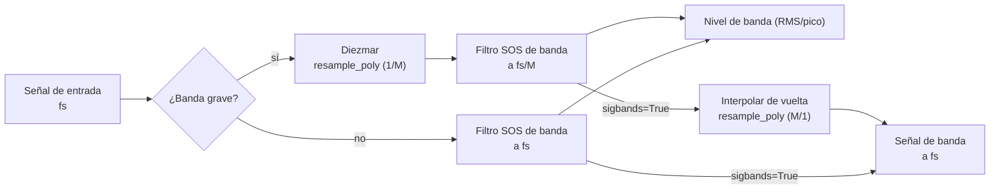

Esta página reúne la teoría de la propia cadena de medición: las bandas fraccionales de octava normalizadas y los bancos de filtros en el dominio temporal que las implementan, las curvas de ponderación frecuencial, la integración temporal, las métricas de nivel, de evento y de exposición, la intensidad sonora y el marco de incertidumbre del GUM que sustenta cada magnitud medida. Forma parte de la [referencia de teoría](/phonometry/es/reference/theory/).

## Frecuencias de banda de octava (ANSI S1.11 / IEC 61260)

Las frecuencias centrales (fm) y los bordes (f1, f2) usan una razón en base 10:

$$
G = 10^{0{,}3}
$$

**Frecuencia central:**

$$
f_m = 1000 \cdot G^{x/b}
$$

(para b impar)

**Bordes de banda:**

$$
f_1 = f_m \cdot G^{-1/(2b)}, \quad f_2 = f_m \cdot G^{1/(2b)}
$$

## Resolución frecuencial vs separación de bins FFT

`octave_filter` es un **banco de filtros de octava fraccional en el dominio del
tiempo**, no un estimador espectral FFT/Welch. Por tanto, su resultado no tiene
una resolución frecuencial en el sentido `fs / nfft`.

Para `fraction=3`, la salida contiene un nivel escalar por banda de tercio de
octava. La granularidad relevante es la definición normalizada de la banda:
frecuencia central, borde inferior y borde superior. Como las bandas de octava
fraccional están espaciadas logarítmicamente, su ancho absoluto en Hz crece con
la frecuencia mientras su ancho relativo se mantiene aproximadamente constante.

Por ejemplo, con `fraction=3` y `limits=[12, 20000]`, la banda de tercio de
octava en torno a 1 kHz es aproximadamente:

| Banda nominal | Borde inferior | Centro | Borde superior | Ancho |
| :--- | ---: | ---: | ---: | ---: |
| 1 kHz | 891.25 Hz | 1000.00 Hz | 1122.02 Hz | 230.77 Hz |

Puedes inspeccionar las bandas exactas con:

```python
from phonometry import metrology

fc, fl, fu, labels = metrology.nominal_frequencies(fraction=3, limits=[12, 20000])
for label, center, lower, upper in zip(labels, fc, fl, fu):
    print(label, center, lower, upper, upper - lower)
```

Si necesitas bins FFT de banda estrecha para inspección tonal, ejecuta
Welch/FFT sobre la señal original y usa los bordes de banda de phonometry como
máscaras:

```python
import numpy as np
from scipy import signal
from phonometry import metrology

fs = 100_000
# cualquier señal de presión 1D en Pa (se sintetiza para que el ejemplo funcione)
pressure_signal_pa = 0.02 * np.random.default_rng(0).standard_normal(fs)
x = pressure_signal_pa

# Niveles de tercio de octava normalizados de phonometry.
levels, centers = metrology.octave_filter(
    x,
    fs=fs,
    fraction=3,
    limits=[12, 20_000],
)

# Las mismas definiciones de banda, incluidos los bordes.
fc, fl, fu, labels = metrology.nominal_frequencies(fraction=3, limits=[12, 20_000])

# Estimación Welch de banda estrecha sobre la señal original.
nperseg = min(2**15, len(x))
freq_bins, psd = signal.welch(
    x,
    fs=fs,
    window="hann",
    nperseg=nperseg,
    noverlap=nperseg // 2,
    scaling="density",
)

# Ejemplo: listar los bins Welch dentro de la banda más cercana a 1 kHz.
band_index = int(np.argmin(np.abs(np.asarray(fc) - 1000.0)))
in_band = (freq_bins >= fl[band_index]) & (freq_bins <= fu[band_index])

print("Banda de tercio de octava seleccionada:", labels[band_index])
print("Separación de bins Welch:", freq_bins[1] - freq_bins[0], "Hz")
for f, pxx in zip(freq_bins[in_band], psd[in_band]):
    print(f, pxx)
```

Esto mantiene separados los dos conceptos: phonometry da niveles de octava
fraccional normalizados, mientras Welch da bins FFT de banda estrecha. Con
`fs=100000` y `nperseg=2**15`, la separación de bins Welch es de unos `3.05 Hz`.
La ventana y el solape afectan al leakage y a la varianza del promediado, pero
no cambian la separación de bins de cada segmento FFT.

Con `sigbands=True`, `octave_filter` también puede devolver la forma de onda
filtrada por cada banda. Aplicar Welch/FFT a una de esas señales puede servir
como vista diagnóstica del contenido dentro de esa banda, pero no recupera bins
FFT a partir de los niveles escalares por banda.

## Respuestas en magnitud |H(jw)|

La librería implementa los prototipos clásicos estándar:

**1. Butterworth:** banda de paso máximamente plana.

$$
|H(j\omega)| = \frac{1}{\sqrt{1 + (\omega/\omega_c)^{2n}}}
$$

**2. Chebyshev I:** rizado uniforme en la banda de paso, caída más abrupta.

$$
|H(j\omega)| = \frac{1}{\sqrt{1 + \epsilon^2 T_n^2(\omega/\omega_c)}}
$$

**3. Chebyshev II:** Chebyshev inverso, rizado uniforme en la banda atenuada,
banda de paso plana.

$$
|H(j\omega)| = \frac{1}{\sqrt{1 + \frac{1}{\epsilon^2 T_n^2(\omega_{stop}/\omega)}}}
$$

**4. Elíptico:** rizado en ambas bandas, máxima selectividad.

$$
|H(j\omega)| = \frac{1}{\sqrt{1 + \epsilon^2 R_n^2(\omega/\omega_c, L)}}
$$

**5. Bessel:** retardo de grupo máximamente plano (fase lineal).

$$
H(s) = \frac{\theta_n(0)}{\theta_n(s/\omega_0)}
$$

(donde $\theta_n$ es el polinomio de Bessel inverso)

### Colocación de los bordes de banda

Para todas las arquitecturas, el banco sitúa los **puntos de −3 dB en los bordes
de banda**. Dos casos requieren tratamiento especial:

- **Chebyshev II**: en scipy, `Wn` es el borde de la banda *atenuada*.
  phonometry mapea analíticamente los bordes de −3 dB deseados a bordes de
  banda atenuada — la razón de transición del prototipo es
  $\cosh(\operatorname{acosh}(\sqrt{10^{A/10}-1})/N)$ — aplicando la
  transformación paso-bajo→paso-banda en el dominio bilineal pre-warpeado, de
  modo que el mapeo es exacto incluso para bandas diezmadas cercanas a Nyquist.
- **Bessel**: se diseña con `norm="mag"`, que define el punto de −3 dB
  exactamente en `Wn` (la norma `phase` desplazaría los bordes a unos −10 dB).

## Diseño del banco y estabilidad numérica

Para garantizar **estabilidad total** en todo el espectro audible (incluso a
frecuencias bajas como 16 Hz con frecuencias de muestreo altas), phonometry
emplea dos estrategias fundamentales:



1. **Secciones de segundo orden (SOS):** todos los filtros se implementan como
   biquads en cascada, evitando la pérdida catastrófica de precisión de las
   funciones de transferencia de orden alto.
2. **Diezmado multitasa:** para las bandas graves, la señal se diezma antes de
   filtrar y se interpola después. Esto mantiene los polos digitales lejos del
   borde del círculo unidad, evitando oscilaciones y ruido. Los bancos
   Chebyshev II reservan margen de diezmado adicional para que sus bordes de
   banda atenuada queden por debajo del Nyquist diezmado.

## Curvas de ponderación (IEC 61672-1)

La función de transferencia de la ponderación A:

$$
R_A(f) = \frac{12194^2 \cdot f^4}{(f^2 + 20{,}6^2)\sqrt{(f^2 + 107{,}7^2)(f^2 + 737{,}9^2)}(f^2 + 12194^2)}
$$

$$
A(f) = 20 \log_{10}(R_A(f)) + 2{,}00
$$

El filtro digital se obtiene de los polos/ceros analógicos mediante la
transformación bilineal. Como esta comprime las frecuencias cerca de Nyquist, el
modo `high_accuracy` por defecto diseña y ejecuta el filtro a una frecuencia
interna sobremuestreada (≥ 144 kHz) — consulta
[Ponderación frecuencial](/phonometry/es/guides/weighting/).

## Integración temporal

Implementada como un integrador exponencial IIR de primer orden:

$$
y[n] = \alpha \cdot x^2[n] + (1 - \alpha) \cdot y[n-1]
$$

$$
\alpha = 1 - e^{-1 / (f_s \cdot \tau)}
$$

donde `tau` es la constante de tiempo (p. ej. 125 ms para Fast).

La condición inicial por defecto es `y[-1] = 0`. Usa `initial_state='first'`
para partir de la energía de la primera muestra, o pasa un escalar/array con el
estado cuadrático medio anterior. Consulta
[Por qué phonometry](/phonometry/es/reference/why-phonometry/) para la
verificación de esta implementación con ráfagas de tono de IEC 61672-1.

## Ponderación G (ISO 7196)

La curva G extiende la ponderación frecuencial al rango de los infrasonidos. La Tabla 1 de ISO 7196:1995 (p. 2) la define mediante cuatro ceros en el origen y cuatro pares de polos complejos conjugados, dados como coordenadas en Hz (multiplicadas por $2\pi$ para obtener rad/s):

$$
z_{1..4} = 0, \qquad
p = 2\pi \left\lbrace -0{,}707 \pm j0{,}707,\  -19{,}27 \pm j5{,}16,\  -14{,}11 \pm j14{,}11,\  -5{,}16 \pm j19{,}27 \right\rbrace \ \text{Hz}
$$

La ganancia $k$ se elige para que la respuesta sea exactamente **0 dB a 10 Hz** (cláusula 4):

$$
k = \left| \frac{\prod_i (j\omega_{10} - p_i)}{\prod_i (j\omega_{10} - z_i)} \right|, \qquad \omega_{10} = 2\pi \cdot 10 \ \text{rad/s}
$$

Los cuatro ceros frente a ocho polos dan forma a la respuesta característica: una subida de aproximadamente **+12 dB/octava entre 1 Hz y 20 Hz**, con caídas de aproximadamente **24 dB/octava** por debajo de 1 Hz y por encima de 20 Hz. Los infrasonidos necesitan su propia curva porque, cerca del umbral de audición, la sonoridad percibida de los tonos de muy baja frecuencia crece con el nivel de presión sonora mucho más abruptamente que a frecuencias medias — un pequeño incremento en dB sobre el umbral produce un gran salto de sonoridad —, de modo que la curva A (anclada en 1 kHz) distorsiona por completo la molestia infrasónica.

Como G actúa sobre 0,25 Hz – 315 Hz, muy por debajo de la frecuencia de Nyquist a tasas de audio, la deformación en frecuencia de la transformación bilineal simple (aplicada sin precompensación) es despreciable en ese rango: en torno al 0,014 % a 315 Hz con $f_s = 48$ kHz, menos de 0,01 dB en la respuesta. Por eso no se aplica el sobremuestreo interno usado en los diseños A/C (cuya acción se extiende hasta 16 kHz).

Consulta la [guía de ponderación frecuencial](/phonometry/es/guides/weighting/) para su uso.

## Métricas de evento y de dosis

El **nivel de exposición sonora** (SEL; LAE con ponderación A, IEC 61672-1:2013) normaliza la energía de un evento discreto (sobrevuelo de un avión, paso de un tren) a una duración de referencia de 1 s:

$$
\mathrm{SEL} = L_{eq,T} + 10 \log_{10}\left(\frac{T}{T_0}\right), \qquad T_0 = 1\ \text{s}
$$

La **exposición sonora** $E$ (IEC 61252, 3.1) es la integral temporal del cuadrado de la presión sonora ponderada A, expresada en pascales al cuadrado por hora:

$$
E = \int_0^T p_A^2(t)\ dt = \overline{p_A^2} \cdot T \quad [\text{Pa}^2\text{h}]
$$

Cuando la grabación es una muestra representativa de una jornada más larga, $E$ escala el cuadrático medio medido por la duración real de la exposición. El **nivel normalizado a 8 h** (IEC 61252, 3.3) convierte la exposición en el nivel estacionario que transporta la misma energía a lo largo de una jornada laboral nominal:

$$
L_{EX,8h} = 10 \log_{10}\left(\frac{E}{8\ \text{h} \cdot p_0^2}\right), \qquad p_0 = 20\ \mu\text{Pa}
$$

Es idéntico al $L_{EP,d}$ de la Directiva 86/188/CEE y al $L_{EX,8h}$ de ISO 1999 (IEC 61252, 3.3 NOTAS 5–6). El ancla de IEC 61252 (3.3 NOTA 4): una exposición de **3,2 Pa²h corresponde a un $L_{EX,8h}$ de exactamente 90 dB**.

**LCpeak** (IEC 61672-1:2013, subcláusula 5.13) es el máximo absoluto de la presión sonora ponderada C expresado en dB, $L_{Cpeak} = 20\log_{10}(\max|p_C(t)|/p_0)$ — la magnitud detrás de los límites de acción laborales de 135/137/140 dB(C). La implementación se verifica contra las respuestas de referencia de un ciclo y de medio ciclo de la Tabla 5.

Consulta la [guía de niveles](/phonometry/es/guides/levels/) para su uso y la [guía de calibración](/phonometry/es/guides/calibration/) para configurar la escala absoluta.

## Intensidad sonora (IEC 61043)

La intensidad sonora es el flujo de potencia acústica promediado en el tiempo $I = \overline{p u}$. La velocidad de partícula se obtiene de la **ecuación de Euler** (conservación del momento linealizada):

$$
\rho_0 \frac{\partial u}{\partial t} = -\frac{\partial p}{\partial r}
$$

Una sonda p-p aproxima el gradiente de presión por la **diferencia finita** de dos micrófonos separados una distancia de separador $\Delta r$ (IEC 61043:1994, definición 3.2):

$$
p = \frac{p_1 + p_2}{2}, \qquad u = -\frac{1}{\rho_0 \Delta r} \int (p_2 - p_1)\ dt, \qquad I = \overline{p\ u}
$$

Para señales estacionarias el mismo estimador tiene una forma exacta en el dominio de la frecuencia a través de la parte imaginaria del **espectro cruzado** unilateral $G_{12}$ de las dos presiones — la implementación lo estima con segmentos promediados tipo Welch con ventana de Hann:

$$
I(f) = -\ \frac{\mathrm{Im}\lbrace G_{12}(f)\rbrace}{2 \pi f\ \rho_0\ \Delta r}
$$

La diferencia finita subestima la intensidad real de onda plana en el factor

$$
\frac{\sin(k \Delta r)}{k \Delta r}, \qquad k = \frac{2 \pi f}{c}
$$

— la cláusula 7.3 de IEC 61043 especifica la respuesta en intensidad de la sonda con exactamente este argumento y la Tabla 3 la tabula (p. ej. −10,5 dB a 6,3 kHz para un separador de 25 mm). Por debajo de $f = 0{,}1 c / \Delta r$ (es decir, $k \Delta r$ por debajo de 0,63) el sesgo se mantiene dentro de unos 0,3 dB; `bias_correction` proporciona el factor recíproco por banda y `max_valid_frequency` la cota.

El **índice presión-intensidad** $\delta_{pI} = L_p - L_I$ mide cuán reactivo es el campo: en una onda plana progresiva libre vale $10 \log_{10}(\rho_0 c / 400) = 0{,}14$ dB, mientras que valores grandes delatan campos reactivos o ruidosos en los que domina el error de fase entre canales. El Anexo A de ISO 9614-1:1993 lo generaliza sobre una superficie de medición como el indicador F2 (con F3 para la potencia parcial negativa y F4 para la no uniformidad del campo), y la **capacidad dinámica** del instrumento $L_d = \delta_{pI0} - K$ (índice presión-intensidad residual menos el factor de error de sesgo: 10 dB para los grados 1/2, 7 dB para el grado 3) debe superar F2 para que la medición sea válida (criterio 1).

Consulta la [guía de intensidad sonora](/phonometry/es/guides/intensity/) para su uso.

## Incertidumbre de medida (ISO/IEC Guide 98-3 — GUM y Suplemento 1)

Los presupuestos de dominio como ISO 12999-1 y el Anexo C de ISO 9612 son
instancias del marco general de la GUM (ISO/IEC Guide 98-3:2008). Dado un
modelo de medición $y = f(x_1, \ldots, x_N)$, la ley de propagación de la
incertidumbre (cláusula 5) combina las incertidumbres típicas de entrada a
través de coeficientes de sensibilidad:

$$
u_c^2(y) = \sum_{i=1}^{N} \left( \frac{\partial f}{\partial x_i} \right)^2 u^2(x_i),
$$

generalizada a $(c \odot u)^{\top} r\ (c \odot u)$ para entradas
correlacionadas. Las sensibilidades se obtienen por diferencias centradas
sobre el modelo del usuario (paso escalado a $10^{-3}$ de cada incertidumbre
de entrada), así que no hacen falta derivadas parciales a mano. Las entradas
de Tipo B entran por las reglas de semiancho de la cláusula 4.3: rectangular
$a/\sqrt{3}$ (4.3.7), triangular $a/\sqrt{6}$ (4.3.9), en U $a/\sqrt{2}$. La
incertidumbre expandida $U = k\,u_c$ toma $k$ de la distribución t con los
grados de libertad efectivos de Welch–Satterthwaite (Anexo G.4):

$$
\nu_{\mathrm{eff}} = \frac{u_c^4}{\sum_i u_i^4 / \nu_i}.
$$

El **Suplemento 1** (ISO/IEC Guide 98-3-1:2008) propaga en cambio las
distribuciones completas: $10^6$ extracciones de Monte Carlo (cláusula 6.4) a
través del mismo modelo dan $u(y)$ y el intervalo de cobertura
probabilísticamente simétrico a partir de los fractiles
$\frac{1}{2}(1 \mp p)$ (cláusula 7.7) — la vía cuando el modelo es no lineal o
la salida visiblemente no gaussiana. Los ejemplos de las propias Guías se
reproducen: el modelo aditivo de cuatro términos da $u_c = 2{,}0$ y el
intervalo Monte Carlo al 95 % $\pm 3{,}88$ de la cláusula 9.2/Tabla 3 del
Suplemento 1 (cuatro entradas rectangulares — la salida es casi trapezoidal,
no gaussiana, así que el intervalo es más estrecho que $\pm 1{,}96\,u$), y el
ejemplo del bloque patrón del Anexo H.1 de la GUM da
$k = t_{0{,}99}(\nu_{\mathrm{eff}} = 16) = 2{,}92$ y $U_{99} = 93$ nm.

Consulta la [guía de incertidumbre de medida](/phonometry/es/guides/gum-uncertainty/) para su uso.
