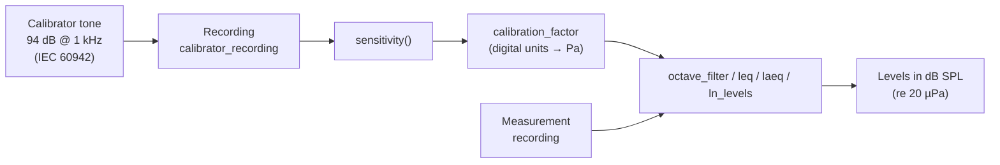

phonometry can return results in physical **Sound Pressure Level (dB SPL)** or
digital **decibels relative to Full Scale (dBFS)**.

## Why calibrate? The theory

A digital recording only knows *numbers*: a full-scale sine wave is ±1.0
regardless of whether it was a whisper or a jet engine. To report physical
sound pressure levels the chain microphone → preamplifier → ADC must be
characterized by a single number, the **sensitivity factor** $S$, that
converts digital units into pascals:

$$
p(t) = S\ x(t) \qquad S = \frac{p_\text{ref}\cdot 10^{L_\text{cal}/20}}{\tilde{x}_\text{ref}}
$$

where $L_\text{cal}$ is the calibrator's level (typically 94 dB, i.e. 1 Pa),
$p_\text{ref} = 20\ \mu\text{Pa}$ and $\tilde{x}_\text{ref}$ is the RMS of
the recorded calibration tone in digital units. `sensitivity()` is
exactly that equation. The factor is valid as long as nothing in the chain
changes — touch the gain knob and you must recalibrate.


## Physical Calibration (Sound Level Meter)



To get accurate SPL measurements from a digital recording, you must first
calculate the sensitivity of your measurement chain using a reference tone
(e.g., 94 dB @ 1 kHz).

```python
import numpy as np
from phonometry import octave_filter, sensitivity

# 1. Record your 94 dB calibrator signal (1 kHz, 1 Pa RMS = 94 dB SPL)
fs = 48000
# calibrator_recording: your recorded 1 kHz calibrator tone (1 Pa RMS = 94 dB SPL).
#   Synthesized here so the guide runs; in a real measurement, record your calibrator.
calibrator_recording = np.sqrt(2) * np.sin(2 * np.pi * 1000 * np.arange(fs) / fs)
# recording: the mic capture you want to calibrate, same input chain (Pa after calibration).
#   Synthesized here; in a real measurement this is your recorded signal.
recording = 0.2 * np.sin(2 * np.pi * 1000 * np.arange(fs) / fs)

# 2. Calculate sensitivity factor
calibration_factor = sensitivity(calibrator_recording, target_spl=94.0, fs=fs)

# 3. Apply calibration to your measurements
spl, freq = octave_filter(recording, fs, calibration_factor=calibration_factor)
# Now 'spl' values are in real-world dB SPL!
```

The same `calibration_factor` works across the whole library: `octave_filter`,
`OctaveFilterBank`, `leq`, `laeq` and `ln_levels`.

## Calibrator assumptions (IEC 60942)

`sensitivity` assumes the reference recording comes from an acoustic
calibrator as specified by **IEC 60942** (classes LS, 1 and 2):

- The default `target_spl=94.0` matches the common 94 dB @ 1 kHz calibrator
  output (the standard requires the principal level to be at least 90 dB re
  20 µPa; 94 dB and 114 dB are the usual choices).
- The resulting sensitivity inherits the calibrator's class tolerance — e.g.
  ±0.4 dB for a class 1 calibrator between 160 Hz and 1.25 kHz (IEC 60942
  Table 1) — plus the RMS estimation error of your recording.
- IEC 60942 specifies the generated level as a 20 s average: record a few
  seconds of *stable* tone (excluding handling noise at the start/end) for the
  RMS estimate to converge.

### Automatic stability validation

When you pass the sample rate (and `validate=True`, the default),
`sensitivity(ref, fs=fs)` checks the recording the way
IEC 60942:2017 checks the calibrator itself (5.3.3): the *short-term level
fluctuation* — the absolute difference between each of the maximum and minimum
F-time-weighted levels and the mean level — must not exceed the Table 2 class 1
limit for the calibrator's nominal frequency (0.07 dB at and above 160 Hz, relaxed
to 0.10 dB below 160 Hz and 0.20 dB at or below 63 Hz, where the F
time-weighting itself ripples). Pass `frequency=` to select the right row for non-1 kHz
calibrators. A `CalibrationWarning` flags badly coupled microphones or handling
noise before they silently corrupt every calibrated level. The recording must
be at least 2 s long (1 s for the F-integrator to settle plus 1 s of settled
envelope); shorter recordings get a warning instead of an unreliable verdict.
Without `fs` the check is skipped. Override the limit with
`max_fluctuation_db` or disable with `validate=False`.

The check catches exactly what ruins field calibrations — a loose coupler,
wind, handling noise:


<details>
<summary>Show the code for this figure</summary>

```python
import matplotlib.pyplot as plt
import numpy as np
from phonometry import time_weighting

fs = 48000
t = np.arange(int(fs * 6.0)) / fs
stable = 0.5 * np.sin(2 * np.pi * 1000 * t)
# 3 % amplitude modulation at 2 Hz: ~0.14 dB of wobble, clearly over
unstable = stable * (1 + 0.03 * np.sin(2 * np.pi * 2.0 * t))

plt.figure(figsize=(9, 5))
skip = fs                     # discard the F-integrator attack (~8 tau)
for x, label in ((stable, "Stable tone (good coupling)"),
                 (unstable, "3% AM tone (loose coupling)")):
    env = time_weighting(x, fs, mode="fast")[skip:]
    level = 10 * np.log10(np.maximum(env, np.finfo(float).eps))
    plt.plot(t[skip:], level - level.mean(), label=label)
for lim in (0.07, -0.07):
    plt.axhline(lim, linestyle="--", color="gray")
plt.xlabel("Time [s]")
plt.ylabel("F-weighted level re mean [dB]")
plt.legend()
plt.show()
```

</details>

### `sensitivity()` parameters

| Parameter | Type / shape | Units | Range / default | Notes |
| :--- | :--- | :--- | :--- | :--- |
| `ref_signal` | 1D/2D array | digital units | non-empty, non-silent | Recording of the calibration tone only (trim handling noise) |
| `target_spl` | float | dB re 20 µPa | default `94.0` | The calibrator's nominal level (114 dB calibrators: pass `114.0`) |
| `ref_pressure` | float | Pa | default `2e-5` | Reference pressure p₀; rarely changed |
| `fs` | int, optional | Hz | > 0; default `None` | Required for the stability validation; omit to skip it |
| `validate` | bool | — | default `True` | Emit `CalibrationWarning` on unstable/short recordings |
| `max_fluctuation_db` | float, optional | dB | default `None` → Table 2 class 1 | Explicit override of the stability limit |
| `frequency` | float | Hz | default `1000.0` | Calibrator's nominal frequency; selects the IEC 60942 Table 2 row |
| `narrowband` | bool | — | default `False` | Estimate the tone with a coherent Goertzel detector near `frequency` (needs `fs`) instead of full-band RMS; rejects broadband hum/noise that otherwise inflates the RMS and shrinks every later level (~−0.44 dB at 20 dB SNR). Enable for noisy coupler recordings |

Returns the sensitivity factor (float) to pass as `calibration_factor=` to
`octave_filter`, `leq`, `laeq`, `ln_levels`, `lc_peak`, `sel` and the dose
functions.

## Field checks, laboratory verification and drift

Calibration lives at three time scales:

- **Every session: the field check.** Couple the calibrator and derive the
  sensitivity before each measurement series, and check it again at the end.
  Normative methods make the second check mandatory and use the pre/post
  difference as a validity gate (a common criterion invalidates the series
  when the two differ by more than 0.5 dB). Whatever the threshold, the
  difference is your drift bound for everything captured in between; carry
  it into the uncertainty budget rather than assuming zero.
- **Periodically: laboratory verification.** A field check only compares the
  chain against the calibrator; it cannot see an error the calibrator and
  meter share, and it says nothing about the response away from 1 kHz.
  IEC 61672-3 defines the periodic tests for the meter (weightings,
  level linearity and ballistics spot-checked against the class limits),
  and IEC 60942 the corresponding tests for the calibrator itself; typical
  laboratory intervals are one to two years.
- **Between checks: drift.** Microphone sensitivity moves with temperature,
  humidity and capsule aging; electronics with battery voltage. A healthy
  class 1 chain drifts a few hundredths of a dB over a session, which is
  why a pre/post difference of half a decibel signals damage rather than
  weather. The largest "drift" of all is a touched gain knob: the factor S
  is valid only while the chain stays exactly as calibrated.

One more class subtlety: tolerances chain. A class 1 measurement requires a
class 1 (or LS) calibrator *and* a class 1 meter; calibrating a class 1
chain with a class 2 calibrator silently downgrades every derived level to
class 2 accuracy, because the calibrator's wider level tolerance enters S
directly.

## Digital Analysis (dBFS)

If you are working with digital audio files (e.g., WAV, FLAC) and want to
analyze levels relative to Full Scale rather than physical pressure, you can use
the `dbfs=True` parameter.

In this mode:

* **0 dBFS** corresponds to a numeric signal level of 1.0 (RMS or Peak).
* `calibration_factor` does not apply (dBFS is relative to digital full scale).
* Useful for analyzing headroom, digital mastering, or normalized signals.

```python
# Assume 'recording' is normalized between -1.0 and 1.0
spl_dbfs, freq = octave_filter(recording, fs, dbfs=True)
# Results will be negative (e.g., -20 dBFS)
```

## RMS vs Peak Levels

phonometry supports two measurement modes to align with professional software
like BK:

- **RMS (`mode='rms'`)**: Energy-based level (standard).
- **Peak (`mode='peak'`)**: Absolute maximum value reached in the frame
  (Peak-holding).

```python
# Measure peak-holding levels for impact analysis
spl_peak, freq = octave_filter(recording, fs, mode='peak')
```

:::note
`mode='peak'` measures the absolute maximum of the **filtered** band signal,
which includes the filter's onset transient (overshoot). Signals that start
abruptly may read up to ~1 dB high. This is inherent to IIR band filters
(an analog SLM behaves the same way), not a processing artifact.
:::

## Integer audio input

Integer signals (e.g. int16 from `scipy.io.wavfile.read`) are converted to
float64 internally before any squaring, so calibration and level results are
identical whether you pass the raw integer array or a float conversion.

## References

- International Electrotechnical Commission. (2017). *Electroacoustics —
  Sound calibrators* (IEC 60942:2017).
  [IEC webstore](https://webstore.iec.ch/en/publication/30045).
  The calibrator classes, level tolerances and the short-term stability
  criterion `sensitivity()` applies to the reference recording.
- International Electrotechnical Commission. (2013). *Electroacoustics —
  Sound level meters — Part 3: Periodic tests* (IEC 61672-3:2013).
  [IEC webstore](https://webstore.iec.ch/en/publication/5710).
  The laboratory verification procedure behind the periodic checks
  recommended above.

---

**Standards.** IEC 60942:2017, *Electroacoustics — Sound calibrators* — the
calibrator level and class assumptions behind `sensitivity()` (the 94 dB
principal level and the Table 1 class tolerances) and the short-term
level-fluctuation stability check of the reference recording (5.3.3, Table 2
class 1 limits per nominal frequency).

## See also

- API reference: [`metrology.calibration`](/phonometry/reference/api/levels/calibration/) and [`phonometry`](/phonometry/reference/api/filters/phonometry/).
