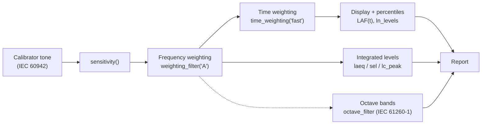

A sound level meter is not one algorithm but a short pipeline of them, and
IEC 61672-1 specifies every stage. phonometry implements each stage as an
independent, composable function; this page assembles them, in order, into a
working meter. Every snippet runs as written (the signals are synthesized so
the page is self-contained), and each stage links to the deep guide that
explains it fully.



The snippets on this page build on each other: run them top to bottom in one
session (or paste the whole page into a script).

## 1. The scenario

A meter needs two recordings from the *same* input chain: the calibrator tone
that anchors the digital numbers to pascals, and the measurement itself. Here
both are synthesized so you can run the page anywhere; in a real measurement
they come from your microphone.

```python
import numpy as np
from phonometry import metrology

fs = 48000

# Calibrator tone: 94 dB SPL = 1 Pa RMS at 1 kHz (IEC 60942).
#   Synthesized here; in the field, record a few seconds of your calibrator.
calibrator = np.sqrt(2) * np.sin(2 * np.pi * 1000 * np.arange(3 * fs) / fs)

# "Street" measurement: 10 s of pink background noise plus a 1 s horn-like
#   1 kHz event, so the statistical levels have something to separate.
recording = metrology.noise_signal(fs, 10.0, color="pink", rms=0.02, seed=7)
recording[4 * fs : 5 * fs] += 0.2 * np.sqrt(2) * np.sin(
    2 * np.pi * 1000 * np.arange(fs) / fs
)
```

## 2. Calibrate: give the samples physical meaning

Digital samples are dimensionless; the **sensitivity factor** converts them
to pascals. `sensitivity()` computes it from the calibrator recording and, at
the same time, validates the recording's short-term stability the way
IEC 60942 qualifies the calibrator itself, so a badly coupled microphone is
caught here instead of corrupting every level downstream.

```python
cal = metrology.sensitivity(calibrator, target_spl=94.0, fs=fs)
# cal is in Pa per digital unit; every level function accepts it as
# calibration_factor. For this synthetic tone it is ~1.0.
```

Deep guide: [Calibration and dBFS](/phonometry/guides/calibration/), which
also covers calibrating from a known microphone sensitivity and the digital
dBFS mode used when no physical reference exists.

## 3. Weight: frequency and time (IEC 61672-1)

The meter never shows raw pressure. The signal first passes the **A
frequency weighting** (the ear-response curve of IEC 61672-1), is squared,
and is then smoothed by the **Fast exponential detector** (time constant
125 ms). The result is the moving level a meter's display follows, LAF(t):

```python
pressure = cal * recording                                # digital units -> Pa
weighted = metrology.weighting_filter(pressure, fs, curve="A")
envelope = metrology.time_weighting(weighted, fs, mode="fast")  # mean-square Pa^2
laf_t = 10 * np.log10(np.maximum(envelope, 1e-12) / (2e-5) ** 2)
# laf_t peaks near 80 dB during the event and settles near 55 dB between.
```

You rarely write this chain yourself: every level function of the next step
applies the frequency weighting internally, and the percentile levels rebuild
this Fast envelope for you. The energy metrics (Leq, SEL) integrate the
squared weighted signal directly, with no ballistics, exactly as a meter
does. The chain is shown here because it *is* the meter's display.

Deep guides: [Frequency Weighting (A, C, G, Z)](/phonometry/guides/weighting/)
and [Time Weighting](/phonometry/guides/time-weighting/).

## 4. Integrate: the numbers a meter reports

One pass over the calibrated recording yields the standard readouts: the
energy-equivalent **LAeq**, the **percentile levels** that describe how the
level fluctuated (L90 is the background, L10 the events), the
**sound exposure level** that normalizes the event to one second, and the
C-weighted **peak** for impulsive content.

```python
la_eq = metrology.laeq(recording, fs, calibration_factor=cal)     # ~70.2 dB
ln = metrology.ln_levels(
    recording, fs, n=(10, 50, 90), weighting="A", calibration_factor=cal
)                                                # L10 ~78.0, L50 ~55.1, L90 ~54.9
lae = metrology.sel(recording, fs, weighting="A", calibration_factor=cal)  # ~80.2
lc_pk = metrology.lc_peak(recording, fs, calibration_factor=cal)           # ~84.4

print(f"LAeq {la_eq:.1f} dB | L10 {ln[10]:.1f} | L90 {ln[90]:.1f} "
      f"| LAE {lae:.1f} | LCpeak {lc_pk:.1f}")
```

Note the arithmetic the numbers encode: the 1 s event dominates LAeq (it sits
25 dB above the background, far more than the 10 dB the nine-times-longer
background gets back in duration), LAE is LAeq plus 10 log10 of the 10 s
duration, and L90 barely notices the event at all.

Deep guide: [Integrated and Statistical Levels](/phonometry/guides/levels/),
which adds noise dose, Lden and rating levels, and octave spectrograms.

## 5. Band-filter: the spectrum view (IEC 61260-1)

A class 1 meter with a filter set reports band levels. `octave_filter`
decomposes the calibrated signal into fractional-octave bands whose design is
anchored to the IEC 61260-1 band edges; `nominal=True` labels them with the
preferred frequencies you would read on an instrument.

```python
spl, bands = metrology.octave_filter(
    recording, fs, fraction=3, calibration_factor=cal, nominal=True
)
# 33 one-third-octave band levels in dB SPL, labeled '12.5' ... '20k'.
# The '1k' band holds the event: ~70 dB, while its neighbors stay ~25 dB below.
print(dict(zip(bands, np.round(spl, 1))))
```

Deep guides: [Filter Banks](/phonometry/guides/filter-banks/) for the filter
architectures and zero-phase mode,
[Block Processing](/phonometry/guides/block-processing/) for streaming, and
[Multichannel and Performance](/phonometry/guides/multichannel/) for arrays.

## 6. Verify: is this meter class 1?

A real instrument is only a "class 1 sound level meter" after its weightings
and filters pass the acceptance limits of the standards. The library ships
the same verifiers it applies to itself in CI: `verify_weighting_class`
sweeps a `WeightingFilter` against the IEC 61672-1 Table 3 limits, and
`verify_filter_class` sweeps an `OctaveFilterBank` against the IEC 61260-1
Table 1 limits.

```python
wf = metrology.WeightingFilter(fs, curve="A")
print(metrology.verify_weighting_class(wf)["overall_class"])   # 1

bank = metrology.OctaveFilterBank(fs, fraction=3)
print(metrology.verify_filter_class(bank)["overall_class"])    # 1
```

The verdicts also come per band, so you can see exactly where a design would
leave its class corridor. Deep guides:
[Frequency Weighting](/phonometry/guides/weighting/) (section on class
verification) and [Filter Banks](/phonometry/guides/filter-banks/) (class
compliance).

## Where to go next

The meter built here is the trunk; the rest of the core grows from it.

- [Measurement uncertainty (GUM and Monte Carlo)](/phonometry/guides/gum-uncertainty/):
  attach an uncertainty to the LAeq you just computed, calibration term
  included.
- [Calibrated spectral analysis](/phonometry/guides/spectral-analysis/): when
  bands are too coarse, the Welch PSD with confidence intervals.
- [Correlation, time delay and envelope](/phonometry/guides/correlation-delay/):
  two microphones instead of one, and the delay between them.
- [Block Processing](/phonometry/guides/block-processing/): turn this page's
  offline meter into a streaming one with carried filter state.

## See also

- API reference: [`metrology.calibration`](/phonometry/reference/api/levels/calibration/),
  [`metrology.parametric_filters`](/phonometry/reference/api/filters/parametric-filters/),
  [`metrology.levels`](/phonometry/reference/api/levels/levels/),
  [`phonometry`](/phonometry/reference/api/filters/phonometry/) and
  [`metrology.compliance`](/phonometry/reference/api/filters/compliance/).
