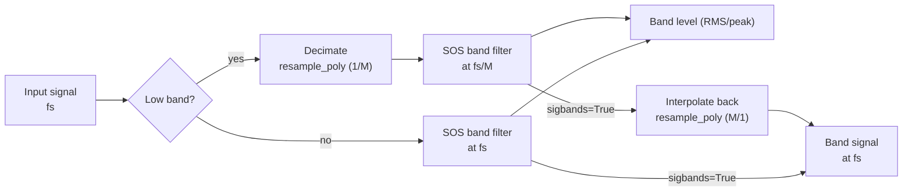

## Octave Band Frequencies (ANSI S1.11 / IEC 61260)

The mid-band frequencies (fm) and edges (f1, f2) use a base-10 ratio:

$$
G = 10^{0.3}
$$

**Mid-band:**

$$
f_m = 1000 \cdot G^{x/b}
$$

(for odd b)

**Band edges:**

$$
f_1 = f_m \cdot G^{-1/2b}, \quad f_2 = f_m \cdot G^{1/2b}
$$

## Frequency Resolution vs FFT Bin Spacing

`octave_filter` is a **time-domain fractional-octave filter bank**, not an FFT or
Welch spectrum estimator. Therefore, its result does not have a frequency
resolution in the `fs / nfft` sense.

For `fraction=3`, the output contains one scalar level per third-octave band.
The relevant frequency granularity is the standardized band definition: center
frequency, lower edge, and upper edge. Because fractional-octave bands are
logarithmically spaced, their absolute bandwidth in Hz grows with frequency
while their relative bandwidth remains approximately constant.

For example, with `fraction=3` and `limits=[12, 20000]`, the exact third-octave
band around 1 kHz is approximately:

| Nominal band | Lower edge | Center | Upper edge | Bandwidth |
| :--- | ---: | ---: | ---: | ---: |
| 1 kHz | 891.25 Hz | 1000.00 Hz | 1122.02 Hz | 230.77 Hz |

You can inspect the exact bands with:

```python
from phonometry import nominal_frequencies

fc, fl, fu, labels = nominal_frequencies(fraction=3, limits=[12, 20000])
for label, center, lower, upper in zip(labels, fc, fl, fu):
    print(label, center, lower, upper, upper - lower)
```

If you need narrowband FFT bins for tonal inspection, run Welch/FFT on the
original signal and use the phonometry band edges as masks:

```python
import numpy as np
from scipy import signal
from phonometry import octave_filter, nominal_frequencies

fs = 100_000
# any 1D pressure signal in Pa (synthesized here so the example runs)
pressure_signal_pa = 0.02 * np.random.default_rng(0).standard_normal(fs)
x = pressure_signal_pa

# Standardized third-octave levels from phonometry.
levels, centers = octave_filter(
    x,
    fs=fs,
    fraction=3,
    limits=[12, 20_000],
)

# Same standardized band definitions, including lower/upper edges.
fc, fl, fu, labels = nominal_frequencies(fraction=3, limits=[12, 20_000])

# Narrowband Welch estimate on the original signal.
nperseg = min(2**15, len(x))
freq_bins, psd = signal.welch(
    x,
    fs=fs,
    window="hann",
    nperseg=nperseg,
    noverlap=nperseg // 2,
    scaling="density",
)

# Example: list the Welch bins inside the third-octave band closest to 1 kHz.
band_index = int(np.argmin(np.abs(np.asarray(fc) - 1000.0)))
in_band = (freq_bins >= fl[band_index]) & (freq_bins <= fu[band_index])

print("Selected third-octave band:", labels[band_index])
print("Welch bin spacing:", freq_bins[1] - freq_bins[0], "Hz")
for f, pxx in zip(freq_bins[in_band], psd[in_band]):
    print(f, pxx)
```

This keeps the two concepts separate: phonometry gives standardized
fractional-octave levels, while Welch gives narrowband FFT bins. With
`fs=100000` and `nperseg=2**15`, the Welch bin spacing is about `3.05 Hz`.
Window choice and overlap affect leakage and averaging variance, but they do not
change the bin spacing of each FFT segment.

When `sigbands=True`, `octave_filter` can also return the time-domain waveform
filtered by each band. Applying Welch/FFT to one selected filtered waveform can
be useful as a diagnostic view of the content inside that filtered band, but it
does not recover FFT bins from the scalar band levels.

## Magnitude Responses |H(jw)|

The library implements standard classical filter prototypes:

**1. Butterworth:** Maximally flat passband.

$$
|H(j\omega)| = \frac{1}{\sqrt{1 + (\omega/\omega_c)^{2n}}}
$$

**2. Chebyshev I:** Equiripple in passband, steeper roll-off.

$$
|H(j\omega)| = \frac{1}{\sqrt{1 + \epsilon^2 T_n^2(\omega/\omega_c)}}
$$

**3. Chebyshev II:** Inverse Chebyshev, equiripple in stopband, flat passband.

$$
|H(j\omega)| = \frac{1}{\sqrt{1 + \frac{1}{\epsilon^2 T_n^2(\omega_{stop}/\omega)}}}
$$

**4. Elliptic:** Equiripple in both, maximum selectivity.

$$
|H(j\omega)| = \frac{1}{\sqrt{1 + \epsilon^2 R_n^2(\omega/\omega_c, L)}}
$$

**5. Bessel:** Maximally flat group delay (linear phase).

$$
H(s) = \frac{\theta_n(0)}{\theta_n(s/\omega_0)}
$$

(Where $\theta_n$ is the reverse Bessel polynomial)

### Band-edge placement

For every architecture the bank places the **−3 dB points on the band edges**.
Two cases need special handling:

- **Chebyshev II**: scipy's `Wn` is the *stopband* edge. phonometry maps the
  desired −3 dB edges to stopband edges analytically — the prototype transition
  ratio is $\cosh(\operatorname{acosh}(\sqrt{10^{A/10}-1})/N)$ — applying the
  lowpass→bandpass transform in the pre-warped bilinear domain so the mapping
  stays exact for decimated bands close to Nyquist.
- **Bessel**: designed with `norm="mag"`, which defines the −3 dB point exactly
  at `Wn` (the `phase` norm would shift the edges to roughly −10 dB).

## Filter Bank Design & Numerical Stability

To ensure **100% stability** across the entire audible spectrum (even at low
frequencies like 16 Hz with high sample rates), phonometry employs two
critical strategies:



1. **Second-Order Sections (SOS):** All filters are implemented as a series of
   cascaded biquads. This avoids the catastrophic numerical precision loss
   associated with high-order transfer functions (coefficients a, b).
2. **Multi-rate Decimation:** For low-frequency bands, the signal is
   automatically downsampled (decimated) before filtering and upsampled
   afterwards. This keeps the digital pole locations far from the unit circle
   boundary, preventing oscillation and noise. Chebyshev II banks reserve extra
   decimation headroom so their stopband edges stay below the decimated Nyquist.

## Weighting Curves (IEC 61672-1)

The A-weighting transfer function:

$$
R_A(f) = \frac{12194^2 \cdot f^4}{(f^2 + 20.6^2)\sqrt{(f^2 + 107.7^2)(f^2 + 737.9^2)}(f^2 + 12194^2)}
$$

$$
A(f) = 20 \log_{10}(R_A(f)) + 2.00
$$

The digital filter is obtained from the analog poles/zeros via the bilinear
transform. Because the bilinear transform compresses frequencies near Nyquist,
the default `high_accuracy` mode designs and runs the filter at an internally
oversampled rate (≥ 144 kHz) — see [Frequency Weighting](/phonometry/guides/weighting/).

## Time Integration

Implemented as a first-order IIR exponential integrator:

$$
y[n] = \alpha \cdot x^2[n] + (1 - \alpha) \cdot y[n-1]
$$

$$
\alpha = 1 - e^{-1 / (f_s \cdot \tau)}
$$

Where `tau` is the time constant (e.g., 125 ms for Fast).

The default initial condition is `y[-1] = 0`. Use `initial_state='first'` to
start from the first input energy, or pass a scalar/array with the previous
mean-square output state. See [Why phonometry](/phonometry/reference/why-phonometry/) for the
IEC 61672-1 tone-burst verification of this implementation.

## G-weighting (ISO 7196)

The G curve extends frequency weighting into the infrasound range. ISO 7196:1995 Table 1 (p. 2) defines it by four zeros at the origin and four complex-conjugate pole pairs, given as coordinates in Hz (multiplied by $2\pi$ to obtain rad/s):

$$
z_{1..4} = 0, \qquad
p = 2\pi \left\lbrace -0.707 \pm j0.707,\  -19.27 \pm j5.16,\  -14.11 \pm j14.11,\  -5.16 \pm j19.27 \right\rbrace \ \text{Hz}
$$

The gain $k$ is chosen so that the response is exactly **0 dB at 10 Hz** (clause 4):

$$
k = \left| \frac{\prod_i (j\omega_{10} - p_i)}{\prod_i (j\omega_{10} - z_i)} \right|, \qquad \omega_{10} = 2\pi \cdot 10 \ \text{rad/s}
$$

The four zeros against eight poles shape the characteristic response: a rise of approximately **+12 dB/octave between 1 Hz and 20 Hz**, with roll-offs of approximately **24 dB/octave** below 1 Hz and above 20 Hz. Infrasound needs its own curve because near the hearing threshold the perceived loudness of very-low-frequency tones grows much more steeply with sound pressure level than at mid frequencies — a small dB increase above threshold produces a large loudness jump — so the A curve (anchored at 1 kHz) grossly misrepresents infrasonic annoyance.

Since G acts on 0.25 Hz – 315 Hz, the plain bilinear transform is already exact there and the internal oversampling used for the A/C designs (whose action extends to 16 kHz) is not applied.

See the [Frequency Weighting guide](/phonometry/guides/weighting/) for usage.

## Equal-loudness contours (ISO 226:2023)

A tone has a *loudness level* of $L_N$ phon when it is judged equally loud as a 1 kHz pure tone at $L_N$ dB SPL. ISO 226:2023 Formula (1) (clause 4.1, p. 2) gives the SPL of a pure tone at frequency $f$ that reaches loudness level $L_N$:

$$
L_f = \frac{10}{\alpha_f} \log_{10}\left[ \left(4 \cdot 10^{-10}\right)^{0.3 - \alpha_f} \left( 10^{\ 0.03 L_N} - 10^{\ 0.072} \right) + 10^{\ \alpha_f (T_f + L_U)/10} \right] - L_U
$$

Formula (2) (clause 4.2) inverts it, returning the loudness level of a tone at SPL $L_f$:

$$
L_N = \frac{100}{3} \log_{10}\left[ \frac{10^{\ \alpha_f (L_f + L_U)/10} - 10^{\ \alpha_f (T_f + L_U)/10}}{\left(4 \cdot 10^{-10}\right)^{0.3 - \alpha_f}} + 10^{\ 0.072} \right]
$$

The three parameters come from Table 1 (p. 4), tabulated at the 29 preferred third-octave frequencies of ISO 266 from 20 Hz to 12.5 kHz:

- $\alpha_f$ — exponent for loudness perception at frequency $f$,
- $L_U$ — magnitude of the linear transfer function, normalized at 1 kHz ($L_U = 0$ at 1 kHz),
- $T_f$ — threshold of hearing at $f$, in dB.

The standard specifies **no interpolation** between the tabulated frequencies. Formula (1) is specified for **20 phon to 90 phon** between 20 Hz and 4 kHz, and only up to **80 phon between 5 kHz and 12.5 kHz** — above 80 phon the contour therefore stops at 4 kHz. Values outside these limits from Formula (2) are extrapolations the standard labels as informative only.

See the [Psychoacoustics guide](/phonometry/guides/psychoacoustics/) for usage.

## Tone prominence: TNR and PR (ECMA-418-1)

Both methods operate on a Hann-windowed, RMS-averaged power spectrum (clauses 11.1 / 12.1) and use the clause 10 critical-band model. The critical bandwidth centred on a tone at $f$ is (Formula 2):

$$
\Delta f_c = 25.0 + 75.0 \left(1.0 + 1.4 \left(\tfrac{f}{1000}\right)^2\right)^{0.69} \ \text{Hz}
$$

Band edges are placed **arithmetically** for $f \le 500$ Hz (Formulae 4–5): $f_{1,2} = f \mp \Delta f_c / 2$, and **geometrically** above (Formulae 7–8): $f_1 = -\Delta f_c/2 + \sqrt{\Delta f_c^2 + 4 f^2}/2$, $f_2 = f_1 + \Delta f_c$.

**TNR** (clause 11). The tone band spans the spectral minima on both sides of the peak within 15 % of $\Delta f_c$ (clause 11.2). The tone power subtracts the straight line connecting the band-edge bins (Formula 9): over $N$ tone-band bins, $P_t = \sum_k P_k - (P_{\text{lo}} + P_{\text{hi}})\ N/2$. The masking-noise power is the remaining critical-band power rescaled to the full critical bandwidth (Formula 10): $P_n = (P_{\text{band}} - P_t) \cdot \Delta f_c / \Delta f_{\text{band}}$, and $\mathrm{TNR} = 10\log_{10}(P_t/P_n)$ (Formula 11). The prominence criterion (Formulae 12–13) is

$$
\mathrm{TNR}_{\text{crit}} = \begin{cases} 8.0 + 8.33 \log_{10}(1000/f_t) \ \text{dB} & f_t < 1\ \text{kHz} \\ 8.0 \ \text{dB} & f_t \ge 1\ \text{kHz} \end{cases}
$$

**PR** (clause 12) compares the level of the critical band centred on the tone, $L_M$, with the mean power of the two **contiguous** critical bands $L_L$, $L_U$ (edges from the fitted Formulae 21–22 with Tables 2–3): $\mathrm{PR} = 10\log_{10} P_M - 10\log_{10}\left[(P_L + P_U)/2\right]$ (Formula 23). For $f_t \le 171.4$ Hz the lower band is truncated at 20 Hz and its power rescaled to a **100 Hz bandwidth** (Formula 24). The criterion (Formulae 25–26) is 9.0 dB at $f_t \ge 1$ kHz, rising as $9.0 + 10.0\log_{10}(1000/f_t)$ below. Tones are assessed within the 89.1 Hz – 11.2 kHz range of interest (clauses 11.5 / 12.6).

See the [Prominent Discrete Tones guide](/phonometry/guides/tone-prominence/) for usage.

## Event and dose metrics

**Sound exposure level** (SEL; LAE with A-weighting, IEC 61672-1:2013) normalizes the energy of a discrete event (aircraft flyover, train pass) to a 1 s reference duration:

$$
\mathrm{SEL} = L_{eq,T} + 10 \log_{10}\left(\frac{T}{T_0}\right), \qquad T_0 = 1\ \text{s}
$$

**Sound exposure** $E$ (IEC 61252, 3.1) is the time integral of the squared A-weighted sound pressure, expressed in pascal-squared hours:

$$
E = \int_0^T p_A^2(t)\ dt = \overline{p_A^2} \cdot T \quad [\text{Pa}^2\text{h}]
$$

When the recording is a representative sample of a longer shift, $E$ scales the measured mean square by the actual exposure duration. The **normalized 8 h level** (IEC 61252, 3.3) converts exposure to the steady level that carries the same energy over a nominal working day:

$$
L_{EX,8h} = 10 \log_{10}\left(\frac{E}{8\ \text{h} \cdot p_0^2}\right), \qquad p_0 = 20\ \mu\text{Pa}
$$

It is identical to $L_{EP,d}$ of Directive 86/188/EEC and $L_{EX,8h}$ of ISO 1999 (IEC 61252, 3.3 NOTES 5–6). The anchor of IEC 61252 (3.3 NOTE 4): an exposure of **3.2 Pa²h corresponds to $L_{EX,8h}$ of exactly 90 dB**.

**LCpeak** (IEC 61672-1:2013, subclause 5.13) is the absolute maximum of the C-weighted sound pressure expressed in dB, $L_{Cpeak} = 20\log_{10}(\max|p_C(t)|/p_0)$ — the quantity behind the 135/137/140 dB(C) occupational action limits. The implementation is verified against the one-cycle and half-cycle reference responses of Table 5.

See the [Levels guide](/phonometry/guides/levels/) for usage and the [Calibration guide](/phonometry/guides/calibration/) for absolute-scale setup.

## Environmental descriptors (ISO 1996-1)

The **day-evening-night level** $L_{den}$ (ISO 1996-1:2016, 3.6.4) is an energy average over the 24 h day with penalty weightings of **+5 dB for the evening** and **+10 dB for the night**:

$$
L_{den} = 10 \log_{10}\left\lbrace\frac{1}{24}\left[ t_d\ 10^{0.1 L_{day}} + t_e\ 10^{0.1 (L_{evening} + 5)} + t_n\ 10^{0.1 (L_{night} + 10)} \right]\right\rbrace
$$

with default period durations $(t_d, t_e, t_n) = (12, 4, 8)$ h — countries may define the periods differently (3.6.4 Note 1). The **day-night level** $L_{dn}$ (3.6.5) drops the evening period:

$$
L_{dn} = 10 \log_{10}\left\lbrace\frac{1}{24}\left[ t_d\ 10^{0.1 L_{day}} + t_n\ 10^{0.1 (L_{night} + 10)} \right]\right\rbrace, \qquad (t_d, t_n) = (15, 9)\ \text{h}
$$

Both are special cases of the **composite whole-day rating level** (6.5, generalizing Formulae 5–6), where each period $i$ contributes its rating level $L_i$ plus an adjustment $K_i$, weighted by its share of the day:

$$
L_R = 10 \log_{10}\left[ \sum_i \frac{h_i}{24}\ 10^{0.1 (L_i + K_i)} \right], \qquad \sum_i h_i = 24\ \text{h}
$$

The adjustments $K_i$ cover time-of-day penalties (ISO 1996-1 Table A.1: evening 5 dB, night 10 dB) as well as source-character adjustments — e.g. tonal penalties, which the ECMA-418-1 TNR/PR assessments can justify objectively.

See the [Levels guide](/phonometry/guides/levels/) for usage.

## Impulsive-sound prominence (NT ACOU 112)

An impulse annoys beyond its energy, so environmental surveys after ISO 1996-2 penalize periods containing prominent impulsive sounds; NT ACOU 112:2002 makes that penalty objective. From the A-weighted, time-weighting-F level history of a single event, the onset rate (dB/s) and the level difference (dB) of the onset — which qualifies when steeper than 10 dB/s (clauses 4.5–4.7) — predict the perceived prominence (clause 7, Formula 1):

$$
P = 3 \lg(\text{onset rate}) + 2 \lg(\text{level difference}),
$$

designed to peak around 15 for very sudden, loud impulses. The adjustment to the measurement-period level takes the governing (highest-$P$) impulse (clause 8, Formula 2):

$$
K_I = 1.8\ (P - 5)\ \text{dB} \quad (P > 5;\ \text{else } K_I = 0),
$$

and the whole-day rating level combines the adjusted periods energetically (clause 8, Note 1):

$$
L_{Ar,T} = 10 \lg\Big[ \frac{1}{T} \sum_N \Delta t_N\ 10^{(L_{Aeq,N} + K_{I,N})/10} \Big].
$$

$K_I$ is exactly the kind of source-character adjustment that enters the ISO 1996-1 composite rating level above. The anchors $P(1000\ \text{dB/s}, 30\ \text{dB}) = 9 + 2\lg 30 = 11.95$ and $K_I(P{=}10) = 9.0$ dB are reproduced exactly.

See the [Impulse Prominence guide](/phonometry/guides/impulse-prominence/) for usage.

## Zwicker loudness (ISO 532-1)

The ear analyzes sound in **critical bands**: frequency regions within which energy is summed before loudness is formed. The **Bark scale** maps frequency to critical-band rate $z$, 0 to 24 Bark, and ISO 532-1:2017 samples the specific loudness $N'(z)$ at 0.1-Bark steps (240 values). The implementation is a clean-room port of the standard's normative reference program (Annex A.4) and proceeds in stages:

1. **One-third-octave levels** — 28 bands, 25 Hz to 12.5 kHz (the Annex A filterbank at 48 kHz, Tables A.1/A.2). For time-varying sounds the squared band outputs are smoothed by three cascaded low-passes with $\tau = 2/(3 f_c)$ ($f_c$ capped at 1 kHz) and sampled every 2 ms.
2. **Low-frequency grouping** — the 11 bands up to 250 Hz receive the equal-loudness corrections of Table A.3 and are summed into the first three critical bands (25–80, 100–160, 200–250 Hz).
3. **a0 transmission** — the outer/middle-ear transfer correction of Table A.4 (plus the diffuse-field difference of Table A.5 when `field='diffuse'`) yields the critical-band levels $L_E$.
4. **Core loudness** — each of the 20 critical bands is transformed with the threshold-in-quiet levels $L_{TQ}$ of Table A.6 (after the bandwidth adaptation DCB of Table A.7):

$$
N_c = 0.0635 \cdot 10^{0.025 L_{TQ}} \left[ \left( 1 - s + s \cdot 10^{(L_E - L_{TQ})/10} \right)^{0.25} - 1 \right] \ \text{sone/Bark}, \qquad s = 0.25
$$

(the reference program's form of Zwicker's loudness transformation; bands below threshold contribute zero).

5. **Slopes** — level-dependent upper masking slopes (steepness per specific-loudness range and critical band, Tables A.8/A.9) attach decaying flanks toward higher $z$; the total loudness is the area under the pattern:

$$
N = \int_0^{24} N'(z)\ dz \ \ \text{sone}
$$

For time-varying sounds a nonlinear temporal decay (time constants 5/15/75 ms, clause 6.3) and the duration-dependent weighting of the total loudness (3.5 ms and 70 ms low-passes weighted 0.47/0.53, clause 6.4) precede the 500 Hz loudness-vs-time output and the percentile values N5/N10 (clause 6.5).

**Sone and phon** are tied together by the 1 kHz anchor (1 sone = 40 phon; clause 5.6):

$$
N = 2^{(L_N - 40)/10} \ \text{sone} \qquad \Longleftrightarrow \qquad L_N = 40 + 10 \log_2 N \ \text{phon} \qquad (N \ge 1)
$$

below 1 sone the reference program uses $L_N = 40 (N + 0.0005)^{0.35}$, floored at 3 phon.

See the [Psychoacoustics guide](/phonometry/guides/psychoacoustics/) for usage.

## Advanced loudness models & sound quality

ISO 532-1 is one of three loudness models; two newer families refine the auditory front-end and add the sound-quality metrics tonality and roughness.

### Moore-Glasberg loudness (ISO 532-2:2017, ISO 532-3:2023)

Instead of Zwicker's fixed critical bands, the Moore-Glasberg model forms a continuous **excitation pattern** on the ERB-number ("Cam") scale using level-dependent **rounded-exponential (roex)** auditory filters. As a function of the normalized frequency deviation $g = |f - f_c| / f_c$ from a filter centred at $f_c$, the filter weighting is

$$
W(g) = (1 + p\ g)\ e^{-p\ g}
$$

where the slope $p$ grows with the source level, broadening the lower skirt as level rises (ISO 532-2, Formulae 2–5); this reproduces the upward spread of masking. Passing the stimulus intensity through every filter gives the excitation $E(i)$, and a compressive law maps it to the **specific loudness** $N'(i)$ in sone/Cam (Formulae 7–9), of the mid-level form

$$
N'(i) = C \left[ \left( G\ \frac{E(i)}{E_0} + A \right)^{\alpha} - A^{\alpha} \right]
$$

with the calibration constant $C = 0.0617$ sone/Cam (ISO 532-2; $0.063$ in ISO 532-3). The total loudness is the area under the pattern,

$$
N = \int N'(i)\ di \ \ \text{sone}
$$

and a binaural-inhibition stage (Formulae 10–13) combines the ears so a diotic sound is louder than the same sound at one ear. The 1 kHz / 40 dB SPL anchor gives exactly 1 sone.

**ISO 532-3** makes this time-varying. A running spectrum from six parallel Hann-windowed FFTs (segment lengths 2–64 ms, each contributing its own frequency range, updated every $T_0 = 1$ ms) drives the same excitation and specific-loudness chain, integrated by two cascaded first-order smoothers with $\alpha = 1 - e^{-T_0 / \tau}$,

$$
S(t) = \alpha\ x(t) + (1 - \alpha)\ S(t - 1)
$$

using a fast time constant on the attack and a slower one on the release. This yields the **short-term loudness** $S'(t)$ (attack/release near 20–30 ms) and the **long-term loudness** $S''(t)$ (near 0.1–0.75 s); the peak long-term loudness $N_{\max} = \max_t S''(t)$ predicts the loudness of sounds up to about 5 s.

### Sottek Hearing Model (ECMA-418-2:2025)

ECMA-418-2 builds all three of its metrics on one auditory front-end (Clause 5): an outer/middle-ear filter, a bank of 53 overlapping gammatone-like band-pass filters spaced on the Bark_HMS scale ($z = 0.5$ to $26.5$), half-wave rectification, and a short-block RMS $\tilde{p}(l, z)$ per band $z$ and time block $l$. A compressive nonlinearity (Formula 23) turns the band RMS into the **specific basis loudness** $N'_{\mathrm{basis}}(l, z)$, whose calibration constant $c_N$ fixes a 1 kHz / 40 dB SPL tone at 1 sone_HMS. The loudness assembles the tonal and noise loudness (below) over bands and time (Formulae 113–117); it grows about $1.65\times$ per 10 dB, more slowly than Zwicker's factor of 2 — an intrinsic property of the Sottek summation.

### Tonality — autocorrelation of the band signal (ECMA-418-2)

A tonal component is periodic, so it survives in the **autocorrelation function** (ACF) of a band's rectified signal while broadband noise decorrelates. For each band the unbiased ACF of the block is

$$
\phi_z(m) = \frac{1}{M - m} \sum_{n=0}^{M - 1 - m} p_z(n)\ p_z(n + m)
$$

A windowed spectral estimate of $\phi_z$ separates a **tonal loudness** $N'_{\mathrm{tonal}}(l, z)$ from the **noise loudness** $N'_{\mathrm{noise}}(l, z)$ (Formulae 36–48). The specific tonality is the tonal loudness scaled by a smooth signal-to-noise gate $q(l)$ (Formulae 49–51),

$$
T'(l, z) = c_T\ q(l)\ N'_{\mathrm{tonal}}(l, z)
$$

and the single value $T$ (tu_HMS) is the gated time-average of the per-block maximum over bands (Formulae 61–64). The constant $c_T$ fixes the 1 kHz / 40 dB tone at 1 tu_HMS, and the band of the ACF peak gives the tonal frequency $f_{\mathrm{ton}}$.

### Roughness — envelope modulation (ECMA-418-2)

Roughness is the sensation of fast (roughly 20–300 Hz) amplitude modulation, strongest near 70 Hz. From each band's envelope $p_E(n)$ (Hilbert magnitude), a modulation spectrum is formed and weighted by a modulation-rate function peaking near 70 Hz and by the modulation depth; correlating the modulation across neighbouring bands and applying the specified temporal filtering yields the **specific roughness** $R'(l_{50}, z)$ and the time-dependent roughness

$$
R(l_{50}) = \sum_z R'(l_{50}, z) \ \ \text{asper}
$$

(Formulae 65–111). The single value $R$ is the 90th percentile of $R(l_{50})$ over time (Clause 7.1.10); the constant $c_R$ (Formula 104) calibrates the reference sound — a 1 kHz carrier 100 % amplitude-modulated at 70 Hz at 60 dB SPL — to 1 asper.

### Sharpness (DIN 45692)

Sharpness condenses the high-frequency emphasis of a sound into one number: the $g(z)$-weighted first moment of the ISO 532-1 stationary specific-loudness pattern (DIN 45692:2009, Equation 1):

$$
S = k\ \frac{\int_0^{24} N'(z)\ g(z)\ z\ dz}{\int_0^{24} N'(z)\ dz} \ \text{acum}, \qquad
g(z) = \begin{cases} 1 & z \le 15.8\ \text{Bark} \\ 0.15\ e^{0.42 (z - 15.8)} + 0.85 & z > 15.8\ \text{Bark} \end{cases}
$$

evaluated on the same 240-bin, 0.1-Bark grid. The constant $k$ is not hard-coded but derived from the calibration requirement (clause 6): a critical-band-wide narrowband noise 920–1080 Hz at 60 dB SPL scores exactly 1 acum — the derived $k = 0.108$ lands inside the normative window $0.105 \le k < 0.115$ (clause 5.2). The informative Annex B weightings are provided under the same 1-acum anchor: von Bismarck (knee at 15 Bark, $0.2\ e^{0.308(z-15)} + 0.8$) and Aures (loudness-dependent, $g(z) = 0.078\ (e^{0.171 z}/z)\ N/\ln(0.05 N + 1)$). The Table A.2 narrow-band targets are reproduced within the clause 6 tolerance (5 % or 0.05 acum): 0.38 acum at 250 Hz, 1.00 at 1 kHz, 1.78 at 2.5 kHz, 2.82 at 4 kHz.

See the [Psychoacoustics guide](/phonometry/guides/psychoacoustics/) for usage.

## Modulation transfer and STI (IEC 60268-16)

Speech intelligibility rides on the slow intensity modulations of the speech envelope. The **modulation transfer function** $m(F)$ of a transmission channel is the ratio of received to emitted modulation depth of the octave-band intensity envelope at modulation frequency $F$; the full STI evaluates it at the 14 one-third-octave modulation frequencies 0.63–12.5 Hz in the seven octave bands 125 Hz – 8 kHz (A.2.2). From a measured impulse response the **Schroeder closed form** gives it directly (indirect method):

$$
m_k(f_m) = \frac{\left| \int_0^{\infty} h_k^2(t)\ e^{-j 2 \pi f_m t}\ dt \right|}{\int_0^{\infty} h_k^2(t)\ dt}
$$

Steady background noise multiplies each band's $m$ by the intensity ratio (the noise term):

$$
m'_k = m_k \cdot \frac{I_k}{I_k + I_{n,k}} = \frac{m_k}{1 + 10^{-\mathrm{SNR}_k/10}}
$$

and when absolute band levels are known the full correction $m'_k = m_k I_k / (I_k + I_{am,k} + I_{rt,k} + I_{n,k})$ adds the auditory masking intensity $I_{am,k}$ (from the next lower octave band, Table A.2) and the absolute reception threshold $I_{rt,k}$ (Table A.3). Each corrected $m$ maps to an **effective SNR**, clipped to the ±15 dB range where intelligibility actually varies, then to a transmission index (A.5.4/A.5.5):

$$
\mathrm{SNR}_{\mathrm{eff}} = 10 \log_{10} \frac{m}{1 - m}\ \text{dB}, \qquad \mathrm{TI} = \frac{\mathrm{SNR}_{\mathrm{eff}} + 15}{30}
$$

The band MTI is the mean TI over the modulation frequencies, and the STI weights the bands with the male factors $\alpha_k$, $\beta_k$ of Ed. 5 Table A.1 (A.5.6):

$$
\mathrm{STI} = \sum_{k=1}^{7} \alpha_k\ \mathrm{MTI}_k - \sum_{k=1}^{6} \beta_k \sqrt{\mathrm{MTI}_k\ \mathrm{MTI}_{k+1}}
$$

truncated to 1.0. STIPA (Annex B) samples the same physics with just two modulation frequencies per band (Table B.1) on a test signal with source modulation index 0.55; the received depths are measured by sine/cosine correlation of the ~100 Hz low-passed intensity envelopes $I_k(t)$ over an integer number of modulation periods:

$$
m_{dr} = \frac{2 \sqrt{\left( \sum_t I_k(t) \sin 2 \pi f_m t \right)^2 + \left( \sum_t I_k(t) \cos 2 \pi f_m t \right)^2}}{\sum_t I_k(t)}, \qquad m = \frac{m_{dr}}{0.55}
$$

See the [Speech Transmission Index guide](/phonometry/guides/speech-transmission/) for usage.

## Speech Intelligibility Index (ANSI S3.5)

Where the STI characterizes a transmission channel, the SII (ANSI S3.5-1997) predicts intelligibility from what the listener can actually hear: 18 one-third-octave bands 160 Hz – 8 kHz, each contributing its band importance $I_i$ (Table 3, $\sum I_i = 1$, peaking near 2 kHz). All inputs are equivalent spectrum levels (clauses 3.11/3.55). Speech masks itself upward: each band's masking spectrum $Z_i$ (clause 5.4) accumulates the lower bands along slopes $C_i = -80 + 0.6\,(B_i + 10 \lg f_i - 6.353)$ dB, and the disturbance is the energetic sum of masking and hearing floor, $D_i = 10 \lg(10^{0.1 Z_i} + 10^{0.1 X'_i})$ with $X'_i = X_i + T'_i$ the reference internal noise spectrum plus the listener's hearing-threshold shift (clauses 5.5/5.6). The band audibility clips the speech-to-disturbance margin into $[0, 1]$ (clause 5.8), a level-distortion factor discounts overly loud presentation (clause 5.7), and the index sums (clause 6):

$$
A_i = \operatorname{clip}\Big( \frac{E'_i - D_i + 15}{30},\ 0,\ 1 \Big), \qquad
L_i = \operatorname{clip}\Big( 1 - \frac{E'_i - U_i - 10}{160},\ 0,\ 1 \Big), \qquad
\mathrm{SII} = \sum_{i=1}^{18} I_i\ L_i\ A_i .
$$

The Table 3 standard speech spectra for the normal, raised, loud and shout vocal efforts are built in (25.01 / 33.86 / 42.16 / 51.31 dB at 1 kHz); $U_i$ in the level-distortion factor is always the normal-effort spectrum. The anchor values: the normal-effort spectrum in quiet with normal hearing scores SII ≈ 0.996, the masking-spectrum reference values are matched to $10^{-4}$, and the vocal-effort spectra are cross-verified against the Google and CRAN reference implementations.

See the [Speech Intelligibility guide](/phonometry/guides/speech-intelligibility/) for usage.

## Hearing thresholds and presbycusis (ISO 389-7, ISO 7029)

ISO 389-7:2006 Table 1 fixes the reference threshold of hearing of otologically normal young adults — the free-field and diffuse-field SPL corresponding to 0 dB HL at the 11 audiometric frequencies 125 Hz – 8 kHz (22.1 dB at 125 Hz for both fields, 2.4/0.8 dB free/diffuse at 1 kHz, diverging at high frequency to 12.6 vs 6.8 dB at 8 kHz). ISO 7029:2017 describes how that threshold shifts statistically with age: the median deviation from age 18 is (clause 4.2, Table 1)

$$
\Delta H_{md} = a\ (Y - 18)^b \ \text{dB},
$$

and any fractile follows a two-sided Gaussian model (clause 4.4), $\Delta H_Q = \Delta H_{md} + z(Q)\ s$, using the upper spread $s_u$ for $z \ge 0$ (worse than median) and the lower spread $s_l$ otherwise — each a degree-5 polynomial in $Y - 18$ per sex and frequency (clause 4.3, Tables 2–5). At age 18 every deviation is zero by construction. The formulae are established to 80 years at and below 2 kHz and to 70 years above; beyond that the evaluation is an extrapolation. Anchors: at 60 years the medians evaluate to 7.85 dB (male, 1 kHz), 20.21 dB (male, 4 kHz) and 15.32 dB (female, 4 kHz) — the Table 1 formula to $10^{-3}$.

See the [Hearing Threshold guide](/phonometry/guides/hearing-threshold/) for usage.

## Noise-induced hearing loss (ISO 1999)

ISO 1999:2013 predicts the permanent threshold shift a noise-exposed population accrues. The median noise-induced shift (NIPTS) for 10–40 years of exposure is (clause 6.3.1, Formula 2, Table 1):

$$
N_{50} = \big[ u + v \lg(t/t_0) \big]\ (L_{EX,8h} - L_0)^2, \qquad t_0 = 1\ \text{yr},
$$

quadratic in the excess over the frequency-dependent onset level $L_0$ (75 dB at 4 kHz — the most sensitive band — up to 93 dB at 500 Hz) and zero below it; under 10 years it scales as $\lg(t+1)/\lg 11$ (Formula 3). Fractiles add the spread, $N_Q = N_{50} + z\ d_{u,l}$ with $d = (X + Y \lg t)(L_{EX,8h} - L_0)^2$ (clause 6.3.2, Formulae 4–7, Tables 2/3), clamped at zero; the convention counts the fraction of the population with the *smaller* shift, so $Q = 0.9$ is the most-susceptible decile (reliable range 0.05–0.95). The hearing threshold level associated with age and noise (HTLAN) combines NIPTS with the ISO 7029 age component at the same fractile through the compressed sum (clause 6.1, Formula 1):

$$
H' = H + N - \frac{H\ N}{120}.
$$

The Annex D worked examples (Tables D.1–D.4; e.g. 100 dB / 40 yr at 3 kHz: 29/38/60 dB at the 0.10/0.50/0.90 fractiles) are reproduced exactly at the standard's integer rounding, and the Formula 2 hand value at 4 kHz / 20 yr / 90 dB is $N_{50} = 12.94$ dB.

See the [Noise-Induced Hearing Loss guide](/phonometry/guides/noise-induced-hearing-loss/) for usage.

## Sound intensity (IEC 61043)

Sound intensity is the time-averaged acoustic power flux $I = \overline{p u}$. The particle velocity follows from **Euler's equation** (linearized conservation of momentum):

$$
\rho_0 \frac{\partial u}{\partial t} = -\frac{\partial p}{\partial r}
$$

A p-p probe approximates the pressure gradient by the **finite difference** of two microphones a spacer distance $\Delta r$ apart (IEC 61043:1994, definition 3.2):

$$
p = \frac{p_1 + p_2}{2}, \qquad u = -\frac{1}{\rho_0 \Delta r} \int (p_2 - p_1)\ dt, \qquad I = \overline{p\ u}
$$

For stationary signals the same estimator has an exact frequency-domain form through the imaginary part of the one-sided **cross spectrum** $G_{12}$ of the two pressures — the implementation estimates it with Welch-averaged, Hann-windowed segments:

$$
I(f) = -\ \frac{\mathrm{Im}\lbrace G_{12}(f)\rbrace}{2 \pi f\ \rho_0\ \Delta r}
$$

The finite difference underestimates the true plane-wave intensity by the factor

$$
\frac{\sin(k \Delta r)}{k \Delta r}, \qquad k = \frac{2 \pi f}{c}
$$

— IEC 61043 clause 7.3 specifies the probe intensity response with exactly this argument and Table 3 tabulates it (e.g. −10.5 dB at 6.3 kHz for a 25 mm spacer). Below $f = 0.1 c / \Delta r$ (i.e. $k \Delta r$ under 0.63) the bias stays within about 0.3 dB; `bias_correction` provides the reciprocal factor per band and `max_valid_frequency` the bound.

The **pressure-intensity index** $\delta_{pI} = L_p - L_I$ measures how reactive the field is: in a free plane progressive wave it equals $10 \log_{10}(\rho_0 c / 400) = 0.14$ dB, while large values flag reactive or noisy fields in which the inter-channel phase error dominates. ISO 9614-1:1993 Annex A generalizes it over a measurement surface as the indicator F2 (with F3 for negative partial power and F4 for field non-uniformity), and the instrument's **dynamic capability** $L_d = \delta_{pI0} - K$ (pressure-residual intensity index minus the bias error factor: 10 dB for grades 1/2, 7 dB for grade 3) must exceed F2 for the measurement to be valid (criterion 1).

See the [Sound Intensity guide](/phonometry/guides/intensity/) for usage.

## Room noise criteria (ANSI S12.2)

ANSI/ASA S12.2-2019 rates steady background noise in rooms against families of octave-band curves (16 Hz – 8 kHz). The **NC rating** uses the tangency method on the Table 1 curves (NC-15 to NC-70): each measured band is interpolated against the tabulated curve values, the rating is the highest per-band index and the band that sets it is the governing band — the interpolation makes the rating continuous (an NC-42.5 is reported as such, not snapped to a curve). The **RC Mark II** contour (Annex D) is a pure −5 dB/octave line keyed to its 1000 Hz value with a low-frequency floor of $\max(\mathrm{RC} + 25,\ 55)$ dB at 16/31.5 Hz; the rating is the arithmetic mean of the 500/1000/2000 Hz levels rounded to an integer (clause D.4), and the spectral-quality tag compares the spectrum with the reference contour (clause D.3): rumble "R" when any band at or below 500 Hz exceeds it by more than 5 dB, hiss "H" when any band at or above 1 kHz exceeds it by more than 3 dB (both together "RH"), else neutral "N" — reported as e.g. RC-35(N). The generated RC contours reproduce Table D.1 digit for digit, and feeding any Table 1 NC curve back returns its own rating. NCB, RNC (Annex A) and the QAI (clause D.5) are deliberately out of scope.

See the [Room Noise guide](/phonometry/guides/room-noise/) for usage.

## Room and building acoustics (ISO 18233, ISO 3382, ISO 16283, ISO 10140, EN 12354, ISO 12999, ISO 717, ISO 354)

### Deterministic-excitation impulse response (ISO 18233)

A room/transmission path is modelled as **linear time-invariant**, so its impulse response $h(t)$ carries everything. ISO 18233 replaces the classical noise-burst decay with a deterministic excitation that is **deconvolved** into $h(t)$, gaining 20–30 dB of effective signal-to-noise ratio. The exponential sine sweep (ESS, Annex B) has instantaneous frequency $f(t) = f_1 (f_2/f_1)^{t/T}$, so its phase is the closed-form integral of $2 \pi f(t)$:

$$
\varphi(t) = \frac{2 \pi f_1 T}{\ln(f_2/f_1)} \left[ \left( \frac{f_2}{f_1} \right)^{t/T} - 1 \right] .
$$

A constant time-per-octave makes the ESS spectrum pink (−3 dB/octave). Deconvolution is done by **linear** (non-circular, zero-padded) spectral division $H = Y\ \overline{X} / (|X|^2 + \varepsilon)$, the Tikhonov term $\varepsilon$ (a fraction of $\max |X|^2$) preventing noise blow-up at the band edges. Since a low-to-high sweep places harmonic-distortion products at negative arrival times, they fall in the wrapped tail and are removed by keeping the causal part (Farina). The MLS method (Annex A) instead exploits that the circular autocorrelation of a maximum-length sequence of length $2^N-1$ is a periodic delta, so $h = \operatorname{xcorr}_{\text{circ}}(\text{recorded}, \text{mls}) / 2^N$; synchronous averaging of $n$ periods adds $10 \log_{10} n$ dB.

### Schroeder backward integration (ISO 3382-1, 5.3.3)

The band decay curve is the **backward-integrated** squared IR (Schroeder):

$$
E(t) = \int_t^{\infty} p^2(\tau)\ d\tau = \int_0^{\infty} p^2\ d\tau - \int_0^t p^2\ d\tau , \qquad L(t) = 10 \log_{10} \frac{E(t)}{E(0)}\ \text{dB},
$$

i.e. a reversed cumulative sum in discrete time. Backward integration cancels the random fluctuation of a single squared IR: for a purely exponential energy decay $p^2(t) = e^{-a t}$ it gives $E(t) = e^{-a t}/a$, an exactly straight line $L(t) = -(10 a / \ln 10)\ t$. Background noise flattens $E(t)$, so integration is truncated at the crossing $t_1$ of the fitted decay line with the noise level and the missing tail is compensated by an exponential with the fitted rate; without that term the finite integral systematically **underestimates** $T$.

### Regression windows and validity (ISO 3382-2, Clause 6, Annex B/C)

Reverberation time is a least-squares fit $L = a + b t$ over a window, extrapolated to 60 dB via $T = -60/b$ (Annex C): **EDT** on 0 to −10 dB, **T20** on −5 to −25 dB, **T30** on −5 to −35 dB. A single-slope decay gives EDT = T20 = T30; a fast early / slow late double slope gives EDT < T30. Validity uses the dynamic-range rule of 5.3.3 — the noise must sit at least 25 dB below the IR peak for EDT (evaluation span + 15 dB), tightened to 46 dB for T20 and 54 dB for T30 so the tail-compensation bias of a flagged-valid value stays within the 5 % JND — and the **curvature** $C = 100\ (T_{30}/T_{20} - 1)$ % (Annex B) flags a non-straight decay above 10 %.

### Clarity, definition and centre time (ISO 3382-1, Annex A)

Splitting the energy at an early/late boundary $t_e$ gives the early-to-late index and the definition ratio:

$$
C_{te} = 10 \log_{10} \frac{\int_0^{t_e} p^2\ dt}{\int_{t_e}^{\infty} p^2\ dt}\ \text{dB}, \qquad D_{50} = \frac{\int_0^{0.05} p^2\ dt}{\int_0^{\infty} p^2\ dt}, \qquad C_{50} = 10 \log_{10} \frac{D_{50}}{1 - D_{50}},
$$

with $t_e = 50$ ms (C50, speech) or 80 ms (C80, music), and the **centre time** $T_s = \int_0^{\infty} t\ p^2\ dt / \int_0^{\infty} p^2\ dt$. For a pure exponential decay these have closed forms $C_{te} = 10 \log_{10}(e^{a t_e} - 1)$ and $T_s = 1/a$; at $T = 1$ s ($a = 13.8155$) they evaluate to C80 = 3.05 dB, C50 = −0.02 dB, D50 = 0.499 and Ts = 72.4 ms — the values the implementation reproduces. Table A.1 JNDs (EDT 5 %, C80 1 dB, D50 0.05, Ts 10 ms) bound how finely each is worth reporting.

### Open-plan spatial decay (ISO 3382-3, Clause 6)

The spatial decay rate of A-weighted speech is the ordinary least-squares slope of $L_{p,A,S}$ against $\lg(r/r_0)$ ($r_0 = 1$ m) over the 2–16 m positions, rescaled to a per-doubling figure, and the nominal level is read off the same line at 4 m:

$$
L = a + b\ \lg(r/r_0), \qquad D_{2,S} = -\lg(2)\ b, \qquad L_{p,A,S,4\text{m}} = a + b\ \lg(4/r_0).
$$

The distraction distance rD and privacy distance rP are the distances where a **linear** (not logarithmic) regression of STI against distance crosses 0.50 and 0.20; a non-negative fitted slope (STI not falling with distance) makes them undefined, realising the standard's "can prove impossible to determine" note.

### Field insulation and weighted rating (ISO 16283-1, ISO 717-1)

Per one-third-octave band the level difference $D = L_1 - L_2$ (energy-averaged over microphone positions, $L = 10 \log_{10}[(1/n) \sum_i 10^{L_i/10}]$) is normalised two ways: the standardized level difference $D_{nT} = D + 10 \log_{10}(T/T_0)$ with $T_0 = 0.5$ s (so $D_{nT} = D$ when $T = T_0$), and the apparent sound reduction index $R' = D + 10 \log_{10}(S/A)$ with the Sabine absorption area $A = 0.16\ V / T$, hence $R' = D + 10 \log_{10}[S T / (0.16\ V)]$.

The single-number rating (ISO 717-1, Clause 4.4) shifts the Table 3 **reference curve** in 1 dB steps toward the measured curve until the sum of *unfavourable* deviations $\sum_i \max(0, \text{ref}_i + k - \text{meas}_i)$ is maximal but $\le$ 32.0 dB (16 thirds) or 10.0 dB (5 octaves); the rating $R_w$ is the shifted reference at 500 Hz. The **spectrum adaptation terms** are $C = X_{A1} - X_w$ and $C_{tr} = X_{A2} - X_w$ with $X_{Aj} = -10 \log_{10} \sum_i 10^{(L_{ij} - X_i)/10}$ (Table 4 spectra No. 1 pink noise, No. 2 urban traffic), each rounded to an integer. The ISO 717-1 Annex C worked example ($R_w = 30$, $C = -2$, $C_{tr} = -3$, unfavourable sum 31.8 dB) is reproduced exactly.

### Impact insulation and absorption (ISO 16283-2, ISO 717-2, ISO 354)

Impact insulation swaps the airborne source for a standardized **tapping
machine** and rates the receiving-room level, so the sign conventions flip. The
standardized and normalized impact levels are $L'_{nT} = L_i - 10 \log_{10}(T/T_0)$
(the reverberation term is *subtracted*, opposite to $D_{nT}$) and
$L'_n = L_i + 10 \log_{10}(A/A_0)$ with $A_0 = 10$ m² and $A = 0.16\ V/T$. The
ISO 717-2 rating shifts the Table 3 reference curve until $\sum_i \max(0, \text{meas}_i - (\text{ref}_i + k))$
is maximal but $\le$ 32.0 dB (16 thirds) or 10.0 dB (5 octaves) — the
*unfavourable* deviation now counts where the **measurement exceeds** the
reference (impact noise is worse when louder), the mirror image of ISO 717-1.
The rating is the shifted reference at 500 Hz, reduced by a further 5 dB for
octave bands, and the adaptation term is $C_I = L_{n,\text{sum}} - 15 - L_{n,w}$
with the energetic sum $L_{n,\text{sum}} = 10 \log_{10} \sum_i 10^{L_i/10}$ over
100–2500 Hz (thirds) or 125–2000 Hz (octaves). The ISO 717-2 Annex C examples
are reproduced exactly (thirds $L_{n,w} = 79$, $C_I = -11$; octaves $54$, $0$),
via the same monotone shift search as ISO 717-1 run on the negated curves.

Sound absorption (ISO 354) measures the equivalent absorption area from
Sabine's relation applied to a reverberation room empty and with the specimen:
$A = 55.3\ V/(c\ T) - 4 V m$ (the $4 V m$ term is the air absorption, $m$ the
power attenuation coefficient in 1/m), so the specimen area is
$A_T = A_2 - A_1$ and its coefficient $\alpha_s = A_T/S$. With the speed of
sound from Eq. (6), $c = 331 + 0.6\ t$ (°C), and $m$ converted from an
ISO 9613-1 attenuation coefficient by $m = \alpha / (10 \lg e)$. Because
diffraction and edge scattering intercept more than the flat sample area,
$\alpha_s$ is left unclamped and may exceed 1.0 (Clause 3.7 NOTE 2).

### Laboratory vs field normalization (ISO 10140, ISO 16283)

The field indices carry a prime because they include flanking transmission
around the partition; the laboratory indices do not, because a qualified
facility suppresses it. The algebra is otherwise identical, differing only in
which quantity is normalised. The airborne pair is the direct laboratory sound
reduction index $R = L_1 - L_2 + 10 \log_{10}(S/A)$ (ISO 10140-2) versus the
apparent field index $R' = L_1 - L_2 + 10 \log_{10}(S/A)$ (ISO 16283-1), the
same closed form evaluated with the facility's known $A$ or the room's measured
$A = 0.16\ V/T$. The impact pair is the normalized laboratory level
$L_n = L_i + 10 \log_{10}(A/A_0)$ (ISO 10140-3) versus the field $L'_n$
(ISO 16283-2), both referenced to $A_0 = 10$ m². Before either is formed the
receiving-room level is corrected for background noise by the energy
subtraction $L = 10 \log_{10}(10^{L_{sb}/10} - 10^{L_b/10})$ for a 6–15 dB
signal-to-background margin, capped at a fixed $1.3$ dB (the limit of
measurement) at or below 6 dB and omitted at or above 15 dB (ISO 10140-4,
Clause 4.3) — the laboratory analogue of the 6/10 dB rule of ISO 16283-1. The
façade extension (ISO 16283-3) replaces the source-room level by the level 2 m
in front of the façade, $D_{2m} = L_{1,2m} - L_2$, and adds a fixed
angle-of-incidence correction to the element sound reduction index, $-1.5$ dB
for the 45° loudspeaker method ($R'_{45°}$) and $-3$ dB for the all-angle
road-traffic method ($R'_{tr,s}$); all three carry the ISO 717-1 airborne
single number.

### Flanking transmission prediction (EN 12354-1/2)

The apparent field index is the energetic sum of the direct path $Dd$ and, for
each flanking element $F=f$ across its junction with the separating element, the
three paths $Ff$, $Df$ and $Fd$ (EN 12354-1, simplified single-number model,
Formula 26):

$$
R'_w = -10 \log_{10}\Big[ 10^{-R_{Dd,w}/10}
       + \sum 10^{-R_{Ff,w}/10} + \sum 10^{-R_{Df,w}/10}
       + \sum 10^{-R_{Fd,w}/10} \Big].
$$

The direct path is $R_{Dd,w} = R_{s,w} + \Delta R_{Dd,w}$ (Formula 27), the
separating-element laboratory index plus any lining improvement. Each flanking
path (Formula 28a) is

$$
R_{ij,w} = \frac{R_{i,w} + R_{j,w}}{2} + \Delta R_{ij,w} + K_{ij}
         + 10 \log_{10}\frac{S_s}{l_0\ l_f},
$$

with $R_{i,w}$, $R_{j,w}$ the laboratory indices of the two elements meeting at
the junction ($i$ source side, $j$ receiving side), $\Delta R_{ij,w}$ the
combined lining improvement, $S_s$ the separating-element area, $l_f$ the
junction coupling length and $l_0 = 1$ m the reference coupling length. $K_{ij}$
is the junction **vibration reduction index** (Annex E), an empirical function of
the mass ratio $M = \log_{10}(m'_{\perp,i}/m'_i)$ — for a rigid cross-junction
$K_{13} = 8.7 + 17.1 M + 5.7 M^2$ (through) and $K_{12} = 8.7 + 5.7 M^2$
(corner), read at 500 Hz — floored at $K_{ij,\min} = 10 \log_{10}[l_f\ l_0
(1/S_i + 1/S_j)]$ (Formula 29). Two linings combine as $\max(a,b) + \min(a,b)/2$
(Formulas 30/31). The impact counterpart (EN 12354-2, Formula 21) is the direct
subtraction $L'_{n,w} = L_{n,w,eq} - \Delta L_w + K$, with the bare-floor
equivalent level $L_{n,w,eq} = 164 - 35 \log_{10}(m'/m'_0)$ (Annex B), the
covering improvement $\Delta L_w$ (ISO 717-2) and the flanking correction $K$
from Table 1. The EN 12354-1 Annex H.3 ($R'_w = 52$ dB) and EN 12354-2 Annex E.3
($L'_{n,w} = 45$ dB) worked examples are reproduced exactly; the simplified
model is stated to have about a 2 dB standard deviation (Clause 5).

### Absorption in enclosed spaces (EN 12354-6)

EN 12354-6:2003 predicts the equivalent absorption area of a room from its
parts (the normative Clause 4 model). The total (Formula 1) sums the surfaces,
the objects and the air:

$$
A = \sum_i \alpha_{s,i}\ S_i + \sum_j A_{obj,j} + \sum_k \alpha_{s,k}\ S_k + A_{air},
\qquad A_{air} = 4\ m\ V\ (1 - \psi),
$$

with $m$ the power attenuation coefficient of air (Formula 2; Table 1
tabulates it for six temperature/humidity climates over the octave bands
125 Hz – 8 kHz), $\psi = \sum V_{obj} / V$ the volume fraction occupied by
objects (Formula 3), and a hard irregular object approximated by
$A_{obj} = V_{obj}^{2/3}$ (Formula 4). The reverberation time follows from
Sabine applied to the free volume (clause 4.4, Formula 5):

$$
T = \frac{55.3}{c_0}\ \frac{V\ (1 - \psi)}{A},
$$

with $c_0 = 345.6$ m/s chosen so that $55.3/c_0$ is the familiar $0.16$
(clause 4.4 NOTE). The three Annex E worked cases are reproduced: the
bare 29.75 m³ room gives $A = 2.26$ m² and $T = 2.1$ s at 1 kHz, and adding
hard objects ($\psi \approx 0.072$) raises $A$ to 5.03 m² and drops $T$ to
0.9 s. The informative Annex D method for irregular spaces and unevenly
distributed absorption is out of scope.

See the [Enclosed-Space Absorption guide](/phonometry/guides/enclosed-space-absorption/) for usage.

### Measurement uncertainty (ISO 12999-1)

ISO 12999-1 supplies the uncertainty of the quantities above from
inter-laboratory (ISO 5725) reproducibility and repeatability rather than a
GUM functional model. Three **measurement situations** fix the standard
uncertainty $u$: situation **A** (laboratory characterisation) uses the
reproducibility standard deviation $\sigma_R$; situation **B** (same location,
different teams) the in-situ $\sigma_{situ}$; situation **C** (same location,
operator and equipment, repeated) the repeatability $\sigma_r$. The per-band and
single-number values are tabulated for airborne $R$/$R'$/$D_n$/$D_{nT}$
(Tables 2/3), impact $L_n$/$L'_n$ (Table 4 bands, situations B/C only; Table 5
ratings adding a situation-A estimate) and the
covering reduction $\Delta L$ (Tables 6/7, situation A only). The expanded
uncertainty is $U = k\ u$ (Formula 2) with the coverage factor $k$ of Table 8
(at 95 %, $k = 1.96$ two-sided, $k = 1.65$ one-sided; a minimum $k = 1$ is
enforced). A two-sided interval $Y = y \pm U$ reports a value (Formula 3); a
one-sided factor declares conformity, $y - U > $ requirement for a lower limit
(Formula 5) or $y + U <$ requirement for an upper limit (Formula 4).
Uncorrelated components combine in quadrature $u_c = \sqrt{\sum u_i^2}$
(Formula C.2), $m$ independent measurements reduce $u$ to $u/\sqrt{m}$
(Formula A.7), and the uncorrelated single-number uncertainty is the
energy-weighted quadrature sum of the band uncertainties (Formula B.2).

See the [Room Acoustics](/phonometry/guides/room-acoustics/) and
[Building Acoustics](/phonometry/guides/building-acoustics/) guides for usage.

## Outdoor propagation and occupational exposure (ISO 9613-1/2, ISO 9612)

### Atmospheric absorption (ISO 9613-1)

Air is a lossy medium: a propagating tone loses energy to shear viscosity and
heat conduction (classical and rotational losses, growing as $f^2$) and to the
**vibrational relaxation** of the oxygen and nitrogen molecules, each an energy
reservoir that resonates near a humidity- and temperature-dependent relaxation
frequency. ISO 9613-1:1993, Eq. (5) gives the pure-tone attenuation coefficient
$\alpha$ in decibels per metre:

$$
\alpha = 8.686\ f^2 \Big[ 1.84\times10^{-11} \big(p_a/p_r\big)^{-1} \big(T/T_0\big)^{1/2}
       + \big(T/T_0\big)^{-5/2} \big( 0.01275\ \tfrac{e^{-2239.1/T}}{f_{rO} + f^2/f_{rO}}
       + 0.1068\ \tfrac{e^{-3352.0/T}}{f_{rN} + f^2/f_{rN}} \big) \Big],
$$

with the oxygen and nitrogen relaxation frequencies $f_{rO}$, $f_{rN}$ of
Eq. (3)/(4), the reference conditions $T_0 = 293.15$ K, $p_r = 101.325$ kPa
(Clause 4.2) and the molar water-vapour concentration $h$ from the relative
humidity (Annex B). At low frequency $\alpha \propto f^2$; near each relaxation
frequency the corresponding term peaks and rolls off, which is why $\alpha$ rises
by two decades from 50 Hz to 10 kHz and why raising the humidity sweeps a peak
across the band. The library reproduces Table 1 to under 0.4 % (the standard's
own printed precision), well inside its stated $\pm 10$ %; passing
`exact_midband=True` snaps each frequency onto the exact midbands
$f_m = 1000 \cdot 10^{k/10}$ (Note 5) used to compute that table. The same
$\alpha$ is the only route to the ISO 354 power attenuation coefficient
$m = \alpha/(10 \lg e)$, exposed as `air_attenuation_m`.

### Outdoor propagation, general method (ISO 9613-2)

ISO 9613-2:1996 predicts the octave-band level at a receiver **downwind** of a
point source (or the equivalent moderate temperature inversion) as
$L_{fT}(DW) = L_W + D_c - A$ (Eq. (3)), where $D_c$ is the directivity correction
and $A$ is the octave-band attenuation, a sum of independent physical mechanisms
(Eq. (4)):

$$
A = A_{div} + A_{atm} + A_{gr} + A_{bar} + A_{misc}.
$$

The library implements the four general terms of Clause 7; the informative
$A_{misc}$ (foliage, industrial sites, housing) and reflections are left to the
caller. **Geometrical divergence** is spherical spreading from a point source,
$A_{div} = 20 \log_{10}(d/d_0) + 11$ dB with $d_0 = 1$ m (Eq. (7)) — exactly
51 dB at 100 m, +6 dB per distance doubling. **Atmospheric absorption** is
$A_{atm} = \alpha\ d$ (Eq. (8)) with $\alpha$ the ISO 9613-1 coefficient above.
**Ground effect** $A_{gr} = A_s + A_r + A_m$ (Eq. (9)) sums a source, receiver and
middle region, each evaluated from the Table 3 functions $a'/b'/c'/d'$ and its
ground factor $G$ (0 hard, 1 porous); a negative $A_{gr}$ denotes a net gain from
the ground reflection. An alternative A-weighted-only form
$A_{gr} = 4.8 - (2 h_m/d)[17 + 300/d] \ge 0$ (Eq. (10)) is offered for porous
ground when only the A-weighted level matters, paired with the solid-angle index
$D_\Omega$ (Eq. (11)). **Screening** by a barrier is the diffraction insertion
loss

$$
D_z = 10 \log_{10}\big[ 3 + (C_2/\lambda)\ C_3\ z\ K_{met} \big] \quad\text{dB},
$$

(Eq. (14)) with $C_2 = 20$ (or 40 when ground reflections are handled by image
sources), $C_3 = 1$ for a single edge or Eq. (15) for a double edge, the
path-length difference $z = d_{ss} + d_{sr} - d$ (Eq. (16)/(17)), wavelength
$\lambda = 340/f$ and the meteorological factor $K_{met}$ (Eq. (18)); $D_z$ is
capped at 20 dB (single) or 25 dB (double). For a top-edge barrier the ground
effect of the screened path is folded into the screening term,
$A_{bar} = D_z - A_{gr} \ge 0$ (Eq. (12), Note 13); for a lateral (vertical-edge)
barrier $A_{bar} = D_z$ and the ground term is kept (Eq. (13)). The long-term
average level subtracts the meteorological correction $C_{met}$ (Eq. (6),
(21)/(22)). The method's stated accuracy is $\pm 1$ to $\pm 3$ dB for broadband
noise up to 1000 m (Table 5).

### Occupational noise exposure and uncertainty (ISO 9612)

ISO 9612:2009 is the engineering method (accuracy grade 2) for a worker's daily
noise exposure level $L_{EX,8h}$, normalised to a nominal 8 h day. Three
**measurement strategies** trade effort for representativeness. The *task-based*
method (Clause 9) splits the day into tasks, energy-averages $I \ge 3$ samples
per task (Eq. 7) and sums the task contributions
$L_{EX,8h,m} = L_{p,A,eqT,m} + 10 \log_{10}(T_m/T_0)$ energetically (Eq. 9/10).
The *job-based* method (Clause 10) energy-averages $N \ge 5$ random samples over a
homogeneous exposure group (Eq. 11) and normalises the effective-day duration
(Eq. 12); the *full-day* method (Clause 11) does the same arithmetic on whole-day
measurements (Eq. 13).

The **Annex C** uncertainty budget is normative. The combined standard
uncertainty is $u^2 = \sum c_i^2 u_i^2$ (C.1) and the expanded uncertainty is
$U = k\ u$ with $k = 1.65$ for a **one-sided** 95 % interval (Clause 14), so the
reported upper limit is $L_{EX,8h} + U$. The task and job methods differ in an
instructive way: the task noise-sampling uncertainty $u_{1a}$ divides the summed
squared deviations by $I(I-1)$ — the standard error of the mean (Eq. C.6) —
whereas the job/full-day sampling uncertainty $u_1$ is the plain sample standard
deviation with denominator $N-1$ (Eq. C.12), so the same spread contributes more
in the job method (fewer, coarser samples). The task budget (Eq. C.3) adds the
sensitivity coefficients $c_{1a}$ (Eq. C.4) and $c_{1b}$ (Eq. C.5) and an optional
task-duration uncertainty $u_{1b}$ (Eq. C.7); the job/full-day budget (Eq. C.9)
reads $c_1 u_1$ from Table C.4 as a function of $(N, u_1)$ and adds the instrument
uncertainty $u_2$ (Table C.5) and microphone-position uncertainty $u_3 = 1.0$ dB
in quadrature. Peak levels $L_{p,Cpeak}$ are reported without an uncertainty:
Annex C provides no method for them (Table C.5, Note 1). The three worked
examples of Annexes D (task, $L_{EX,8h} = 84.3$ dB, $U = 2.7$ dB), E (job,
$88.1$ dB, $3.8$ dB) and F (full-day, $90.1$ dB, $3.4$ dB) are reproduced to
the standard's printed precision — every intermediate of Annex E is digit-exact,
and its final level differs only by the standard's own pre-rounding of the
effective-day level (see the [Occupational Noise Exposure guide](/phonometry/guides/occupational-exposure/)).

See the [Outdoor Propagation guide](/phonometry/guides/outdoor-propagation/) and the
[Occupational Noise Exposure guide](/phonometry/guides/occupational-exposure/) for usage.

## Sound power determination (ISO 3744/3745/3746, ISO 3741, ISO 9614-2/3)

The sound power level $L_W = 10 \log_{10}(P/P_0)$ ($P_0 = 1$ pW) is an
*emission* quantity: unlike a pressure level it does not depend on the receiver
distance or the room. Three families of methods recover it.

### Enveloping-surface pressure (ISO 3744/3746)

Over a reflecting plane the free-field relation is simply
$L_W = \bar{L}_p + 10 \log_{10}(S/S_0)$: the mean-square pressure averaged over
an enveloping surface of area $S$, multiplied by $S$, is the radiated power.
Two corrections restore that idealisation. Uncorrelated **background noise**
adds its mean square to the source's, so with the margin
$\Delta L_p = L_{ST} - L_{bg}$ the source-only level is recovered by subtracting
$K_1 = -10 \log_{10}(1 - 10^{-\Delta L_p/10})$ (from $p_{src}^2 = p_{ST}^2 (1 - 10^{-\Delta L_p/10})$).
The **reverberant field** of a non-anechoic room adds a near-uniform energy
density $4P/(A c)$ to the direct $P/(S c)$, so the surface level exceeds the
free-field value by their ratio, $K_2 = 10 \log_{10}(1 + 4 S/A)$, with $A$ the
room's equivalent absorption area. The surface area is the closed form of the
geometry: a hemisphere $S = 2 \pi r^2$ over one reflecting plane (halved and
quartered for two and three planes), a one-plane box $S = 4(ab + bc + ca)$ with
$a = 0.5\ l_1 + d$, $b = 0.5\ l_2 + d$, $c = l_3 + d$. ISO 3746 (survey) shares
the maths with looser criteria. The expanded uncertainty is
$U = 2 \sqrt{\sigma_{R0}^2 + \sigma_{omc}^2}$.

### Precision grade in anechoic rooms (ISO 3745)

ISO 3745:2012 is the grade-1 (precision) sibling: a qualified anechoic or
hemi-anechoic room removes the reverberant field, so there is no $K_2$ term and
the corrections become meteorological. The power level is
$L_W = \bar{L}_p + 10 \lg(S/S_0) + C_1 + C_2 + C_3$ (Eq. 14/15) over a full
sphere $S = 4 \pi r^2$ or hemisphere $S = 2 \pi r^2$, with the background
correction $K_{1i} = -10 \lg(1 - 10^{-0.1 \Delta L_{pi}})$ applied per
microphone position *before* the energy average (Eq. 11) — no correction is
needed above a 15 dB margin, and below 10 dB (250 Hz – 5 kHz) or 6 dB (edge
bands) the correction is clamped and the result flagged as an upper bound
(clause 9.4.2). The meteorological terms are
$C_1 = -10 \lg(p_s/p_{s0}) + 5 \lg[(273 + \theta)/\theta_0]$ and
$C_2 = -10 \lg(p_s/p_{s0}) + 15 \lg[(273 + \theta)/\theta_1]$ with
$\theta_0 = 314$ K, $\theta_1 = 296$ K — at the 23 °C / 101.325 kPa reference
$C_2 = 0$ exactly and $C_1 = -0.128$ dB — and
$C_3 = A_0 (1.0053 - 0.0012 A_0)^{1.6}$ with $A_0 = a(f)\ r$ restores the
ISO 9613-1 air absorption over the measurement radius. The Annex D/E
microphone arrays are built in as digit-exact coordinate tables (40 equal-area
positions; the mirror set 21–40 is added when the band-SPL spread exceeds
$N_M/2$, clause 9.3.2), and the same positions yield the directivity index
$DI_i = L_{pi} - \bar{L}_p$ (Eq. 21). The clause 10.5 uncertainty example,
$U = 2\sqrt{0.5^2 + 2.0^2} = 4.12$ dB, is reproduced, along with the Table 2/3
per-band $\sigma_{R0}$ values.

### Reverberation room (ISO 3741)

In a qualified diffuse field the steady energy density $w = 4P/(A c)$ ties the
power to the room absorption, giving $L_W = \bar{L}_p + 10 \log_{10}(A/A_0) - 6$
plus higher-order corrections, with $A = (55.26/c)(V/T_{60})$ and
$c = 20.05 \sqrt{273 + \theta}$. The **Waterhouse correction**
$10 \log_{10}(1 + S c/(8 V f))$ compensates the extra energy stored in the
boundary layer that interior microphones miss ($S c/(8 V f) = S \lambda/(8 V)$,
so it fades as frequency rises); the $4.34\ A/S$ term is the mean-free-path air
correction, and $C_1$, $C_2$ carry the result to the reference meteorological
conditions (23 °C, 101.325 kPa). The **comparison method** subtracts a
reference source of known power measured in the same room,
$L_W = L_{W(\text{RSS})} + (\bar{L}_p - \bar{L}_{p,\text{RSS}} + C_2)$, so the
absorption-area, Waterhouse and $C_1$ terms cancel and the room need not be
characterised.

### Intensity scanning (ISO 9614-2)

Sound intensity is the net energy flux $\vec{I} = \overline{p\ \vec{u}}$, so by
the divergence theorem the power through a closed surface is
$P = \sum_i \langle I_{n,i} \rangle\ S_i$. A steady source *outside* the surface
contributes zero net flux (its energy enters and leaves), which is why
intensity rejects stationary background noise — but it can still drive a band's
$P$ negative, in which case that band is not determinable. Two normative field
indicators gate validity: the surface pressure-intensity indicator
$F_{pI} = [L_p] - L_W + 10 \log_{10}(S/S_0)$ (reactivity) and the
negative-partial-power indicator
$F_{+/-} = 10 \log_{10}(\sum_i \lvert P_i \rvert / \lvert \sum_i P_i \rvert)$
(recirculation), together with the probe's dynamic capability
$L_d = \delta_{pI0} - K$ ($K = 10$ dB grade 2, 7 dB grade 3), which must exceed
$F_{pI}$. A band earns the engineering grade when $L_d > F_{pI}$, $F_{+/-} \le 3$ dB
and the two repeated sweeps agree within the Table 2 limit.

### Precision intensity scanning (ISO 9614-3)

ISO 9614-3:2002 upgrades the scanning method to precision grade with a tighter
indicator machinery. The partial powers $P_i = I_{n,i} S_i$ (Eq. 5) sum as
before, but validity now rests on the signed and unsigned pressure-intensity
indicators $F_{pIn} = \bar{L}_p - L_{In}$ (Eqs. B.3/B.6 — the F2/F3 of
ISO 9614-1) and the normalized intensity non-uniformity $F_S$ (Eq. B.8),
through five acceptance criteria (Annex C): scan repeatability
$|L_{In}(1) - L_{In}(2)| \le s/2$ (C.1), dynamic capability
$L_d = \delta_{pI0} - K \ge F_{pIn}(\text{signed})$ with the precision
bias-error factor $K = 10$ dB (C.2),
$F_{pIn}(\text{signed}) - F_{pIn}(\text{unsigned}) \le 3$ dB (C.3),
$F_S \le 2$ (C.4) and the scan-density convergence
$0.83 \le F_S(1)/F_S(2) \le 1.2$ (C.5). Eq. 10 normalizes the result to the
reference meteorological conditions,
$L_{W0} = L_W - 15 \lg[(B/101325) \cdot 296.15/(273.15 + \theta)]$. Bands whose
net power is negative are not determinable (clause 9.2) and are flagged. A
uniform normal intensity recovers the power exactly (100 µW over 3.75 m² →
80.0 dB re 1 pW), independent of how the surface is segmented.

See the [Sound Power guide](/phonometry/guides/sound-power/) for usage.

## Surface scattering and diffusion (ISO 17497-1, ISO 17497-2)

### Random-incidence scattering coefficient (ISO 17497-1)

A rough surface splits the reflected energy into a specular and a scattered
part; the scattering coefficient $s$ is the non-specular energy fraction.
ISO 17497-1:2004+A1:2014 measures it in a reverberation room with the test
sample on a turntable: four reverberation times — stationary and rotating,
each without and with the sample (Table 2) — give the random-incidence
absorption $\alpha_s$ (clause 8.1.1, Formula 1) and the *specular* absorption
$\alpha_{spec}$ (clause 8.1.2, Formula 4). Rotation decorrelates the scattered
reflections between decays, so they average out and register as extra
"absorption", and the scattering coefficient follows (clause 8.1.3,
Formula 5):

$$
s = \frac{\alpha_{spec} - \alpha_s}{1 - \alpha_s},
$$

each $\alpha$ being a two-condition Sabine difference
$55.3 (V/S) [1/(c_b T_b) - 1/(c_a T_a)] - 4 (V/S)(m_b - m_a)$ with
$c = 343.2 \sqrt{(273.15 + t)/293.15}$ (Formula 2) and $m$ from ISO 9613-1
via $m = \alpha_{dB}/(10 \lg e)$ (Formula 3). The base plate itself must
scatter little: Table 1 caps its coefficient (Formula 6) at 0.05–0.25 across
100 Hz – 5 kHz (clause 6.2). Negative $s$ is truncated to zero for
presentation (clause 8.3), but values above 1 near grazing bands are kept
(clause 6.3.2). The Annex A uncertainty chain ($u_\alpha$, Formulae A.3/A.4;
$u_s$, Formula A.5; $U = 2 u_s$) is implemented. Since the standard prints no
worked example, the oracle is a synthetic end-to-end chain
($V = 200$ m³, $S = 10$ m², $T = 8.0/6.0/7.5/5.0$ s → $s = 0.093$) plus the
Formula A.5 hand value $u_s = 0.0297$.

### Directional diffusion coefficient (ISO 17497-2)

ISO 17497-2:2012 measures, in the free field, how uniformly a surface spreads
its reflected polar response over $n$ microphones. The autocorrelation-based
coefficient (clause 8.1, Formula 5) is

$$
d_\theta = \frac{\left( \sum_i p_i \right)^2 - \sum_i p_i^2}{(n - 1) \sum_i p_i^2},
\qquad p_i = 10^{L_i/10},
$$

1 for a perfectly uniform response and tending to 0 for a single specular
lobe; Formula 6 is the area-weighted form with $N_i = A_i / A_{min}$ from the
Formula 8 solid-angle factors ($A_i = (4\pi/\Delta\phi) \sin^2(\Delta\theta/4)$
at the zenith). Normalizing against a flat reference reflector of the same
size removes edge diffraction (clause 8.2, Formula 7):
$d_{\theta,n} = (d_\theta - d_{\theta,r})/(1 - d_{\theta,r})$. The
random-incidence value averages the source angles with weights 1:3:3:3:3 for
0°, ±30°, ±60° (clause 8.4). Anchors: levels (70, 74, 68, 72) dB →
$d = 0.7367$; zenith area factor 1.5710.

See the [Surface Scattering guide](/phonometry/guides/surface-scattering/) for usage.

## In-situ road surface absorption (ISO 13472-1, ISO 13472-2)

ISO 13472-1:2002 (extended surface method) recovers the normal-incidence
absorption of a road surface in place, from one microphone above it: the
direct and reflected components of an impulse response are separated by the
**subtraction technique** and the **Adrienne window** (clause 6.4: a sharp
leading edge, a mandated 5 ms flat top and a Blackman-Harris trailing edge),
and

$$
\alpha(f) = 1 - \frac{1}{K_r^2} \left| \frac{H_r(f)}{H_i(f)} \right|^2,
\qquad K_r = \frac{d_s - d_m}{d_s + d_m} = \frac{2}{3}
$$

for the mandatory geometry $d_s = 1.25$ m, $d_m = 0.25$ m (clause 4.2,
Annex C) — $K_r$ is the spherical-spreading ratio between the direct and the
image path. Ratioing the road measurement against one on a highly reflective
reference surface cancels the entire electro-acoustic chain along with $K_r$
(Annex B). The 5 ms window bounds the sampled area (Annex A closed form:
radius ≈ 1.34 m for the standard geometry) and the valid range is
250 Hz – 4 kHz in one-third octaves. ISO 13472-2:2010 (spot method,
250–1600 Hz) instead couples a small impedance tube to the surface and defers
the mathematics to the ISO 10534-2 transfer-function method below (its
clauses 4/5.7/6.6) — the implementation reuses that module, adding the Part 2
geometry and validity limits ($f_u = 0.58\ c_0/d$; microphone spacing bounds
$0.45\ c_0/f_{max}$ and $0.05\ c_0/f_{min}$, clause 5.4) and the Annex A
subtractive correction for internal system losses.

See the [Surface Scattering guide](/phonometry/guides/surface-scattering/) for usage.

## Acoustic material characterisation (ISO 11654, ISO 9053-1/2, ISO 10534-1/2, ASTM E2611)

### Weighted sound absorption (ISO 11654)

ISO 11654:1997 condenses an ISO 354 third-octave absorption curve into a
single number. The practical coefficient $\alpha_p$ averages the three thirds
of each octave 250 Hz – 4 kHz and rounds to steps of 0.05 (clause 4.1). The
reference curve (0.80, 1.00, 1.00, 1.00, 0.90 at 250–4000 Hz) is then shifted
downward in 0.05 steps until the sum of unfavourable deviations — counted only
where the measurement falls *below* the shifted curve — is $\le 0.10$;
$\alpha_w$ is the shifted curve at 500 Hz (clause 4.2). A shape indicator
flags excess absorption $\ge 0.25$ above the shifted curve: L at 250 Hz, M at
500/1000 Hz, H at 2000/4000 Hz (clause 4.3), and the informative Annex B maps
$\alpha_w$ to the absorption classes A–E. Because every quantity is a multiple
of 0.05, the implementation does the whole grid arithmetic in integer
twentieths, making the shift search and class boundaries exact and
float-safe. The two Annex A worked examples are reproduced:
$\alpha_p = (0.35, 0.70, 0.65, 0.60, 0.55)$ → $\alpha_w = 0.60$, class C; and
raising 500 Hz to 1.00 keeps $\alpha_w = 0.60$ but adds the indicator, "0.60(M)".

### Airflow resistance (ISO 9053-1/2)

Airflow resistivity $\sigma = R\,A/d$ is the key transport parameter of a
porous absorber. ISO 9053-1:2018 (static method) drives a steady flow through
the specimen and fits $\Delta p = a\,u + b\,u^2$ through the origin
(clause 7.5); since $R_s = \Delta p / u = a + b\,u$, the linear coefficient is
the zero-velocity specific resistance, reported at the reference velocity
$u = 0.5$ mm/s. ISO 9053-2:2020 (alternating method) replaces the flowmeter
with a ~2 Hz piston and a microphone in a closed cavity (clause 8.7,
Formula 2):

$$
R = \kappa'\ \frac{p_s}{2 \pi f V}\ \frac{h_t}{h_s}\ 10^{(L_{ps} - L_{pt})/20}
$$

— only a level *difference* enters, so the sound-level device needs no
absolute calibration. The effective exponent $\kappa'$ (Annex A,
Formula A.7) corrects the adiabatic $\kappa$ for wall heat conduction through
the thermal boundary layer $b = \sqrt{2 c_0 l_h / \omega}$ (Formulae A.4/A.5).
The Annex A.3 worked example (100 mm closed cylinder at 2 Hz: $b = 1.83$ mm,
$\kappa' = 1.370 = 0.978\,\kappa$) is reproduced, and the validity guards of
Formula 3 (transfer ratio < 0.3) and Formula 4 (10 dB background margin) are
enforced.

### Impedance tube (ISO 10534-1, ISO 10534-2, ASTM E2611)

A tube below its cut-on frequency ($f d < 0.58\ c_0$ circular,
$< 0.50\ c_0$ rectangular; microphone-spacing limits $f s < 0.45\ c_0$ and
$f > c_0/(20 s)$; clauses 4.2–4.5) carries only plane waves, so the surface
reflection factor of a sample is fully observable. ISO 10534-2
(transfer-function method) compares the measured two-microphone transfer
function $H_{12}$ with the analytic incident and reflected ones
$H_I = e^{-j k_0 s}$, $H_R = e^{+j k_0 s}$ (Annex D) to give (clause 7,
Eq. 17):

$$
r = \frac{H_{12} - H_I}{H_R - H_{12}}\ e^{2 j k_0 x_1}, \qquad
\alpha = 1 - |r|^2, \qquad \frac{Z}{\rho c_0} = \frac{1 + r}{1 - r},
$$

with the complex wavenumber's attenuation lower bound
$k_0'' = 1.94 \times 10^{-2} \sqrt{f}/(c_0 d)$ (Eq. A.18). ISO 10534-1
(standing-wave-ratio method) is the closed-form classic:
$|r| = (s - 1)/(s + 1)$ from the max/min ratio $s = 10^{\Delta L/20}$ and the
phase from the first-minimum position (Eqs. 12–26) — an SWR of 3 gives exactly
$|r| = 0.5$ and $\alpha = 0.75$. ASTM E2611-19 adds transmission: four
microphones decompose the up- and downstream fields into the $A, B, C, D$
waves (Eqs. 17–20) and a two-load (or symmetric one-load) solve yields the
specimen's 2×2 **transfer matrix** $[p; u]_0 = T\,[p; u]_d$ (Eqs. 16/22–24),
from which the anechoic-backing normal-incidence transmission loss is
(Eqs. 25/26)

$$
TL = 20 \lg \frac{\left| T_{11} + T_{12}/\rho c + \rho c\ T_{21} + T_{22} \right|}{2},
$$

plus the hard-backed reflection
$R = (T_{11} - \rho c\,T_{21})/(T_{11} + \rho c\,T_{21})$ (Eq. 27), the
material wavenumber $\arccos(T_{11})/d$ (Eq. 29) and the characteristic
impedance $\sqrt{T_{12}/T_{21}}$ (Eq. 30). The three standards deliberately
keep their own sign ansatz and temperature units (ISO in kelvin, ASTM in
Celsius), and near-singular load solves raise a warning. Since neither
standard prints a numeric example, the oracles are physics identities: the
analytic air-layer matrix ($\det T = 1$, $T_{11} = T_{22}$, TL = 0 dB,
hard-backed $|R| = 1$), synthetic round-trips that recover a known $r$, and
two-load recovery of an asymmetric reciprocal specimen.

See the [Materials guide](/phonometry/guides/materials/) for usage.

## Human vibration (ISO 8041-1, ISO 2631-1/2, ISO 5349-1/2, Directive 2002/44/EC)

Human response to vibration depends on frequency, axis and body part, so
acceleration is filtered by the frequency weightings of ISO 8041-1:2017 before
any metric. Each weighting is the analog cascade
$H(s) = H_h(s) H_l(s) H_t(s) H_s(s)$ (Formula 5): two-pole Butterworth
band-limiting high-pass and low-pass stages (Formulae 1/2), an
acceleration–velocity transition (Formula 3, carrying the only non-unity gain,
$K = 1.024$ for Wb) and an upward step (Formula 4), with the Table 3 corner
frequencies and Q factors; a corner at infinity collapses its stage to unity
(Table 3 NOTEs). Wk (vertical whole-body) and Wd (horizontal) of
ISO 2631-1, Wm (buildings, ISO 2631-2), Wb (rail, ISO 2631-4), Wc/We/Wj
(seat-back, rotational, head) and Wh (hand-arm, ISO 5349-1) plus Wf (motion
sickness) are all implemented from the exact cascade — the filter is applied
as the exact complex response via FFT (magnitude *and* phase), not a
bilinear-warped digital approximation — and the ISO 8041-1 Annex B design-goal
tables (B.1–B.9) are reproduced to 0.1 %.

The weighted metrics follow ISO 2631-1:1997: running rms with linear or
exponential integration (Eqs. 2/3), **MTVV** as its maximum (Eq. 4), the
fourth-power **VDV** $= (\int a_w^4\, dt)^{1/4}$ in m/s^1.75 (Eq. 5), the crest
factor with the basic method deemed adequate up to 9 (clause 6.2), and the
vibration total value $a_v = \sqrt{\sum_j k_j^2 a_{wj}^2}$ (Eq. 10). Hand-arm
exposure follows ISO 5349-1:2001: $a_{hv}$ (Eq. 1, all $k = 1$), daily
exposure $A(8) = a_{hv} \sqrt{T/T_0}$ with $T_0 = 8$ h (Eq. 2), partial
exposures combined in quadrature (ISO 5349-2:2001, Eqs. 1–3), and the Annex C
vascular-risk model $D_y = 31.8\ A(8)^{-1.06}$ for the years to 10 %
white-finger prevalence. The Directive 2002/44/EC action and limit values are
built in: hand-arm $A(8)$ 2.5/5.0 m/s², whole-body $A(8)$ 0.5/1.15 m/s² or
VDV 9.1/21.0 m/s^1.75 (Article 3). The ISO 5349-2 worked examples are
reproduced (E.2.1: 7.4 m/s² for 2.5 h → $A(8) = 4.1$ m/s²; E.3 forestry,
three tools → 3.6 m/s²), as are the ISO 5349-1 Table C.1 exposure-duration
rows.

### Multiple shocks (ISO 2631-5)

Repeated shocks damage the lumbar spine through peak compression rather than
average energy, so ISO 2631-5:2018 replaces the Wk weighting with the
seat-to-spine transfer function of clause 5.2 (Formula 1: one complex zero and
six complex pole pairs, unity at DC, resonance near 5 Hz —
$|H| \approx 1.54$ at 5 Hz) and accumulates the positive spinal-response peaks with a
sixth-power (Palmgren-Miner) dose (clause 5.3, Formulae 3/4):

$$
D_z = 1.07 \left( \sum_i A_{z,i}^6 \right)^{1/6}, \qquad
D_{zd} = D_z\ (t_d / t_m)^{1/6}.
$$

Annex C converts the daily dose to a compressive stress $S_d = m_z D_{zd}$
($m_z = 0.029/0.025$ MPa per m/s² for the 82 kg male / 64 kg female), tracks
the age-declining ultimate strength $S_u = 6.75 - S_{age}(b + i)$ and forms
the cumulative stress variable $R$ (Formulae C.3/C.4), mapped to an injury
probability by the Table C.1 Weibull law $\Pi = 1 - e^{-(R/\alpha)^\beta}$.
The spinal filter is evaluated analytically in the frequency domain and
validated against the Annex D 256 Hz digital-filter tabulation within the
clause 5.2 tolerance; the Annex C worked example (five 40 m/s² shocks per day
over 20 years) is reproduced: $D_{zd} = 55.97$ m/s², $R = 1.22$,
$\Pi = 0.37$. The Annex A finite-element spinal model (distributed by ISO as
separate software) is out of scope.

See the [Human Vibration guide](/phonometry/guides/human-vibration/) and the
[Multiple-Shock Vibration guide](/phonometry/guides/multiple-shock-vibration/) for usage.

## Measurement uncertainty (ISO/IEC Guide 98-3 — GUM and Supplement 1)

Domain budgets like ISO 12999-1 and ISO 9612 Annex C are instances of the
general framework of the GUM (ISO/IEC Guide 98-3:2008). Given a measurement
model $y = f(x_1, \ldots, x_N)$, the law of propagation of uncertainty
(clause 5) combines the input standard uncertainties through sensitivity
coefficients:

$$
u_c^2(y) = \sum_{i=1}^{N} \left( \frac{\partial f}{\partial x_i} \right)^2 u^2(x_i),
$$

generalized to $(c \odot u)^{\top} r\ (c \odot u)$ for correlated inputs. The
sensitivities are obtained by central differences on the user's model callable
(step scaled to $10^{-3}$ of each input uncertainty), so no hand-derived
partials are needed. Type B inputs enter through the clause 4.3 half-width
rules: rectangular $a/\sqrt{3}$ (4.3.7), triangular $a/\sqrt{6}$ (4.3.9),
U-shaped $a/\sqrt{2}$. The expanded uncertainty $U = k\,u_c$ takes $k$ from
the t-distribution at the Welch–Satterthwaite effective degrees of freedom
(Annex G.4):

$$
\nu_{\mathrm{eff}} = \frac{u_c^4}{\sum_i u_i^4 / \nu_i}.
$$

**Supplement 1** (ISO/IEC Guide 98-3-1:2008) propagates the full distributions
instead: $10^6$ Monte Carlo draws (clause 6.4) through the same model give
$u(y)$ and the probabilistically symmetric coverage interval from the
$\frac{1}{2}(1 \mp p)$ fractiles (clause 7.7) — the route when the model is
non-linear or the output visibly non-Gaussian. The Guides' own examples are
reproduced: the four-term additive model gives $u_c = 2.0$ and the Monte Carlo
95 % interval $\pm 3.88$ of Supplement 1 clause 9.2/Table 3 (four rectangular
inputs — the output is nearly trapezoidal, not Gaussian, so the interval is
narrower than $\pm 1.96\,u$), and the GUM Annex H.1 end-gauge example gives
$k = t_{0.99}(\nu_{\mathrm{eff}} = 16) = 2.92$ and $U_{99} = 93$ nm.

See the [GUM Uncertainty guide](/phonometry/guides/gum-uncertainty/) for usage.
